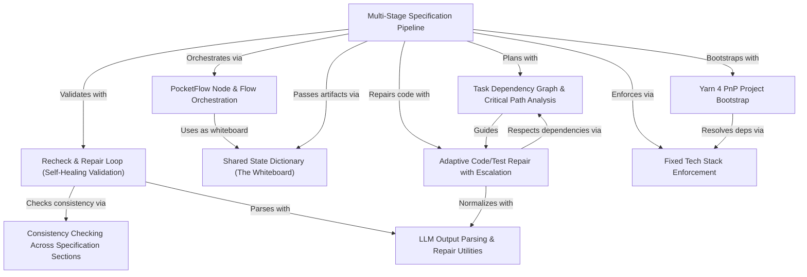

# Tutorial: CODING

This project is an **AI-driven code generation system** that transforms a raw business idea into a **production-ready TypeScript/Node.js application**. It operates through a **multi-stage pipeline** (business specification → system specification → task planning → code generation) where each stage is validated and automatically repaired by a **self-healing validation loop**. The system enforces a **fixed technology stack** (Node.js 24, TypeScript 5, Express 5, MySQL 8, etc.), uses **Yarn 4 Plug'n'Play** for zero-install dependency management, and coordinates all steps via a **shared state dictionary** ("whiteboard") that allows nodes to communicate without direct coupling. When generated code fails tests, an **adaptive repair mechanism** escalates through multiple strategies (targeted fixes, holistic review, compilation-focused repair, radical regeneration) until tests pass or the system halts with full diagnostic context.

**Source Repository:** [None](None)

## Chapters

1. [Multi-Stage Specification Pipeline
](01_multi_stage_specification_pipeline_.md)
2. [PocketFlow Node & Flow Orchestration
](02_pocketflow_node___flow_orchestration_.md)
3. [Shared State Dictionary (The "Whiteboard")
](03_shared_state_dictionary__the__whiteboard___.md)
4. [Recheck & Repair Loop (Self-Healing Validation)
](04_recheck___repair_loop__self_healing_validation__.md)
5. [Fixed Tech Stack Enforcement
](05_fixed_tech_stack_enforcement_.md)
6. [Yarn 4 PnP Project Bootstrap
](06_yarn_4_pnp_project_bootstrap_.md)
7. [Task Dependency Graph & Critical Path Analysis
](07_task_dependency_graph___critical_path_analysis_.md)
8. [Adaptive Code/Test Repair with Escalation
](08_adaptive_code_test_repair_with_escalation_.md)
9. [Consistency Checking Across Specification Sections
](09_consistency_checking_across_specification_sections_.md)
10. [LLM Output Parsing & Repair Utilities
](10_llm_output_parsing___repair_utilities_.md)

