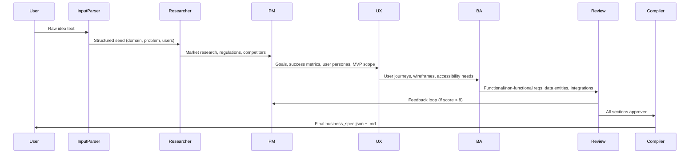
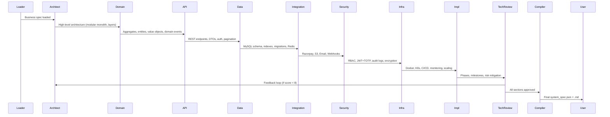
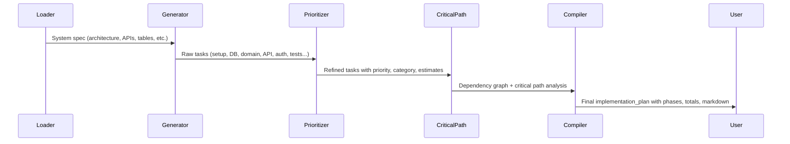
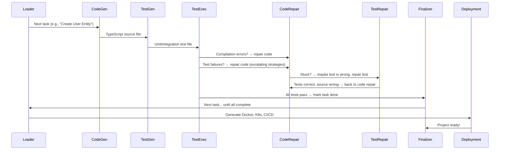

# Chapter 1: Multi-Stage Specification Pipeline

Welcome to the first chapter of the CODING tutorial! 🎉

Imagine you're building a house. You wouldn't start laying bricks without a blueprint. And you wouldn't draw a blueprint without understanding what the homeowner wants. Software development works the same way — but instead of homeowners, architects, and builders, we have **AI agents** playing each role.

This chapter introduces the **Multi-Stage Specification Pipeline** — the backbone of the CODING project. It's an assembly line that transforms a raw idea into production-ready code through four distinct stages, each with its own specialized AI agents.

---

## The Problem: From Idea to Code is Messy

Let's start with a concrete example. Suppose you tell an AI:

> *"Build me a job portal where companies can post jobs, manage hiring teams with RBAC, and job seekers can apply with a freemium model (3 free applications, then subscription). Need JWT auth, 2FA, multi-currency billing, Razorpay payments, and AWS S3 storage."*

If you dump this entire prompt into a code generator, you'll get a mess:
- Missing requirements (forgot audit logs? forgot moderation?)
- Inconsistent designs (API doesn't match database schema)
- Broken code (imports that don't exist, tests that fail)
- No way to trace *why* a decision was made

**The core problem:** Going straight from idea → code skips the critical thinking steps that ensure quality, consistency, and maintainability.

---

## The Solution: Four Stages, One Pipeline

The Multi-Stage Specification Pipeline breaks this into **four sequential workflows**, like an assembly line:

```mermaid
flowchart LR
    A[💡 Raw Idea] --> B[1️⃣ Business Spec\nPM/UX/BA Agents]
    B --> C[📋 Business Spec\nArtifact]
    C --> D[2️⃣ System Spec\nArchitect/Domain/API/Data]
    D --> E[🏗️ System Spec\nArtifact]
    E --> F[3️⃣ Tasks\nPlanner → Granular Tasks]
    F --> G[📝 Task List\nArtifact]
    G --> H[4️⃣ Code Gen\nAgents Write TS + Tests]
    H --> I[✅ Production Code]
    
    style A fill:#fff3e0
    style C fill:#e8f5e9
    style E fill:#e8f5e9
    style G fill:#e8f5e9
    style I fill:#e3f2fd
```



Each stage:
1. **Consumes** the previous stage's artifact
2. **Produces** a structured artifact for the next stage
3. **Validates** its output before passing the baton
4. **Loops back** to fix issues if validation fails

This ensures **errors are caught early** — before they compound downstream.

---

## Stage 1: Business Specification — "What Are We Building?"

**Agents:** PM (Product Manager), UX (User Experience), BA (Business Analyst), Researcher, Reviewer, Compiler

**Input:** Raw idea (plain text)  
**Output:** `business_spec.json` + `business_spec.md` — structured requirements



**Key insight:** Each agent focuses on *one perspective*. The PM thinks about *business value*, UX thinks about *user flows*, BA thinks about *precise requirements*. The Reviewer scores quality and routes feedback back — like a code review, but for specs.

---

## Stage 2: System Specification — "How Will We Build It?"

**Agents:** Architect, Domain Modeler, API Designer, Data Designer, Integration, Security, Infrastructure, Implementation Planner, Tech Reviewer, Compiler

**Input:** `business_spec`  
**Output:** `system_spec.json` + `system_spec.md` — technical blueprints



**Key insight:** This is where *technical decisions* happen. The Architect chooses "modular monolith with layered architecture." The Domain Modeler maps BA's "Company, Job, Application" entities to DDD aggregates. The Data Designer creates normalized MySQL tables with proper indexes. Each section builds on the previous — **no section works in isolation**.

---

## Stage 3: Implementation Tasks — "What Exactly Do We Code?"

**Agents:** Task Generator, Prioritizer, Critical Path Analyzer, Compiler

**Input:** `system_spec`  
**Output:** `implementation_tasks.json` + `tasks_only.json` — granular, dependency-ordered coding tasks



**Key insight:** The Planner doesn't just list tasks — it creates a **dependency graph**. Task "Create User Entity" must come before "Create User Repository" which comes before "Create User API." The Critical Path Analyzer identifies the longest chain of dependent tasks — this is your *minimum project duration*.

---

## Stage 4: Code Generation — "Write the Actual Code"

**Agents:** Task Loader, Code Generator, Test Generator, Test Executor, Code Repair, Test Repair, Task Finalizer, Deployment Generator, Finalizer

**Input:** `implementation_tasks` + `system_spec`  
**Output:** TypeScript source files + passing tests + deployment configs



**Key insight:** This is a **fail-stop design**. If code doesn't compile → halt and repair. If tests fail → repair code (with escalating strategies: fix logic → fix imports → refactor → rewrite). If code repair gets stuck → maybe the *test* is wrong, try repairing the test. If *both* fail → halt for human intervention. **No silent failures.**

---

## The Glue: Shared State Dictionary

All stages communicate through a **shared dictionary** (like a whiteboard). Each workflow reads what it needs, writes its output, and the next workflow picks it up.

```python
# Simplified view of shared state flowing through main.py
shared = {
    "workdir": "/path/to/project",
    "input": "Raw idea text...",
    
    # Stage 1 output
    "business_spec": {...},
    "seed": {...},
    "pm_section": {...},
    "ux_section": {...},
    "ba_section": {...},
    
    # Stage 2 output
    "system_spec": {...},
    "architecture_section": {...},
    "domain_model_section": {...},
    "api_design_section": {...},
    "data_design_section": {...},
    # ... more sections
    
    # Stage 3 output
    "tasks": [...],
    "critical_path_analysis": {...},
    "implementation_plan": {...},
    
    # Stage 4 working state
    "current_task": {...},
    "generated_code": "...",
    "test_results": {...},
    
    # Cross-cutting
    "errors": [],
    "feedback_history": [],
    "quality_score": 8.5,
}
```

This is covered in detail in [Chapter 3: Shared State Dictionary (The "Whiteboard")](03_shared_state_dictionary__the__whiteboard___.md).

---

## Orchestration: PocketFlow Nodes & Flows

The pipeline isn't hardcoded — it's built from **Nodes** (atomic steps) and **Flows** (directed graphs of nodes). PocketFlow handles the execution.

```python
# flow.py — Business Spec Workflow (simplified)
from pocketflow import Flow, Node

# Each agent is a Node
input_parser = InputParserNode()
researcher = ResearcherNode()
pm_agent = PMAgentNode()
# ... ux, ba, review, compiler

# Validation & repair nodes
recheck = RecheckNode()
repair_json = RepairJSONNode()
repair_consistency = RepairConsistencyNode()

# Connect them: output action → next node
input_parser - "next" >> recheck
recheck - "seed_valid" >> researcher
recheck - "seed_repair_json" >> repair_json
# ... feedback loops from review
review_agent - "pm" >> pm_agent
review_agent - "pass" >> compiler

# EndNode signals "next_flow" to chain workflows
compiler - "next_flow" >> EndNode()

business_flow = Flow(start=input_parser)
```

This is covered in detail in [Chapter 2: PocketFlow Node & Flow Orchestration](02_pocketflow_node___flow_orchestration_.md).

---

## Running the Pipeline

From `main.py`, you kick off the entire assembly line:

```python
# main.py — Entry point
from flow import (
    business_spec_workflow,
    system_spec_workflow,
    tasks_implementation_workflow,
    setup_workflow,
    code_gen_workflow
)
from pocketflow import Flow

# 1. Create each workflow
business_flow = business_spec_workflow()
system_flow = system_spec_workflow()
task_flow = tasks_implementation_workflow()
setup_flow = setup_workflow()
code_gen_flow = code_gen_workflow()

# 2. Chain them: workflow1 -"next_flow">> workflow2
business_flow - "next_flow" >> system_flow
system_flow - "next_flow" >> task_flow
task_flow - "next_flow" >> setup_flow
setup_flow - "next_flow" >> code_gen_flow

# 3. Run master flow with shared state
master_flow = Flow(start=business_flow)
master_flow.run(shared)
```

**That's it.** The master flow executes all four stages sequentially, passing the shared dictionary along. Each stage validates its output, loops back on failure, and only proceeds when quality thresholds are met.

---

## What You Get at the End

After the pipeline completes, your `JobPortal_v2/doc/` folder contains:

```
doc/
├── business_spec.md          # Human-readable business requirements
├── business_spec.json        # Structured business spec (for Stage 2)
├── system_spec.md            # Technical blueprint (architecture, APIs, DB, etc.)
├── system_spec.json          # Structured system spec (for Stage 3)
├── implementation_tasks.json # Full plan with phases, critical path, estimates
├── tasks_only.json           # Just the task array (for Stage 4)
└── implementation_tasks.md   # Human-readable task breakdown
```

And in your `src/` folder: **production-ready TypeScript code with passing tests.**

---

## Why This Architecture Works

| Traditional Approach | Multi-Stage Pipeline |
|---------------------|---------------------|
| One giant prompt → hope for best | Specialized agents per concern |
| Errors discovered in code | Errors caught at spec stage |
| No traceability | Full artifact chain: idea → spec → tasks → code |
| Hard to iterate | Feedback loops at every stage |
| Context overflow | Each agent sees only what it needs |

---

## What's Next?

You now understand the **big picture**: four stages, specialized agents, validation loops, and shared state. But how does PocketFlow actually *execute* these nodes? How do nodes pass data? How do loops work?

In the next chapter, we'll peel back the curtain on the orchestration engine.

👉 **[Chapter 2: PocketFlow Node & Flow Orchestration](02_pocketflow_node___flow_orchestration_.md)**

