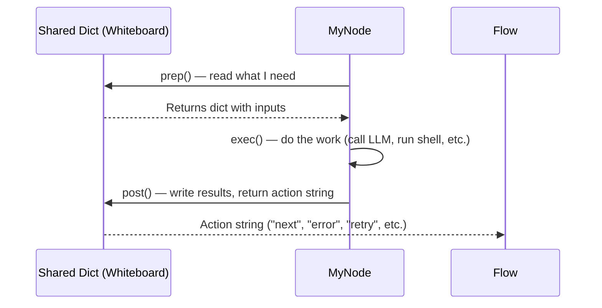
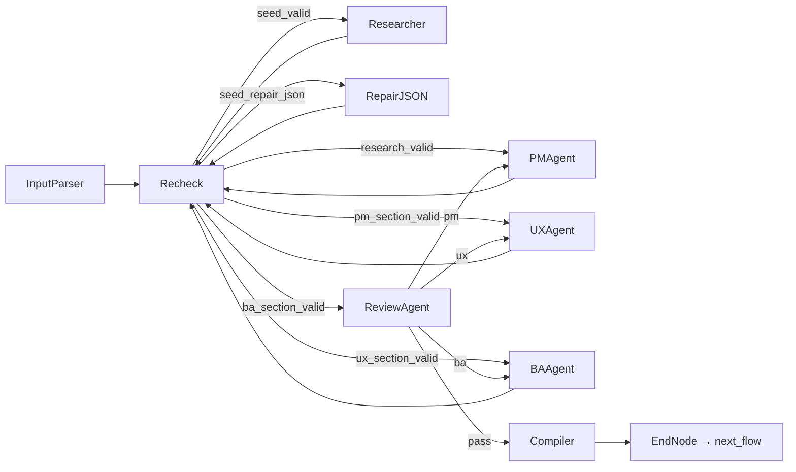
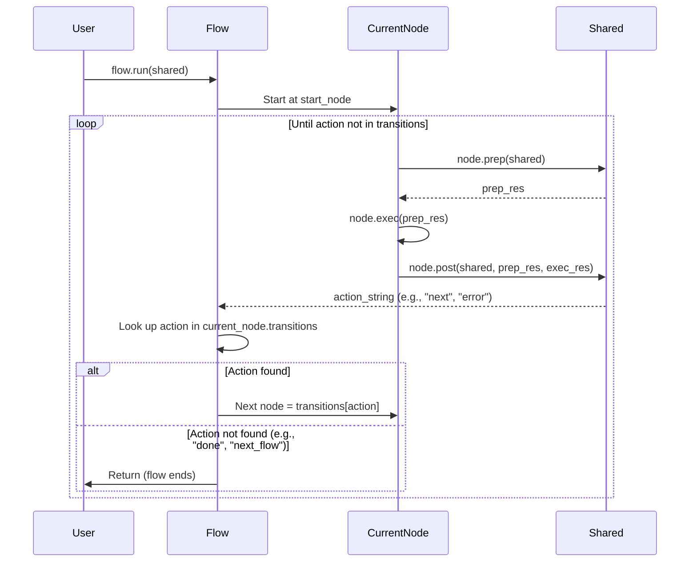
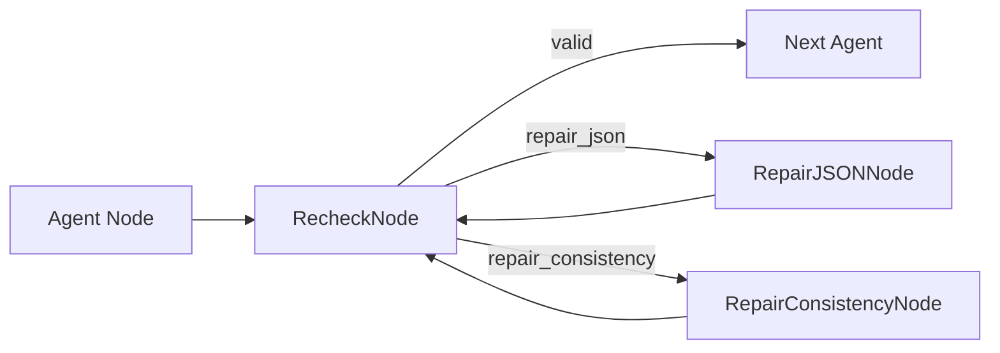

# Chapter 2: PocketFlow Node & Flow Orchestration

Welcome back! 🎉

In [Chapter 1: Multi-Stage Specification Pipeline](01_multi_stage_specification_pipeline_.md), we saw the **big picture**: four stages (Business Spec → System Spec → Tasks → Code Gen) that transform a raw idea into production code. Each stage has specialized AI agents, validation loops, and produces structured artifacts.

But *how* does this actually run? What executes the agents, handles the loops, passes data between steps, and decides what runs next?

Enter **PocketFlow** — the tiny orchestration engine that makes it all work.

---

## The Problem: "Spaghetti Orchestration"

Imagine writing the Business Spec workflow *without* a framework. You'd end up with something like this:

```python
# ❌ Without PocketFlow — a nightmare to maintain
def run_business_spec(shared):
    seed = input_parser(shared)
    if not validate(seed): return fix_and_retry(input_parser, shared)
    
    research = researcher(shared)
    if not validate(research): return fix_and_retry(researcher, shared)
    
    pm = pm_agent(shared)
    if review(pm) < 8: return run_business_spec(shared)  # recursive loop?!
    
    ux = ux_agent(shared)
    # ... and so on, with nested ifs, manual state passing, 
    # no clear way to express "go back to PM if UX fails review"
```

**Problems:**
- **Hard to read**: Business logic buried in control flow
- **Hard to change**: Want to add a new agent? Rewire everything manually
- **Hard to debug**: Where did it fail? What was the shared state at each step?
- **No reuse**: Can't compose workflows from smaller pieces

---

## The Solution: Nodes + Flows

PocketFlow gives you two building blocks:

| Concept | Analogy | Responsibility |
|---------|---------|----------------|
| **Node** | A single box in a flowchart | One atomic step: read shared state → do work → write shared state → decide next action |
| **Flow** | The arrows connecting boxes | A directed graph of Nodes. Knows *only* wiring: "if Node A returns 'success', run Node B" |

**The magic**: Nodes don't know about each other. They only read/write a **shared dictionary** (the "whiteboard" from Chapter 1). The Flow handles all routing.

---

## Core Concept 1: The Node

Every agent, validator, repair step, and compiler in CODING is a **Node**. A Node has three methods:



### The Three Methods

```python
# pocketflow.Node (simplified)
class Node:
    def prep(self, shared):
        """Read from shared dict. Return dict of inputs for exec()."""
        pass
    
    def exec(self, prep_res):
        """Do the actual work. Return raw result (string, dict, etc.)."""
        pass
    
    def post(self, shared, prep_res, exec_res):
        """Write to shared dict. Return action string for Flow routing."""
        pass
```

### Real Example: `InputParserNode` (from `business_nodes.py`)

```python
class InputParserNode(Node):
    def prep(self, shared):
        # 1. READ: Check if spec already exists on disk
        json_path = os.path.join(shared["workdir"], "doc", "business_spec.json")
        if os.path.exists(json_path):
            return None  # Skip — already done!
        
        # Return inputs for exec()
        return {
            "user_input": shared.get("input", ""),
            "is_retry": len(shared.get("errors", [])) > 0,
            "error_log": shared.get("errors", []),
        }

    def exec(self, prep_res):
        # 2. WORK: Call LLM to parse raw idea into structured seed
        if prep_res is None:
            return None
        prompt = f"Parse this business idea...{prep_res['user_input']}"
        return call_llm(INPUT_PARSER_PROMPT, prompt)

    def post(self, shared, prep_res, exec_res):
        # 3. WRITE: Save parsed seed to shared, decide next action
        if shared.get("_bypass"):  # Loaded from disk
            return "next_flow"
        
        parsed = parse_llm_json(exec_res)
        if parsed is None:
            shared["errors"] = ["Input parser returned invalid JSON"]
            return "error"  # Flow will route to repair!
        
        shared["seed"] = parsed
        shared["errors"] = []
        return "next"  # Flow routes to RecheckNode
```

**Key insight**: The Node doesn't know what runs next. It just returns `"next"` or `"error"`. The **Flow** decides what that means.

---

## Core Concept 2: The Flow

A **Flow** wires Nodes together using the `>>` operator:

```python
from pocketflow import Flow, Node

# Define nodes
input_parser = InputParserNode()
recheck = RecheckNode()
researcher = ResearcherNode()

# Wire them: action_string >> next_node
input_parser - "next" >> recheck
recheck - "seed_valid" >> researcher
recheck - "seed_repair_json" >> repair_json_node

# Create flow starting at input_parser
business_flow = Flow(start=input_parser)

# Run with shared state
shared = {"input": "Build a job portal...", "workdir": "/tmp/project"}
business_flow.run(shared)
```

### Visual: Business Spec Flow (simplified)



**The Flow is just a graph.** It has no logic — it only follows the action strings returned by `post()`.

---

## Core Concept 3: The Shared Dictionary (The "Whiteboard")

All Nodes communicate through **one shared dictionary** passed to `Flow.run(shared)`. This is the "global whiteboard" from Chapter 1.

```python
shared = {
    # Input
    "input": "Build a job portal...",
    "workdir": "/tmp/project",
    
    # Business Spec outputs (written by Nodes)
    "seed": {"domain": "job portal", "core_problem": "..."},
    "research": {"competitors": [...], "regulations": [...]},
    "pm_section": {"goals": [...], "mvp_scope": [...]},
    "ux_section": {"user_journeys": [...], "wireframes": [...]},
    "ba_section": {"functional_requirements": [...], "data_requirements": [...]},
    "review": {"quality_score": 8.5, "section_feedback": {...}},
    "quality_score": 8.5,
    "business_spec": "...compiled markdown...",
    
    # Cross-cutting
    "errors": [],
    "feedback_history": [],
    "current_iteration": 0,
}
```

**Nodes only read what they need, write what they produce.** No explicit parameters passed between Nodes — the shared dict *is* the interface.

> 📖 **Deep dive**: [Chapter 3: Shared State Dictionary (The "Whiteboard")](03_shared_state_dictionary__the__whiteboard___.md)

---

## Putting It Together: A Mini Workflow

Let's build a tiny workflow from scratch to see how it feels.

### Step 1: Define Nodes

```python
from pocketflow import Node, Flow

class GreetNode(Node):
    def prep(self, shared):
        return {"name": shared.get("name", "World")}
    
    def exec(self, prep_res):
        return f"Hello, {prep_res['name']}!"
    
    def post(self, shared, prep_res, exec_res):
        shared["greeting"] = exec_res
        return "next"

class ExclaimNode(Node):
    def prep(self, shared):
        return {"text": shared.get("greeting", "")}
    
    def exec(self, prep_res):
        return prep_res["text"] + " 🎉"
    
    def post(self, shared, prep_res, exec_res):
        shared["final"] = exec_res
        return "done"
```

### Step 2: Wire the Flow

```python
greet = GreetNode()
exclaim = ExclaimNode()

# Connect: greet's "next" → exclaim
greet - "next" >> exclaim

# Create flow
flow = Flow(start=greet)
```

### Step 3: Run It

```python
shared = {"name": "Ada"}
flow.run(shared)

print(shared["final"])  # "Hello, Ada! 🎉"
print(shared)           # {'name': 'Ada', 'greeting': 'Hello, Ada!', 'final': 'Hello, Ada! 🎉'}
```

**That's it.** The Flow executed `GreetNode` → `ExclaimNode`, passing data through `shared`.

---

## How CODING Uses This: Real Workflows

### Business Spec Workflow (`flow.py`)

```python
def business_spec_workflow():
    # 1. Create all nodes
    input_parser = InputParserNode()
    researcher = ResearcherNode()
    pm_agent = PMAgentNode()
    ux_agent = UXAgentNode()
    ba_agent = BAAgentNode()
    review_agent = ReviewAgentNode()
    compiler = CompilerNode()
    
    recheck = RecheckNode()
    repair_json = RepairJSONNode()
    repair_consistency = RepairConsistencyNode()
    end = EndNode()  # Returns "next_flow" to chain workflows
    
    # 2. Wire the main chain
    input_parser - "next" >> recheck
    recheck - "seed_valid" >> researcher
    researcher - "next" >> recheck
    recheck - "research_valid" >> pm_agent
    # ... pm → ux → ba → review ...
    
    # 3. Wire feedback loops (review routes back to specific agents)
    review_agent - "pm" >> pm_agent
    review_agent - "ux" >> ux_agent
    review_agent - "ba" >> ba_agent
    review_agent - "pass" >> compiler
    
    # 4. Wire repair loops
    recheck - "seed_repair_json" >> repair_json
    repair_json - "done" >> recheck
    # ... etc ...
    
    # 5. End node signals "next_flow" to master flow
    compiler - "next_flow" >> end
    
    return Flow(start=input_parser)
```

### Chaining Workflows (Master Flow in `main.py`)

```python
from flow import (
    business_spec_workflow,
    system_spec_workflow,
    tasks_implementation_workflow,
    setup_workflow,
    code_gen_workflow
)
from pocketflow import Flow

# Create each stage's workflow
business_flow = business_spec_workflow()
system_flow = system_spec_workflow()
task_flow = tasks_implementation_workflow()
setup_flow = setup_workflow()
code_gen_flow = code_gen_workflow()

# Chain them: each returns "next_flow" at the end
business_flow - "next_flow" >> system_flow
system_flow - "next_flow" >> task_flow
task_flow - "next_flow" >> setup_flow
setup_flow - "next_flow" >> code_gen_flow

# Run the master flow
master_flow = Flow(start=business_flow)
master_flow.run(shared)
```

**Each workflow is a self-contained Flow.** They don't know about each other — they just return `"next_flow"` when done. The master Flow stitches them together.

---

## Internal Implementation: What Happens When You Call `Flow.run(shared)`?

Here's a simplified view of PocketFlow's execution loop:



### PocketFlow Source (simplified from `pocketflow/__init__.py`)

```python
class Flow:
    def __init__(self, start):
        self.start = start
    
    def run(self, shared):
        current = self.start
        while current:
            # 1. PREP
            prep_res = current.prep(shared)
            
            # 2. EXEC
            exec_res = current.exec(prep_res)
            
            # 3. POST — get action string
            action = current.post(shared, prep_res, exec_res)
            
            # 4. ROUTE: find next node via transitions dict
            #    (populated by the `>>` operator)
            current = current.transitions.get(action)
            #    If action not in transitions → flow ends
        
        return shared  # Final shared state
```

**The `>>` operator just builds a `transitions` dict on each Node:**

```python
# In pocketflow.Node
def __rshift__(self, other):
    # Called as: node_a - "action" >> node_b
    # Stores: self.transitions["action"] = other
    return self

def __sub__(self, action):
    # Returns a temporary object that captures the action string
    # Then __rshift__ uses it to populate transitions
    return _TransitionBuilder(self, action)
```

---

## Why This Architecture Works for CODING

| Challenge | How Nodes + Flows Solve It |
|-----------|---------------------------|
| **Complex feedback loops** (Review → PM/UX/BA) | Just wire `review - "pm" >> pm_agent`. No nested loops in code. |
| **Self-healing** (Repair → Recheck → Retry) | `recheck - "repair_json" >> repair_json - "done" >> recheck`. Clear cycle. |
| **Multi-stage pipeline** | Each stage = one Flow. Chain with `"next_flow"`. |
| **Debugging** | Print `shared` at any point. Every Node's input/output is visible. |
| **Testing** | Test a Node in isolation: `node.post(shared, prep_res, exec_res)` |
| **Adding agents** | Create new Node, add one line to Flow wiring. |

---

## Common Patterns in CODING

### 1. Validation + Repair Loop



**Code** (from `flow.py`):
```python
pm_agent - "next" >> recheck
recheck - "pm_section_valid" >> ux_agent
recheck - "pm_section_repair_json" >> repair_json
recheck - "pm_section_repair_consistency" >> repair_consistency
repair_json - "done" >> recheck
repair_consistency - "done" >> recheck
```

### 2. Max Attempts → Escalate to Creator

```python
# After N retries, RecheckNode returns "pm_section_max_attempt_error"
recheck - "pm_section_max_attempt_error" >> pm_agent  # Back to creator!
```

### 3. EndNode: Signal to Master Flow

```python
class EndNode(Node):
    def post(self, shared, prep_res, exec_res):
        return "next_flow"  # Master flow sees this and runs next workflow
```

---

## Debugging Tip: Print the Flow Graph

```python
def print_flow(node, visited=None, indent=0):
    if visited is None:
        visited = set()
    if id(node) in visited:
        return
    visited.add(id(node))
    
    print("  " * indent + f"→ {node.__class__.__name__}")
    for action, next_node in getattr(node, "transitions", {}).items():
        print("  " * (indent + 1) + f"[{action}]")
        print_flow(next_node, visited, indent + 2)

# Usage
business_flow = business_spec_workflow()
print_flow(business_flow.start)
```

Output:
```
→ InputParserNode
  [next]
    → RecheckNode
      [seed_valid]
        → ResearcherNode
          [next]
            → RecheckNode
      [seed_repair_json]
        → RepairJSONNode
          [done]
            → RecheckNode
      ...
```

---

## Summary: What You Learned

| Concept | What It Is | CODING Usage |
|---------|------------|--------------|
| **Node** | Atomic step: `prep` → `exec` → `post` | Every agent, validator, repair, compiler |
| **Flow** | Directed graph of Nodes via `>>` | Each stage (Business, System, Tasks, Setup, Code Gen) |
| **Shared Dict** | Global whiteboard passed to `run()` | All state: specs, tasks, code, errors, iterations |
| **Action String** | Return value of `post()` | `"next"`, `"error"`, `"retry"`, `"next_flow"`, `"pm"`, `"pass"` |
| **EndNode** | Returns `"next_flow"` | Chains workflows in master flow |

---

## What's Next?

You now understand the **orchestration engine** that runs the entire CODING pipeline. But there's one piece we've mentioned repeatedly that makes it all possible: the **Shared State Dictionary** — the "whiteboard" that every Node reads and writes.

How is it structured? What keys exist at each stage? How do Nodes avoid stepping on each other's toes?

👉 **[Chapter 3: Shared State Dictionary (The "Whiteboard")](03_shared_state_dictionary__the__whiteboard___.md)**

