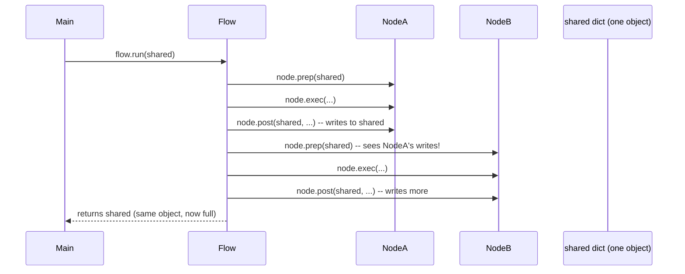
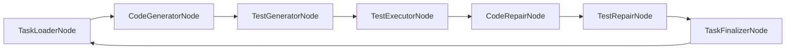

# Chapter 3: Shared State Dictionary (The "Whiteboard")


Welcome back! 🎉

In [Chapter 2: PocketFlow Node & Flow Orchestration](02_pocketflow_node___flow_orchestration_.md), we learned how **Nodes** (atomic steps) and **Flows** (graphs of nodes) work together. Each node has `prep` → `exec` → `post`, and the flow routes based on the action string returned by `post`.

But there's a missing piece: **how do nodes share data?**  
In Chapter 2, we saw `shared` passed to `flow.run(shared)`, but we didn't explore what `shared` *is*, how nodes use it, or why this design is powerful.

---

## The Problem: "How Do Nodes Talk to Each Other?"

Imagine you're building a pipeline with three nodes:

1. **Node A** downloads a file → needs to tell Node B the file path
2. **Node B** processes the file → needs to tell Node C the result
3. **Node C** saves the result to a database

Without a shared mechanism, you'd have to:
- Pass data explicitly: `result_b = node_b(node_a_output)` → but PocketFlow nodes don't call each other!
- Use global variables → messy, hard to test, not thread-safe
- Write to disk between every step → slow, fragile

**We need a simple, universal way for nodes to exchange data.**

---

## The Solution: The Shared State Dictionary (The "Whiteboard")

Think of `shared` as a **whiteboard in a meeting room**:

- Every node (participant) can **read** what others wrote
- Every node can **write** its own results
- The whiteboard persists for the **entire meeting** (pipeline run)
- At any moment, you can **take a photo** (checkpoint) of the whiteboard

In code, `shared` is just a **Python dictionary** passed by reference to every node's `prep`, `exec`, and `post` methods.

```python
# main.py — The master flow starts with a shared dictionary
shared = {
    "workdir": "/path/to/project",
    "input": "Build a job portal...",
    "business_spec": {},      # Will be filled by Stage 1
    "system_spec": {},        # Will be filled by Stage 2
    "tasks": [],              # Will be filled by Stage 3
    "errors": [],             # Cross-cutting: any node can add errors
    "feedback_history": [],   # Cross-cutting: review feedback loops
}

master_flow.run(shared)  # Passed by reference — all nodes see the same dict
```

---

## Key Concepts

### 1. Single Dictionary, Passed by Reference

There is **only one** `shared` dict for the entire pipeline. When you call `flow.run(shared)`, PocketFlow passes **the same dictionary object** to every node.



**Analogy**: It's like a group chat where everyone sees every message. No forwarding needed.

---

### 2. Nodes Communicate Exclusively via Keys

Nodes **never call each other directly**. They only:
- **Read** keys they need in `prep`
- **Write** keys they produce in `post`

```python
# Node A: writes "file_path"
class DownloadNode(Node):
    def post(self, shared, prep_res, exec_res):
        shared["file_path"] = exec_res  # Write to whiteboard
        return "next"

# Node B: reads "file_path", writes "processed_data"
class ProcessNode(Node):
    def prep(self, shared):
        return {"file_path": shared["file_path"]}  # Read from whiteboard

    def post(self, shared, prep_res, exec_res):
        shared["processed_data"] = exec_res  # Write result
        return "next"
```

**Key naming convention in CODING:**
| Prefix | Meaning | Example |
|--------|---------|---------|
| (none) | Major artifact | `business_spec`, `system_spec`, `tasks` |
| `_` | Transient/internal | `_repair_context`, `_setup_files_needed` |
| `_<node>_` | Node-specific scratchpad | `_code_repair_state_<task_id>` |

---

### 3. Enables Checkpointing (Save to Disk)

Because `shared` is a plain dict, you can **serialize it to JSON** at any point:

```python
import json

# Save checkpoint
with open("checkpoint.json", "w") as f:
    json.dump(shared, f, indent=2, default=str)

# Later... resume from checkpoint
with open("checkpoint.json") as f:
    shared = json.load(f)
master_flow.run(shared)  # Continues where it left off!
```

This is used in CODING to persist progress (e.g., `progress.json` in `TaskFinalizerNode`).

---

### 4. Makes Flow Inspectable at Any Point

At any moment — during a run, after a crash, in a debugger — you can print `shared` and see **the entire project state**:

```python
# Debugging: just print shared!
print(json.dumps(shared, indent=2, default=str))
```

Output might show:
```json
{
  "workdir": "/tmp/JobPortal_v2",
  "input": "Build a job portal...",
  "business_spec": { "seed": {...}, "pm_section": {...}, ... },
  "system_spec": { "architecture_section": {...}, ... },
  "tasks": [ { "task_id": "T001", ... }, ... ],
  "current_task": { "task_id": "T042", "title": "Create User Entity" },
  "generated_files": [ { "path": "src/domain/user.ts", "content": "..." } ],
  "test_results": [ { "passed": false, "failures": ["Expected 200 got 404"] } ],
  "errors": [],
  "_code_repair_state_T042": { "attempt": 3, "strategies_tried": ["targeted", "holistic"] }
}
```

**No hidden state.** Everything is visible.

---

## How a Node Uses `shared`: The Three Methods

Let's walk through a real node from CODING: `SetupPlannerNode` (from `setup_nodes.py`).

### 1. `prep(self, shared)` — Read What You Need

```python
def prep(self, shared):
    # Check if setup already done (read from shared)
    if shared.get("setup_finalized") is True:
        return {"skip": True, "reason": "Already done"}

    # Read cross-cutting signals (from previous stages)
    signals = extract_signals(shared)  # Helper reads business_spec, system_spec, tasks

    # Read error history for retry context
    errors = shared.get("errors", [])

    return {
        "skip": False,
        "signals": signals,
        "is_retry": len(errors) > 0,
        "error_log": errors,
    }
```

**What happens**: Node reads `setup_finalized`, `errors`, and implicitly `business_spec`/`system_spec`/`tasks` via `extract_signals(shared)`.

---

### 2. `exec(self, prep_res)` — Do the Work (No `shared` Here!)

```python
def exec(self, prep_res):
    if prep_res.get("skip"):
        return json.dumps({"skipped": True})

    # Build prompt using ONLY prep_res (not shared directly)
    prompt = f"Decide setup files needed...\nSignals: {prep_res['signals']}"
    return call_llm(SYSTEM_PROMPT, prompt, temperature=0.2)
```

**Important**: `exec` receives **only `prep_res`** — the dict returned by `prep`. It does **not** receive `shared`. This keeps `exec` pure and testable.

---

### 3. `post(self, shared, prep_res, exec_res)` — Write Results, Decide Next Action

```python
def post(self, shared, prep_res, exec_res):
    if prep_res.get("skip"):
        shared["setup_status"] = "skipped"
        return "skip"

    # Parse LLM output
    parsed = parse_llm_json(exec_res)
    if parsed is None:
        shared["errors"] = shared.get("errors", []) + ["Invalid JSON from planner"]
        return "error"

    # Write to shared for next nodes
    files_needed = [{"path": item["path"], "purpose": item.get("purpose", "")} for item in parsed]
    shared["_setup_files_needed"] = files_needed
    shared["_setup_files_done"] = []
    shared["_setup_current_index"] = 0
    shared["_setup_signals"] = prep_res["signals"]
    shared["errors"] = []  # Clear errors on success

    return "next"  # Flow routes to next node
```

**What happens**: Node writes `_setup_files_needed`, `_setup_files_done`, etc. to `shared`. Returns `"next"` so Flow continues.

---

## Internal Implementation: How PocketFlow Passes `shared`

You saw in Chapter 2 that `Flow.run(shared)` loops over nodes. Here's the simplified core:

```python
# pocketflow/__init__.py (simplified)
class Flow:
    def run(self, shared):
        current = self.start
        while current:
            # 1. PREP: pass shared
            prep_res = current.prep(shared)

            # 2. EXEC: pass ONLY prep_res (not shared!)
            exec_res = current.exec(prep_res)

            # 3. POST: pass shared again + prep_res + exec_res
            action = current.post(shared, prep_res, exec_res)

            # 4. ROUTE: get next node from transitions
            current = current.transitions.get(action)
            # If action not in transitions → flow ends

        return shared  # Return the same dict (now modified)
```

**Key insight**: `shared` is passed to `prep` and `post`, but **not** to `exec`. This separation:
- Keeps `exec` pure (no side effects, easy to test)
- Makes data flow explicit: `prep` declares what it reads, `post` declares what it writes

---

## Real-World Example: Code Generation Pipeline

In [Chapter 1](01_multi_stage_specification_pipeline_.md), Stage 4 (Code Gen) uses `shared` heavily. Here's how data flows through several nodes:



### Shared Keys at Each Step

| Node | Reads from `shared` | Writes to `shared` |
|------|---------------------|-------------------|
| **TaskLoaderNode** | `tasks`, `completed_task_ids`, `failed_task_ids` | `current_task`, `_task_progress` |
| **CodeGeneratorNode** | `current_task`, `system_spec`, `output_dir` | `generated_files`, `_code_gen_skipped_existing` |
| **TestGeneratorNode** | `current_task`, `generated_files` | `generated_test_files` |
| **TestExecutorNode** | `generated_test_files`, `output_dir` | `test_results`, `_all_tests_passed` |
| **CodeRepairNode** | `test_results`, `generated_files`, `_code_repair_state_<task_id>` | `generated_files` (repaired), updates `_code_repair_state_<task_id>` |
| **TestRepairNode** | `test_results`, `generated_test_files`, `generated_files`, `_test_repair_state_<task_id>` | `generated_test_files` (repaired), updates `_test_repair_state_<task_id>` |
| **TaskFinalizerNode** | `current_task`, `generated_files`, `generated_test_files`, `completed_task_ids` | `completed_task_ids`, `failed_task_ids`, cleans up transient keys |

**Notice**: 
- No node calls another node
- Each node only knows the **keys** it needs
- Transient state (repair counters) lives in `shared` with task-specific keys

---

## Common Patterns in CODING

### 1. Skip If Already Done (Idempotency)

```python
def prep(self, shared):
    if shared.get("setup_finalized"):
        return {"skip": True}
    # ... normal prep
```

Many nodes check a "finalized" flag first. This allows **resuming** after a crash.

---

### 2. Retry Context via `errors` List

```python
def prep(self, shared):
    errors = shared.get("errors", [])
    return {
        "is_retry": len(errors) > 0,
        "error_log": errors,
    }
```

If `errors` is non-empty, the node knows it's a retry and can adjust its prompt (e.g., "Previous attempt failed because...").

---

### 3. Node-Specific Scratchpad with Unique Keys

```python
# CodeRepairNode uses a key unique to the task
repair_key = f"_code_repair_state_{task_id}"
repair_state = shared.get(repair_key, {"attempt": 0, "strategies_tried": []})
# ... update ...
shared[repair_key] = repair_state
```

This avoids collisions when multiple tasks are in flight (though CODING runs one task at a time).

---

### 4. Cross-Cutting Keys for Global State

| Key | Purpose | Written By | Read By |
|-----|---------|------------|---------|
| `errors` | Global error log | Any node on failure | All nodes (for retry context) |
| `feedback_history` | Review feedback loops | ReviewAgent | PM/UX/BA agents |
| `quality_score` | Overall quality gate | ReviewAgent | Compiler, Flow routing |
| `workdir` | Project root | `main.py` | All file-writing nodes |
| `input` | Original user idea | `main.py` | Stage 1 nodes |

---

## Benefits Recap

| Benefit | How `shared` Enables It |
|---------|------------------------|
| **Decoupling** | Nodes don't import or call each other; only agree on key names |
| **Checkpointing** | `shared` is a plain dict → `json.dump(shared)` → resume later |
| **Inspectability** | `print(shared)` shows entire pipeline state at any point |
| **Testability** | Test a node in isolation: `node.post(test_shared, prep_res, exec_res)` |
| **Flexibility** | Add new keys without changing other nodes (e.g., new `_repair_context`) |
| **Debugging** | Set breakpoint in any node, inspect `shared` |

---

## Best Practices for Using `shared`

1. **Prefix transient keys with `_`** (e.g., `_setup_files_needed`) to distinguish from major artifacts.
2. **Clear `errors` on success** in `post`: `shared["errors"] = []`.
3. **Use `shared.get(key, default)`** — never assume a key exists.
4. **Keep `exec` pure** — don't read/write `shared` there; use `prep`/`post`.
5. **Document your keys** — add a comment or docstring listing what keys your node reads/writes.

---

## What's Next?

You now understand the **Shared State Dictionary** — the "whiteboard" that makes the entire CODING pipeline work. Nodes read, write, and coordinate through this single dict, enabling decoupling, checkpointing, and full inspectability.

But how does the pipeline **handle failures**? What happens when a node returns `"error"`? How do repair loops work?

In the next chapter, we'll explore the **Recheck & Repair Loop** — the self-healing validation mechanism that makes CODING robust.

👉 **[Chapter 4: Recheck & Repair Loop (Self-Healing Validation)](04_recheck___repair_loop__self_healing_validation__.md)**

