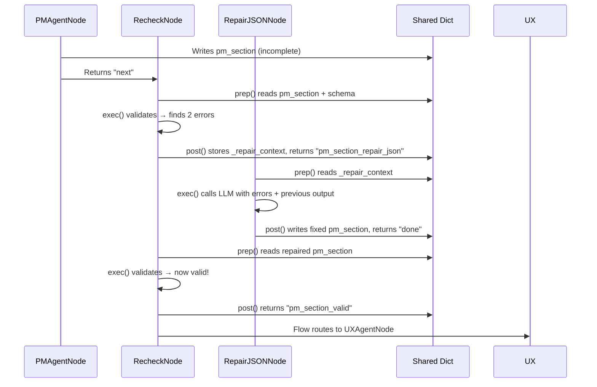

# Chapter 4: Recheck & Repair Loop (Self-Healing Validation)

Welcome back! 🎉

In [Chapter 3: Shared State Dictionary (The "Whiteboard")](03_shared_state_dictionary__the__whiteboard___.md), we learned how all nodes communicate through a single shared dictionary — the "whiteboard" that persists across the entire pipeline. Nodes read what they need in `prep`, do work in `exec`, and write results in `post`.

But there's a catch: **LLMs make mistakes.** They return invalid JSON, forget required fields, or write specifications that contradict each other (e.g., an API endpoint that doesn't match the domain model).

How do we handle this *automatically* without human babysitting?

---

## The Problem: "LLMs Are Creative, Not Precise"

Imagine you ask an LLM to write a JSON spec for a "User" entity:

```json
{
  "name": "User",
  "fields": ["id", "email", "password"]
}
```

But the schema requires `"type": "entity"`, `"aggregate_root": true`, and `"events": []`. The LLM forgot them. Or worse — it returns:

```json
{
  "name": "User",
  "fields": ["id", "email", "password"  // ← missing closing bracket!
}
```

**Invalid JSON.** The next node crashes.

Even if JSON is valid, the *content* might be wrong:
- API Design says `GET /users/{id}` returns `UserDto`
- But Domain Model says the aggregate is `User` (no "Dto" suffix)
- Data Design has a table `users` but API expects `user_profiles`

**Cross-section inconsistency.** The generated code won't compile.

---

## The Solution: A Code Reviewer That Fixes Its Own Feedback

Think of a **human code review**:

1. **Reviewer** reads your PR → finds issues
2. **You** fix the issues → push again
3. **Reviewer** re-checks → if clean, approves; if not, repeat
4. After **N rounds**, reviewer says "Ship it with known issues" rather than blocking forever

The **Recheck & Repair Loop** automates this:

```mermaid
flowchart LR
    Agent[Agent Node\n(e.g., PM Agent)] --> Recheck[RecheckNode\nValidate JSON + Consistency]
    Recheck -- Valid --> Next[Next Agent]
    Recheck -- JSON Error --> RepairJSON[RepairJSONNode\nFix syntax, re-prompt LLM]
    Recheck -- Consistency Error --> RepairConsistency[RepairConsistencyNode\nFix semantic mismatches]
    RepairJSON --> Recheck
    RepairConsistency --> Recheck
    Recheck -- Max Attempts --> ForceProceed[Force Proceed\nwith Warning]
```

**Key idea**: After *every* agent node, a `RecheckNode` validates output. If invalid, it routes to a repair node that **re-prompts the LLM with the exact errors**. The loop repeats until valid — or until a max-attempt limit forces continuation with a warning.

---

## Core Concepts

### 1. RecheckNode — The Validator

`RecheckNode` runs after each agent. It checks two things:

| Check | What It Validates | Example Failure |
|-------|-------------------|-----------------|
| **JSON Schema** | Required keys, types, enums | Missing `"aggregate_root": true` |
| **Cross-Section Consistency** | References between sections | API endpoint `/users` but no `User` aggregate |

```python
# Simplified from recheck_repair_nodes.py
class RecheckNode(Node):
    def prep(self, shared):
        # Which section just finished? (e.g., "pm_section", "api_design_section")
        section = get_latest_completed_section(shared)
        data = shared.get(section, {})
        all_sections = {k: shared.get(k) for k in SECTION_ORDER}
        repair_count = shared.get(f"_repair_count_{section}", 0)
        return {"section": section, "data": data, "all_sections": all_sections, "repair_count": repair_count}

    def exec(self, prep_res):
        # 1. Schema validation
        schema = get_schema(prep_res["section"])
        errors = validate_json_structure(prep_res["data"], schema)
        
        # 2. Consistency checks (only for certain sections)
        inconsistencies = []
        if prep_res["section"] in CONSISTENCY_SECTIONS:
            inconsistencies = run_consistency_checker(prep_res["all_sections"], prep_res["section"])
        
        if errors:
            return {"status": "repair_json", "errors": errors, "inconsistencies": []}
        if inconsistencies:
            return {"status": "repair_consistency", "errors": [], "inconsistencies": inconsistencies}
        return {"status": "valid", "errors": [], "inconsistencies": []}

    def post(self, shared, prep_res, exec_res):
        section = prep_res["section"]
        if exec_res["status"] == "valid":
            return f"{section}_valid"  # Flow routes to next agent
        
        # Increment repair counter
        count_key = f"_repair_count_{section}"
        shared[count_key] = shared.get(count_key, 0) + 1
        
        # Max attempts reached? Force proceed with warning
        if shared[count_key] >= MAX_ATTEMPTS:
            shared["errors"] = shared.get("errors", []) + [
                f"Max repair attempts exceeded for {section}. Proceeding with best effort."
            ]
            return f"{section}_valid"  # Force proceed!
        
        # Store repair context for repair nodes
        shared["_repair_context"] = {
            "section": section,
            "errors": exec_res.get("errors", []),
            "inconsistencies": exec_res.get("inconsistencies", []),
            "previous_output": json.dumps(prep_res["data"], indent=2),
            "attempt": shared[count_key]
        }
        
        # Route to appropriate repair node
        if exec_res["status"] == "repair_json":
            return f"{section}_repair_json"
        return f"{section}_repair_consistency"
```

**Flow wiring** (from `flow.py`):
```python
pm_agent - "next" >> recheck
recheck - "pm_section_valid" >> ux_agent
recheck - "pm_section_repair_json" >> repair_json
recheck - "pm_section_repair_consistency" >> repair_consistency
repair_json - "done" >> recheck
repair_consistency - "done" >> recheck
```

---

### 2. RepairJSONNode — Fix Syntax Errors

When JSON is invalid (missing keys, wrong types, truncated), `RepairJSONNode` re-prompts the LLM:

```python
# Simplified from recheck_repair_nodes.py
class RepairJSONNode(Node):
    def prep(self, shared):
        ctx = shared.get("_repair_context", {})
        return {
            "section": ctx.get("section"),
            "errors": ctx.get("errors", []),
            "previous_output": ctx.get("previous_output", ""),
            "attempt": ctx.get("attempt", 1)
        }

    def exec(self, prep_res):
        schema = get_schema(prep_res["section"])
        required_keys = schema.get("required", [])
        
        prompt = f"""The JSON you produced has errors. Fix them.

ERRORS:
{json.dumps(prep_res["errors"], indent=2)}

YOUR PREVIOUS OUTPUT:
{prep_res["previous_output"]}

REQUIRED KEYS: {json.dumps(required_keys)}

Return ONLY valid JSON with all required keys."""
        
        return call_llm("You are a JSON repair specialist.", prompt, temperature=0.1)

    def post(self, shared, prep_res, exec_res):
        try:
            repaired = json.loads(exec_res)
            # Write fixed data back to shared
            shared[prep_res["section"]] = repaired
            return "done"  # Back to RecheckNode
        except json.JSONDecodeError:
            shared["errors"] = shared.get("errors", []) + [
                f"Repair attempt {prep_res['attempt']} failed: still invalid JSON"
            ]
            return "error"  # RecheckNode will retry or force proceed
```

**Analogy**: Like a linter that not only *reports* "missing semicolon" but *adds* the semicolon for you.

---

### 3. RepairConsistencyNode — Fix Semantic Mismatches

When JSON is valid but *content* contradicts other sections (e.g., API references unknown aggregate), `RepairConsistencyNode` gets the relevant sections and asks the LLM to reconcile:

```python
# Simplified from recheck_repair_nodes.py
class RepairConsistencyNode(Node):
    def prep(self, shared):
        ctx = shared.get("_repair_context", {})
        section = ctx.get("section")
        
        # Gather only sections relevant to this consistency check
        relevant = get_relevant_sections_for_consistency("business", section)
        sections = {k: shared.get(k, {}) for k in relevant}
        
        return {
            "section": section,
            "inconsistencies": ctx.get("inconsistencies", []),
            "sections": sections,
            "is_retry": len(shared.get("errors", [])) > 0,
            "error_log": shared.get("errors", [])
        }

    def exec(self, prep_res):
        # If this is a retry, include previous errors in prompt
        retry_context = ""
        if prep_res["is_retry"]:
            retry_context = f"\nPREVIOUS REPAIR FAILED. Errors: {json.dumps(prep_res['error_log'])}"
        
        prompt = f"""Fix these consistency issues across specification sections.

INCONSISTENCIES:
{json.dumps(prep_res["inconsistencies"], indent=2)}

RELEVANT SECTIONS:
{json.dumps(prep_res["sections"], indent=2, default=str)}

{retry_context}

Return ONLY the corrected JSON for section: {prep_res["section"]}"""
        
        return call_llm("You are a specification consistency specialist.", prompt, temperature=0.2)

    def post(self, shared, prep_res, exec_res):
        # Loop detection: same inconsistencies seen twice → give up
        seen_key = f"_seen_inconsistencies_{prep_res['section']}"
        seen = shared.get(seen_key, [])
        sig = json.dumps(sorted(prep_res["inconsistencies"]), sort_keys=True)
        
        if sig in seen and seen.count(sig) >= 2:
            shared[f"_unfixable_{prep_res['section']}"] = True
            shared["errors"] = shared.get("errors", []) + [
                f"Unfixable consistency loop in {prep_res['section']}. Manual intervention needed."
            ]
            return "error"
        
        seen.append(sig)
        shared[seen_key] = seen
        
        # Apply repair
        repaired = extract_json(exec_res)  # Robust JSON extraction
        if repaired:
            shared[prep_res["section"]] = {**shared.get(prep_res["section"], {}), **repaired}
            return "done"
        return "error"
```

**Analogy**: Like an architect noticing "the kitchen door opens into the bathroom" and redrawing the floor plan.

---

### 4. Loop Counter & Force-Proceed — The Safety Valve

Without a limit, a stubborn inconsistency could loop forever. The **repair counter** prevents this:

```python
# In RecheckNode.post()
count_key = f"_repair_count_{section}"
shared[count_key] = shared.get(count_key, 0) + 1

if shared[count_key] >= MAX_ATTEMPTS:  # MAX_ATTEMPTS = 3
    shared["errors"].append(f"Max attempts for {section}. Forcing proceed.")
    return f"{section}_valid"  # Continue pipeline!
```

**Behavior**:
- Attempts 1-2: Normal repair loop
- Attempt 3: Force proceed with warning logged to `shared["errors"]`
- Pipeline continues — **never halts silently**

**Why not halt?** In a multi-stage pipeline, halting at Stage 1 (Business Spec) means Stages 2-4 never run. Better to have *imperfect but complete* artifacts than *perfect but missing* ones.

---

## How It Works: Step-by-Step Walkthrough

Let's trace a concrete example: **PM Agent writes `pm_section`, then RecheckNode validates it**.

### Scenario
PM Agent outputs:
```json
{
  "problem_statement": "Companies need to hire",
  "goals": ["Reduce time-to-hire"],
  "non_goals": [],
  "success_metrics": [],
  "stakeholders": {"decision_maker": "CTO"},
  "assumptions": ["Budget approved"]
}
```
**Missing**: `goals` should have 3+ items (schema rule), `success_metrics` required.

### Sequence Diagram



### Shared State Evolution

| Step | `shared["pm_section"]` | `shared["_repair_count_pm_section"]` | `shared["_repair_context"]` |
|------|------------------------|--------------------------------------|----------------------------|
| After PM Agent | `{incomplete JSON}` | 0 | (none) |
| After Recheck (1st fail) | `{incomplete JSON}` | 1 | `{errors: [...], previous_output: "..."}` |
| After RepairJSON | `{fixed JSON}` | 1 | (cleared) |
| After Recheck (2nd pass) | `{fixed JSON}` | 1 | (none) → returns valid |

---

## Internal Implementation Deep Dive

### 1. Validation Logic (`utils/external_tools.py`)

Two validators power `RecheckNode.exec()`:

#### Schema Validation
```python
def validate_json_structure(data, schema):
    errors = []
    # Check required keys
    for k in schema.get("required", []):
        if k not in data:
            errors.append(f"Missing required key: '{k}'")
    # Check types
    for k, expected_type in schema.get("types", {}).items():
        if k in data and not isinstance(data[k], expected_type):
            errors.append(f"Key '{k}' expected {expected_type.__name__}, got {type(data[k]).__name__}")
    return errors
```

#### Consistency Checkers (Business & System)
```python
def _business_consistency_checker(sections, current_section):
    issues = []
    pm = sections.get("pm_section", {})
    ux = sections.get("ux_section", {})
    
    # Example: PM stakeholders must appear in UX personas
    if current_section == "ux_section" and pm and ux:
        stakeholder_cats = set(pm.get("stakeholders", {}).keys())
        persona_roles = {p.get("role", "").lower() for p in ux.get("personas", [])}
        missing = stakeholder_cats - persona_roles
        if missing:
            issues.append(f"PM stakeholders {missing} not covered by UX personas")
    
    return issues
```

```python
def _system_consistency_checker(sections, current_section):
    issues = []
    domain = sections.get("domain_model_section", {})
    api = sections.get("api_design_section", {})
    
    # Example: API endpoints must map to domain aggregates
    if current_section == "api_design_section" and domain and api:
        aggregates = [a.get("name", "") for a in domain.get("aggregates", [])]
        for ep in api.get("endpoints", []):
            path = ep.get("path", "")
            # Heuristic: path should contain aggregate name
            if not any(agg.lower() in path.lower() for agg in aggregates):
                issues.append(f"API endpoint '{path}' doesn't match any domain aggregate: {aggregates}")
    
    return issues
```

---

### 2. Robust JSON Extraction (`utils/external_tools.py`)

LLMs often wrap JSON in markdown or add commentary. `extract_json()` handles this:

```python
def extract_json(text):
    # 1. Try direct parse
    try: return json.loads(text)
    except: pass
    
    # 2. Extract from ```json``` code blocks
    md = re.search(r'```(?:\w+)?\s*\n?(.*?)\n?```', text, re.DOTALL)
    if md:
        for fixer in (lambda x: x, fix_truncated_json):
            try: return json.loads(fixer(md.group(1).strip()))
            except: continue
    
    # 3. Find outermost { ... } or [ ... ]
    for start, end in [('{', '}'), ('[', ']')]:
        # ... bracket matching logic ...
    
    # 4. Last resort: fix truncated JSON
    try: return json.loads(fix_truncated_json(text))
    except: return None
```

This is why repair nodes can return "dirty" output — the extractor cleans it.

---

### 3. Loop Detection & Unfixable Flag

Both repair nodes track seen issues to detect infinite loops:

```python
# In RepairConsistencyNode.post()
seen_key = f"_seen_inconsistencies_{section}"
seen = shared.get(seen_key, [])
sig = json.dumps(sorted(inconsistencies), sort_keys=True)

if sig in seen and seen.count(sig) >= 2:
    shared[f"_unfixable_{section}"] = True  # Permanent flag
    return "error"  # Don't loop back to creator
```

Later, `RecheckNode` checks this flag:

```python
# In RecheckNode.post()
if shared.get(f"_unfixable_{section}"):
    shared["errors"].append(f"Skipping unfixable {section}")
    return f"{section}_valid"  # Force proceed!
```

---

## Wiring in the Workflows

### Business Spec Workflow (`flow.py`)

```python
# After each agent → Recheck → Repair loops
pm_agent - "next" >> recheck
recheck - "pm_section_valid" >> ux_agent
recheck - "pm_section_repair_json" >> repair_json
recheck - "pm_section_repair_consistency" >> repair_consistency
recheck - "pm_section_max_attempt_error" >> pm_agent  # Back to creator!

repair_json - "done" >> recheck
repair_consistency - "done" >> recheck
```

**Note**: `*_max_attempt_error` routes **back to the creator agent** (PM Agent) — not to repair nodes. This gives the original agent a fresh chance with accumulated feedback.

---

### System Spec Workflow (Same Pattern)

```python
architect - "next" >> recheck
recheck - "architecture_section_valid" >> domain_model
recheck - "architecture_section_repair_json" >> repair_json
recheck - "architecture_section_repair_consistency" >> repair_consistency
recheck - "architecture_section_max_attempt_error" >> architect
# ... repeats for domain_model, api_design, data_design, etc.
```

---

### Tasks Workflow (Different Checks)

For tasks, `RecheckNode` validates:
1. **Task list structure** (required fields, no duplicate IDs)
2. **Dependency graph** (no cycles, no unknown refs)
3. **Critical path analysis** (references valid tasks, positive duration)

```python
# In exec_task() — utils/external_tools.py
def exec_task(prep_res):
    target = prep_res["check_target"]
    if target == "tasks":
        ok, errs = _validate_task_list(prep_res["tasks"])
        if not ok:
            return {"status": "repair_json", "errors": errs}
        dep_issues = _validate_dependency_graph(prep_res["tasks"])
        if dep_issues:
            return {"status": "repair_dependencies", "issues": dep_issues}
    # ... critical_path, implementation_plan
```

Specialized repair nodes: `RepairDependenciesNode`, `RepairCriticalPathNode`.

---

## Why This Design Works

| Challenge | How Recheck & Repair Solves It |
|-----------|-------------------------------|
| **Invalid JSON** | `RepairJSONNode` re-prompts with exact schema errors |
| **Cross-section drift** | `RepairConsistencyNode` sees *all relevant sections* at once |
| **Infinite loops** | Counter + loop detection + force-proceed after N attempts |
| **Silent failures** | Every error logged to `shared["errors"]` — visible at end |
| **Context loss** | Repair prompt includes *previous output* + *exact errors* |
| **Partial fixes** | Recheck runs *after every repair* — validates full section |

---

## Debugging Tip: Inspect the Repair Trail

At any point, check `shared` for the repair history:

```python
# In a debugger or print statement
print("Repair counts:", {k: v for k, v in shared.items() if k.startswith("_repair_count_")})
print("Unfixable flags:", {k: v for k, v in shared.items() if k.startswith("_unfixable_")})
print("Seen inconsistencies:", {k: v for k, v in shared.items() if k.startswith("_seen_")})
print("Errors:", shared.get("errors", []))
```

Output example:
```
Repair counts: {'_repair_count_pm_section': 2, '_repair_count_ux_section': 1}
Unfixable flags: {'_unfixable_ba_section': True}
Seen inconsistencies: {'_seen_inconsistencies_ux_section': ['["PM stakeholders blockers not covered"]', '["PM stakeholders blockers not covered"]']}
Errors: ['Max repair attempts exceeded for ba_section. Proceeding with best effort.']
```

---

## Summary: What You Learned

| Component | Role | Key Mechanism |
|-----------|------|---------------|
| **RecheckNode** | Validator after every agent | Schema check + consistency check → routes to repair or next |
| **RepairJSONNode** | Fixes syntax/structure | Re-prompts LLM with errors + previous output + required keys |
| **RepairConsistencyNode** | Fixes semantic mismatches | Re-prompts LLM with inconsistencies + relevant cross-sections |
| **Loop Counter** | Prevents infinite retries | `_repair_count_{section}` → force proceed at `MAX_ATTEMPTS=3` |
| **Loop Detection** | Catches unfixable patterns | `_seen_inconsistencies_{section}` → sets `_unfixable_{section}` |
| **Force Proceed** | Never halts pipeline | Returns `*_valid` even on failure, logs warning to `errors` |

---

## What's Next?

You now understand how the pipeline **self-heals** after every LLM call. But all this specification work is pointless if we don't enforce a **fixed technology stack** — the same TypeScript, NestJS, Prisma, Vitest, Yarn 4 PnP stack for every generated project.

In the next chapter, we'll see how CODING bakes the tech stack into every prompt, validator, and generator so the output is always consistent and runnable.

👉 **[Chapter 5: Fixed Tech Stack Enforcement](05_fixed_tech_stack_enforcement_.md)**

