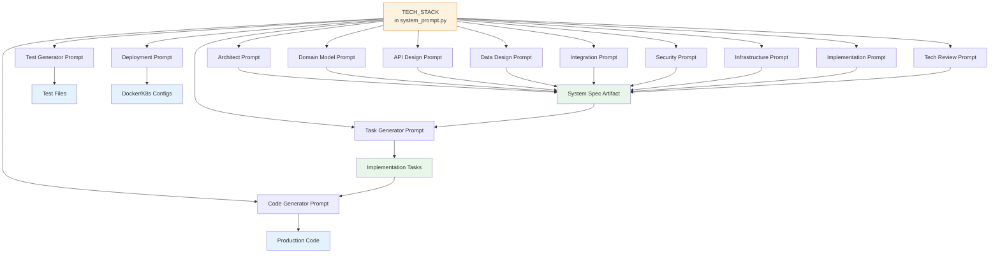

# Chapter 5: Fixed Tech Stack Enforcement


Welcome back! 🎉

In [Chapter 4: Recheck & Repair Loop (Self-Healing Validation)](04_recheck___repair_loop__self_healing_validation__.md), we learned how the pipeline **self-heals** after every LLM call — validating JSON structure, checking cross-section consistency, and repairing errors automatically with escalating strategies.

But there's a foundational decision that makes all that validation *meaningful*: **what technology stack are we building with?**

Imagine if the Architect chose **NestJS** for the API, the API Designer wrote **Fastify** routes, the Data Designer generated **Prisma** models, and the Code Generator produced **Express** controllers. The result? A Frankenstein codebase that doesn't compile.

This chapter explains how CODING **eliminates that chaos** by treating the tech stack as **immutable constants** — defined once, enforced everywhere.

---

## The Problem: "Decision Fatigue & Drift"

When you ask an LLM to "build a backend," it has to make dozens of micro-decisions:

| Decision | Options LLM Might Pick |
|----------|------------------------|
| Runtime | Node.js 18, 20, 22, 24, Bun, Deno |
| Language | JavaScript, TypeScript 4.x, 5.x |
| Framework | Express 4, Express 5, Fastify, NestJS, Koa, Hono |
| Database | PostgreSQL, MySQL, MongoDB, SQLite, PlanetScale |
| ORM | Prisma, TypeORM, Drizzle, Sequelize, Kysely |
| Auth | jsonwebtoken, jose, lucia, next-auth, custom |
| Validation | Zod, Yup, Joi, Valibot, class-validator |
| Testing | Jest, Vitest, Mocha, AVA, uvu |
| Package Manager | npm, yarn 1, yarn 4 (PnP), pnpm, bun |

**Without constraints**, each agent (Architect, API Designer, Data Designer, Task Generator, Code Generator) might pick **different answers** for the same project. The result:
- **Incompatible artifacts**: API spec says Express, DB schema says Prisma, code uses TypeORM
- **Decision fatigue**: LLMs waste tokens "choosing" instead of building
- **Non-reproducible builds**: Run the pipeline twice → get two different stacks

---

## The Solution: One Source of Truth, Enforced Everywhere

CODING defines the **entire technology stack once** in a single constant: `TECH_STACK`. Every system prompt receives this stack and is explicitly instructed:

> **"These are FIXED. Do not suggest alternatives."**

It's like a **company-mandated tech radar** that every architect must follow — no exceptions, no "but I prefer NestJS."

---

## The `TECH_STACK` Constant: Single Source of Truth

Open `utils/system_prompt.py` and you'll find this at the very top:

```python
# utils/system_prompt.py
TECH_STACK = {
    "runtime": "Node.js 24 LTS",
    "language": "TypeScript 5.x",
    "framework": "Express.js 5.x",
    "database": "MySQL 8.x",
    "orm": "TypeORM 0.3.x",
    "cache": "Memcached 1.6.42",
    "queue": "Kafka",
    "auth": "JWT (jose) + argon2",
    "validation": "Zod 4.x",
    "testing": "Vitest + Supertest",
    "logging": "Pino",
    "api_docs": "OpenAPI 3.1 + Swagger UI",
    "deployment": "Docker",
    "ci_cd": "GitHub Actions"
}
```

**That's it.** One dictionary. 15 key-value pairs. The entire stack.

---

## How It Flows: From Constant → Prompts → Artifacts



**Every prompt** that makes technical decisions gets `TECH_STACK` injected. Let's see how.

---

## Injection Pattern: F-Strings in Prompts

In `utils/system_prompt.py`, each system prompt is a **multi-line f-string** that embeds `TECH_STACK` values:

```python
# utils/system_prompt.py — Architect Prompt (simplified)
ARCHITECT_PROMPT = f"""You are a Principal Solutions Architect.

MANDATORY TECHNOLOGY STACK (non-negotiable):
- Runtime: {TECH_STACK['runtime']}
- Language: {TECH_STACK['language']}
- Framework: {TECH_STACK['framework']}
- Database: {TECH_STACK['database']}
- ORM: {TECH_STACK['orm']}
- Cache: {TECH_STACK['cache']}
- Queue: {TECH_STACK['queue']}
- Auth: {TECH_STACK['auth']}
- Validation: {TECH_STACK['validation']}
- Testing: {TECH_STACK['testing']}
- Logging: {TECH_STACK['logging']}
- API Docs: {TECH_STACK['api_docs']}
- Deployment: {TECH_STACK['deployment']}
- CI/CD: {TECH_STACK['ci_cd']}

Rules:
- Technology choices above are FIXED. Do not suggest alternatives.
- For non-stack decisions (e.g., search engine), provide 2-3 alternatives with trade-offs.
...
"""
```

**Same pattern** for Domain Model, API Design, Data Design, Security, Infrastructure, Implementation, Tech Review, Task Generator, Code Generator, Test Generator, Deployment — **all 13 prompts**.

---

## Enforcement in Action: Architect Node

Let's trace how `ArchitectNode` uses this prompt.

### 1. Node Preparation (`system_nodes.py`)

```python
# system_nodes.py — ArchitectNode
class ArchitectNode(Node):
    def prep(self, shared):
        return {
            "business_spec": shared.get("business_spec", {}),
            "existing_architecture": shared.get("architecture_section", {}),
            "feedback": get_latest_feedback(shared, "architecture"),
            "tech_stack": TECH_STACK,  # ← Passed to prompt context
            "is_retry": len(shared.get("errors", [])) > 0,
            "error_log": shared.get("errors", []),
        }
```

### 2. Prompt Execution

```python
    def exec(self, prep_res):
        if prep_res["existing_architecture"] and not prep_res["feedback"]:
            return json.dumps(prep_res["existing_architecture"])
        
        context = {
            "business_requirements": compress_business_spec_for_architecture(prep_res["business_spec"]),
            "previous_version": prep_res["existing_architecture"],
            "feedback_to_address": prep_res["feedback"],
        }
        
        # The prompt ALREADY has TECH_STACK baked in via f-string
        prompt = f"Design system architecture. Context:{json.dumps(context, indent=2)}"
        return call_llm(ARCHITECT_PROMPT, prompt, temperature=0.2)
```

**Key insight**: The LLM **never sees `TECH_STACK` as a variable**. It sees a prompt that *already contains* the fixed stack as plain text. The instruction *"These are FIXED. Do not suggest alternatives."* is part of the prompt itself.

---

## What the LLM Sees: Concrete Example

When `ArchitectNode` runs, the LLM receives a prompt that **literally contains**:

```text
MANDATORY TECHNOLOGY STACK (non-negotiable):
- Runtime: Node.js 24 LTS
- Language: TypeScript 5.x
- Framework: Express.js 5.x
- Database: MySQL 8.x
- ORM: TypeORM 0.3.x
- Cache: Memcached 1.6.42
- Queue: Kafka
- Auth: JWT (jose) + argon2
- Validation: Zod 4.x
- Testing: Vitest + Supertest
- Logging: Pino
- API Docs: OpenAPI 3.1 + Swagger UI
- Deployment: Docker
- CI/CD: GitHub Actions

Rules:
- Technology choices above are FIXED. Do not suggest alternatives.
```

The LLM **cannot** respond with "I'll use NestJS and Prisma" — the prompt explicitly forbids it.

---

## Cross-Agent Consistency: Same Stack, Everywhere

Because **every prompt** uses the same `TECH_STACK` constant, all agents are aligned:

| Agent | Prompt Snippet | Enforced Decision |
|-------|----------------|-------------------|
| **Architect** | `Framework: {TECH_STACK['framework']}` | Express.js 5.x (not NestJS) |
| **Domain Modeler** | `ORM: {TECH_STACK['orm']}` | TypeORM 0.3.x (not Prisma) |
| **API Designer** | `Framework: {TECH_STACK['framework']}, Validation: {TECH_STACK['validation']}` | Express + Zod |
| **Data Designer** | `Database: {TECH_STACK['database']}, ORM: {TECH_STACK['orm']}` | MySQL + TypeORM |
| **Security** | `Auth: {TECH_STACK['auth']}` | jose + argon2 (not jsonwebtoken) |
| **Task Generator** | Full `TECH_STACK` in prompt | Tasks reference TypeORM, Zod, Vitest |
| **Code Generator** | Full `TECH_STACK` in prompt | Generates Express routes, TypeORM entities, Zod schemas |
| **Test Generator** | Full `TECH_STACK` in prompt | Writes Vitest + Supertest tests |
| **Deployment** | `Deployment: {TECH_STACK['deployment']}, CI/CD: {TECH_STACK['ci_cd']}` | Docker + GitHub Actions |

---

## Validation: Tech Review Node Checks Compliance

The `TechReviewNode` doesn't just check quality — it **verifies stack compliance**:

```python
# system_nodes.py — TechReviewNode (simplified)
class TechReviewNode(Node):
    def prep(self, shared):
        return {
            "architecture": shared.get("architecture_section", {}),
            "domain_model": shared.get("domain_model_section", {}),
            "api_design": shared.get("api_design_section", {}),
            # ... all sections ...
            "tech_stack": TECH_STACK,  # ← Reference for validation
        }

    def exec(self, prep_res):
        context = {
            "system_summary": compress_system_for_tech_review({...}),
            "iteration": prep_res["iteration"],
            "max_iterations": prep_res["max_iterations"],
        }
        prompt = f"Review system specification. Context:{json.dumps(context)}"
        return call_llm(TECH_REVIEW_PROMPT, prompt, temperature=0.15)

    def post(self, shared, prep_res, exec_res):
        parsed = parse_llm_json(exec_res)
        review = parsed
        shared["review"] = review
        shared["quality_score"] = review.get("quality_score", 0)
        
        # Check stack_compliance from review
        stack_compliance = review.get("stack_compliance", {})
        if not stack_compliance.get("compliant", True):
            violations = stack_compliance.get("violations", [])
            shared["errors"] = shared.get("errors", []) + [
                f"Stack compliance violation: {v}" for v in violations
            ]
        # ... routing logic ...
```

The `TECH_REVIEW_PROMPT` explicitly asks:

```python
# utils/system_prompt.py
TECH_REVIEW_PROMPT = f"""...
Rules:
- CROSS-SECTION VALIDATION (critical):
  * Does API design (Express routes + Zod) match domain model (TypeORM entities)?
  * Does data design (MySQL + TypeORM) support API contracts (Zod schemas)?
  * Does infrastructure (Docker + GitHub Actions) support Node.js 24 LTS scaling?
  * Does security (jose + argon2) align with Express middleware pipeline?
- Flag technology mismatches: e.g., suggesting MongoDB instead of MySQL, 
  or jsonwebtoken instead of jose.
...
Output JSON:
{{
  "stack_compliance": {{"compliant": true|false, "violations": [...]}},
  ...
}}
"""
```

If the Architect accidentally wrote "NestJS" somewhere, the Tech Reviewer **catches it** and routes back for repair.

---

## Task Generation: Stack-Aware Tasks

The `TaskGeneratorNode` receives `TECH_STACK` and generates tasks that **reference specific stack components**:

```python
# task_nodes.py — TaskGeneratorNode
class TaskGeneratorNode(Node):
    def prep(self, shared):
        return {
            "system_spec": shared.get("system_spec", {}),
            "structured_sections": shared.get("structured_sections", {}),
            "flat_context": shared.get("flat_context", {}),
            "existing_tasks": shared.get("tasks", []),
            "tech_stack": TECH_STACK,  # ← Available for task generation
            "is_retry": len(shared.get("errors", [])) > 0,
            "error_log": shared.get("errors", []),
        }
```

The `TASK_GENERATOR_PROMPT` includes:

```python
# utils/system_prompt.py
TASK_GENERATOR_PROMPT = f"""...
MANDATORY TECHNOLOGY STACK (every task must reference these):
- Runtime: {TECH_STACK['runtime']}
- Language: {TECH_STACK['language']}
- Framework: {TECH_STACK['framework']}
- Database: {TECH_STACK['database']}
- ORM: {TECH_STACK['orm']}
- Cache: {TECH_STACK['cache']}
- Queue: {TECH_STACK['queue']}
- Auth: {TECH_STACK['auth']}
- Validation: {TECH_STACK['validation']}
- Testing: {TECH_STACK['testing']}
- Logging: {TECH_STACK['logging']}
- API Docs: {TECH_STACK['api_docs']}
- Deployment: {TECH_STACK['deployment']}
- CI/CD: {TECH_STACK['ci_cd']}

Rules for task generation:
...
5. Every task must include TypeORM, Zod, Express, or other stack-specific implementation details
...
Task categories (use exactly these):
- setup: Project initialization, tooling, configuration files
- database: TypeORM entities, migrations, data sources
- domain_model: Domain services, value objects, aggregates, repositories
- api: Express routers, controllers, middleware, Zod schemas
- integration: Kafka consumers/producers, external API clients, webhooks
- security: Auth middleware, JWT handling, argon2 hashing, RBAC, helmet
...
"""
```

**Result**: Tasks like:
```json
{
  "task_id": "TASK-015",
  "title": "Create User TypeORM Entity",
  "category": "database",
  "tech_stack_components": ["TypeORM 0.3.x", "MySQL 8.x", "TypeScript 5.x"],
  "files_to_create": [
    {"path": "src/modules/user/entities/User.ts", "purpose": "TypeORM entity with @Entity, @PrimaryGeneratedColumn, @Column"}
  ],
  "coding_agent_context": {
    "implementation_notes": "Use TypeORM 0.3.x Repository pattern. Avoid Active Record. Use Zod 4.x for runtime validation."
  }
}
```

---

## Code Generation: Stack-Enforced Output

The `CodeGeneratorNode` uses `CODE_GENERATOR_PROMPT` which **bakes in the entire stack**:

```python
# utils/system_prompt.py
CODE_GENERATOR_PROMPT = """...
MANDATORY TECHNOLOGY STACK:
- Package Manager: Yarn 4.x (PnP — NO node_modules, use .pnp.cjs)
- Runtime: Node.js 24 LTS
- Language: TypeScript 5.x
- Framework: Express.js 5.x
- Database: MySQL 8.x via TypeORM 0.3.x
- Cache: Memcached 1.6.42
- Queue: Kafka
- Auth: JWT (jose) + argon2
- Validation: Zod 4.x
- Testing: Vitest + Supertest
- Logging: Pino
- API Docs: OpenAPI 3.1 + Swagger UI

CRITICAL RULES:
1. Generate COMPLETE, compilable files — no stubs, no TODOs, no placeholders
2. Every function must have full implementation with proper error handling
3. Use TypeScript strict mode: explicit types, no implicit any
4. TypeORM 0.3.x: Use Repository pattern (NOT ActiveRecord). DataSource.getRepository(Entity)
5. Zod 4.x: Define schemas separately, export both schema and inferred type
6. Express 5.x: Use async handlers with try/catch, return proper JSON responses
7. Pino: Use structured logging, never console.log
8. JWT (jose): Use jwtVerify for validation, jwtSign for creation
9. argon2: Use argon2id, memoryCost: 65536, timeCost: 3
10. Kafka: Use consumer.run with eachMessage handler
11. MySQL: Use TypeORM migrations, never raw queries in business logic
...
"""
```

**The generated code** automatically uses:
- `import { Entity, Column } from 'typeorm'` (not Prisma)
- `import { z } from 'zod'` (not Yup)
- `import { jwtVerify } from 'jose'` (not jsonwebtoken)
- `import pino from 'pino'` (not Winston)
- `import { test, expect } from 'vitest'` (not Jest)

---

## Why This Design Works

| Benefit | How It's Achieved |
|---------|-------------------|
| **Zero decision fatigue** | LLMs never choose stack — it's pre-decided |
| **Cross-agent consistency** | Same `TECH_STACK` injected into all 13 prompts |
| **Immediate compatibility** | API spec matches DB schema matches code |
| **Reproducible builds** | Same input → same stack → same output structure |
| **Easy stack upgrades** | Change `TECH_STACK` in **one file** → entire pipeline updates |
| **Compliance enforcement** | Tech Reviewer validates against `TECH_STACK` |
| **Onboarding** | New developers see one source of truth for stack |

---

## Changing the Stack: One File, One Place

Want to upgrade to **Node.js 26** when it's LTS? Change **one line**:

```python
# utils/system_prompt.py
TECH_STACK = {
    "runtime": "Node.js 26 LTS",  # ← Only change here
    "language": "TypeScript 5.x",
    # ... rest unchanged
}
```

**Every prompt, every agent, every generated artifact** automatically reflects the new version. No find-and-replace across dozens of files.

---

## Analogy: The Company Tech Radar

Think of `TECH_STACK` as your **company's approved technology radar**:

```
┌─────────────────────────────────────┐
│       COMPANY TECH RADAR            │
├─────────────────────────────────────┤
│  ADOPT (Use freely)                 │
│  • Node.js 24 LTS                   │
│  • TypeScript 5.x                   │
│  • Express.js 5.x                   │
│  • MySQL 8.x + TypeORM              │
│  • Zod 4.x + Vitest + Pino          │
│  • Docker + GitHub Actions          │
├─────────────────────────────────────┤
│  TRIAL (Need approval)              │
│  • None — stack is fixed            │
├─────────────────────────────────────┤
│  ASSESS (Evaluating)                │
│  • None — stack is fixed            │
├─────────────────────────────────────┤
│  HOLD (Do not use)                  │
│  • NestJS, Prisma, Jest, Winston    │
│  • jsonwebtoken, Fastify, MongoDB   │
└─────────────────────────────────────┘
```

Every AI architect in the pipeline **must follow this radar**. No exceptions.

---

## What You Learned

| Concept | Description |
|---------|-------------|
| **`TECH_STACK` constant** | Single source of truth for all 15 technology choices |
| **Prompt injection** | F-strings embed stack values directly into every system prompt |
| **Explicit enforcement** | Prompts contain *"These are FIXED. Do not suggest alternatives."* |
| **Cross-agent alignment** | Architect, API Designer, Data Designer, Task Gen, Code Gen all see same stack |
| **Validation gate** | Tech Reviewer checks `stack_compliance` and flags violations |
| **One-file upgrades** | Change `TECH_STACK` in `utils/system_prompt.py` → entire pipeline updates |

---

## What's Next?

You now understand how CODING **enforces a fixed technology stack** across the entire pipeline — from specification to code generation. But a stack definition is useless without a **working project bootstrap** that actually *uses* that stack.

In the next chapter, we'll see how the **Setup Workflow** takes the `TECH_STACK` and generates a **Yarn 4 Plug'n'Play TypeScript project** with all dependencies pinned, Docker configs, CI/CD pipelines, and health checks — ready for the code generator to fill in.

👉 **[Chapter 6: Yarn 4 PnP Project Bootstrap](06_yarn_4_pnp_project_bootstrap_.md)**

