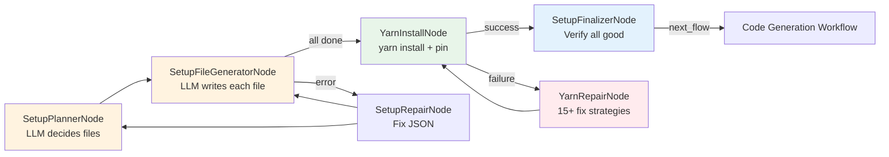
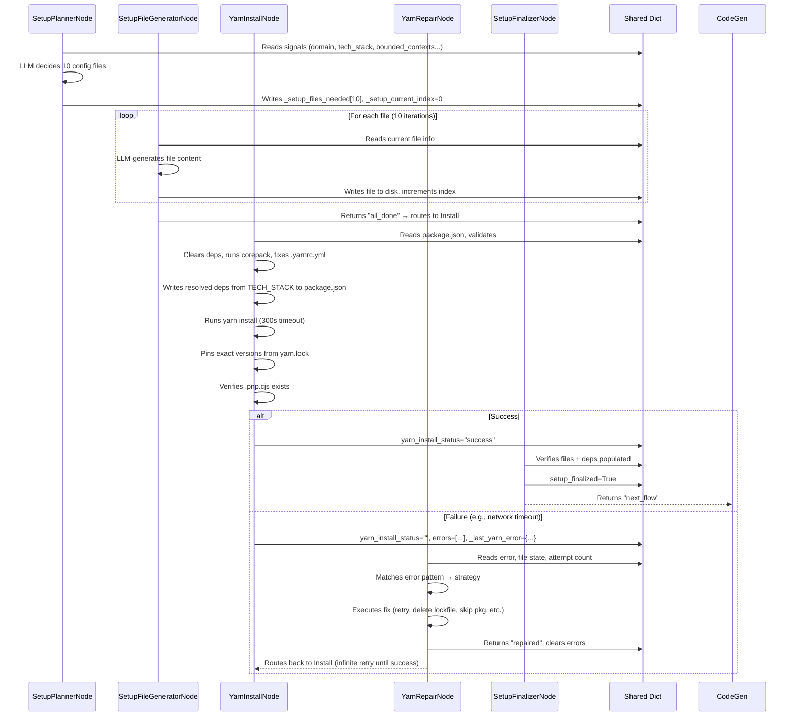
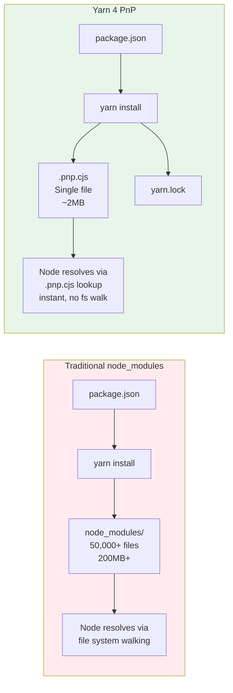

# Chapter 6: Yarn 4 PnP Project Bootstrap

Welcome back! 🎉

In [Chapter 5: Fixed Tech Stack Enforcement](05_fixed_tech_stack_enforcement_.md), we learned how CODING bakes a **single, immutable technology stack** into every prompt — from Architect to Code Generator. The stack includes Node.js 24 LTS, TypeScript 5.x, Express.js 5.x, MySQL 8.x, TypeORM, Zod, Vitest, Yarn 4 PnP, Docker, and more.

But a tech stack on paper doesn't run code. We need a **real, working project** on disk:
- `package.json` with exact dependencies
- `tsconfig.json` for TypeScript
- `.yarnrc.yml` for Plug'n'Play
- `vitest.config.ts` for testing
- `Dockerfile` for deployment
- And critically: **`yarn install` must succeed** so `.pnp.cjs` exists

This chapter shows how CODING **automatically bootstraps** that project — with zero source code, full self-healing, and Yarn 4 Plug'n'Play.

---

## The Problem: "Project Setup is a Minefield"

Imagine you're starting a new TypeScript project with Yarn 4 PnP. You need to:

1. Write `package.json` with the right dependencies (express, typeorm, zod, vitest, pino, jose, argon2, kafkajs, memjs, helmet, cors, dotenv, reflect-metadata, @types/*...)
2. Write `tsconfig.json` with strict mode, ES2022, node16 module resolution
3. Write `.yarnrc.yml` with `nodeLinker: pnp` and `pnpMode: strict`
4. Run `corepack enable && corepack prepare yarn@yarn@stable --activate`
5. Run `yarn install` and hope it works
6. If it fails (network, 404, peer deps, cache corruption, lockfile conflict...), debug and retry
6. Verify `.pnp.cjs` exists
7. Pin exact versions from `yarn.lock` back to `package.json`

**Do this manually once** — it's tedious. **Do it every time you generate a project** — it's a bottleneck. **Do it with an LLM driving** — the LLM might:
- Forget `reflect-metadata` (TypeORM needs it)
- Put `vitest` in `dependencies` instead of `devDependencies`
- Write invalid `.yarnrc.yml` syntax
- Skip `corepack` so `yarn` isn't available
- Not handle a transient network error

---

## The Solution: A Self-Healing, LLM-Driven Bootstrap Pipeline

CODING's **Setup Workflow** is a mini-pipeline that:
1. **Plans** which config files are needed (LLM decides from signals)
2. **Generates** each file one by one (LLM writes content)
3. **Installs** dependencies with Yarn 4 PnP (validates, clears, corepack, installs, pins)
4. **Repairs** any failure automatically (15+ failure modes handled)
5. **Finalizes** only when everything works



**Key principle**: Only **configuration files** are created — never source code (`src/`, `test/`). The LLM acts as a **DevOps architect**, not a developer.

---

## Key Concepts

### 1. SetupPlannerNode — The Architect

The LLM looks at **signals** (project name, domain, tech stack, bounded contexts, integrations, task categories) and decides the **minimal config files** needed.

```python
# setup_nodes.py — SetupPlannerNode.prep()
def prep(self, shared):
    # Skip if already done
    if shared.get("setup_finalized") is True:
        return {"skip": True, "reason": "Already done"}
    
    # Check critical files exist + PnP ready
    critical = ["package.json", "tsconfig.json", ".yarnrc.yml"]
    if all(os.path.exists(os.path.join(workdir, f)) for f in critical) and is_yarn_pnp_ready(workdir):
        return {"skip": True, "reason": "Critical files exist and PnP ready"}
    
    # Extract signals from previous stages
    signals = extract_signals(shared)  # → {project_name, domain, tech_stack, bounded_contexts, ...}
    return {"skip": False, "signals": signals, "is_retry": bool(shared.get("errors")), "error_log": shared.get("errors", [])}
```

**Signals come from** `business_spec`, `system_spec`, `tasks` — see `utils/external_tools.py:extract_signals()`.

```python
# setup_nodes.py — SetupPlannerNode.exec() (simplified prompt)
prompt = f"""You are a project setup architect. Decide MINIMAL configuration files.

Signals: {json.dumps(signals)}

STRICT RULES:
1. ONLY config files — NEVER source code (no src/, test/)
2. ONLY these categories allowed:
   - package.json, tsconfig.json, .yarnrc.yml
   - vitest.config.ts (if testing in signals)
   - .gitignore, .editorconfig, .env.example
   - Dockerfile, .dockerignore (if Docker in signals)
   - .github/workflows/*.yml (if CI/CD in signals)
   - README.md
3. MAX 10 files. More = FAIL.
4. If category not in signals, DO NOT include.

Output JSON array: [{{"path": "package.json", "purpose": "Project manifest"}}]
"""
```

**Output example**:
```json
[
  {"path": "package.json", "purpose": "Project manifest with dependencies"},
  {"path": "tsconfig.json", "purpose": "TypeScript strict config"},
  {"path": ".yarnrc.yml", "purpose": "Yarn 4 PnP configuration"},
  {"path": "vitest.config.ts", "purpose": "Vitest + Supertest config"},
  {"path": "Dockerfile", "purpose": "Multi-stage Docker build"},
  {"path": ".dockerignore", "purpose": "Docker ignore patterns"},
  {"path": ".github/workflows/ci.yml", "purpose": "GitHub Actions CI"},
  {"path": ".gitignore", "purpose": "Git ignore patterns"},
  {"path": ".env.example", "purpose": "Environment template"},
  {"path": "README.md", "purpose": "Project documentation"}
]
```

> 💡 **Why LLM decides?** Different projects need different files. A library doesn't need Docker. A CLI tool doesn't need Kafka. The LLM tailors the bootstrap to the actual project.

---

### 2. SetupFileGeneratorNode — The Builder

Generates **one file at a time** (loop in Flow). Gets the file path + purpose + full project context.

```python
# setup_nodes.py — SetupFileGeneratorNode.prep()
def prep(self, shared):
    files_needed = shared["_setup_files_needed"]
    idx = shared["_setup_current_index"]
    
    # All files already exist? Skip entire batch
    if all(os.path.exists(os.path.join(output_dir, f["path"])) for f in files_needed):
        return {"all_done": True, "all_skipped": True}
    
    if idx >= len(files_needed):
        return {"all_done": True}
    
    current = files_needed[idx]
    full_path = os.path.join(output_dir, current["path"])
    
    # File exists? Skip this one
    if os.path.exists(full_path) and os.path.getsize(full_path) > 0:
        return {"skip": True, "file": current}
    
    return {"file": current, "index": idx, "signals": shared["_setup_signals"], "output_dir": output_dir, ...}
```

```python
# setup_nodes.py — SetupFileGeneratorNode.exec() (simplified)
prompt = f"""Generate ONLY the file: {file_info['path']}

Purpose: {file_info['purpose']}

Project Context:
{json.dumps(context, indent=2)}

Rules:
- Output ONLY JSON: {{"path": "...", "content": "...", "language": "..."}}
- Complete file content as string
- No markdown, no explanations
- Specific to this project's domain and tech stack
"""
```

**Output example** (for `package.json`):
```json
{
  "path": "package.json",
  "content": "{\n  \"name\": \"job-portal-api\",\n  \"version\": \"1.0.0\",\n  \"packageManager\": \"yarn@4.5.1\",\n  \"scripts\": {\n    \"dev\": \"tsx watch src/server.ts\",\n    \"build\": \"tsc\",\n    \"start\": \"node dist/server.js\",\n    \"test\": \"vitest run\",\n    \"typecheck\": \"tsc --noEmit\"\n  },\n  \"dependencies\": {},\n  \"devDependencies\": {}\n}",
  "language": "json"
}
```

> 💡 **Why one file at a time?** Smaller context per LLM call = higher quality. Easier to retry just one file if it fails.

---

### 3. YarnInstallNode — The Installer

This is the **heart of PnP bootstrap**. It doesn't just run `yarn install` — it **prepares, validates, fixes, and verifies**.

```python
# setup_nodes.py — YarnInstallNode.exec() (key steps)
def exec(self, prep_res):
    output_dir = prep_res["output_dir"]
    pkg_path = os.path.join(output_dir, "package.json")
    
    # 1. VALIDATE package.json exists & is valid JSON
    if not os.path.exists(pkg_path):
        return {"success": False, "error_type": "missing_package_json", ...}
    try:
        pkg = json.load(open(pkg_path))
    except json.JSONDecodeError as e:
        return {"success": False, "error_type": "corrupt_package_json", ...}
    
    # 2. CLEAR deps — yarn add will populate them fresh
    pkg["dependencies"] = {}
    pkg["devDependencies"] = {}
    if "packageManager" not in pkg:
        pkg["packageManager"] = "yarn@4.5.1"
    json.dump(pkg, open(pkg_path, "w"), indent=2)
    
    # 3. COREPACK — ensure yarn is available
    for cmd in [["corepack", "enable"], ["corepack", "prepare", "yarn@stable", "--activate"]]:
        if run_shell_command(cmd)[0] != 0:
            return {"success": False, "error_type": "corepack_failed", ...}
    
    # 4. FIX .yarnrc.yml BEFORE any yarn command
    yarnrc_path = os.path.join(output_dir, ".yarnrc.yml")
    yarnrc = open(yarnrc_path).read() if os.path.exists(yarnrc_path) else ""
    # Remove yarnPath if file missing
    # Force nodeLinker: pnp + pnpMode: strict
    # Write back if changed
    
    # 5. ENSURE local yarn binary (.yarn/releases/yarn-*.cjs)
    if not os.path.exists(os.path.join(output_dir, ".yarn/releases")):
        run_shell_command(yarn_cmd + ["set", "version", "stable"])
    
    # 6. CLEAN STALE ARTIFACTS on retry
    if prep_res["attempt"] > 0:
        for f in ["yarn.lock", ".pnp.cjs", ".pnp.loader.mjs"]:
            os.remove(os.path.join(output_dir, f))  # if exists
        shutil.rmtree(os.path.join(output_dir, ".yarn/cache"), ignore_errors=True)
    
    # 7. WRITE DEPS from resolver → package.json → yarn install
    resolved = resolve_dependencies(TECH_STACK)  # ← From Chapter 5!
    pkg["dependencies"] = {name: "*" for name in resolved["dependencies"]}
    pkg["devDependencies"] = {name: "*" for name in resolved["devDependencies"]}
    json.dump(pkg, open(pkg_path, "w"), indent=2)
    
    cmd = yarn_cmd + ["install"]
    if not os.path.exists(os.path.join(output_dir, "yarn.lock")):
        cmd.append("--no-immutable")  # Allow lockfile creation
    run_shell_command(cmd, timeout=300)
    
    # 8. PIN EXACT VERSIONS from yarn.lock → package.json
    lock = open(os.path.join(output_dir, "yarn.lock")).read()
    for section in ["dependencies", "devDependencies"]:
        pinned = {}
        for name in resolved[section]:
            m = re.search(rf'^"{re.escape(name)}@npm:\*":\n\s*version:\s*([^\s]+)', lock, re.MULTILINE)
            if m: pinned[name] = m.group(1)
        if pinned: pkg[section] = pinned
    json.dump(pkg, open(pkg_path, "w"), indent=2)
    
    # 9. VERIFY PnP READY
    if not is_yarn_pnp_ready(output_dir):  # Checks .pnp.cjs or .pnp.loader.mjs
        return {"success": False, "error_type": "pnp_not_ready", ...}
    
    return {"success": True}
```

**What `resolve_dependencies(TECH_STACK)` does** (from `utils/dependency_resolver.py`):

| Tech Stack Entry | Resolved Packages |
|------------------|-------------------|
| `"framework": "Express.js 5.x"` | `express` (deps) |
| `"orm": "TypeORM 0.3.x"` | `typeorm` (deps) + `reflect-metadata` (deps) |
| `"auth": "JWT (jose) + argon2"` | `jose` + `argon2` (deps) |
| `"validation": "Zod 4.x"` | `zod` (deps) |
| `"testing": "Vitest + Supertest"` | `vitest`, `@vitest/coverage-v8`, `supertest` (devDeps) |
| `"logging": "Pino"` | `pino` (deps) |
| Always added | `dotenv`, `helmet`, `cors`, `express-rate-limit` (deps) + `@types/node`, `tsx`, `eslint`, `typescript-eslint` (devDeps) |
| Type mappings | `@types/express`, `@types/cors`, etc. (devDeps) |

> 💡 **Why `*` versions first, then pin?** `yarn add` with `*` resolves latest compatible. Then we read exact versions from `yarn.lock` and pin them — reproducible builds!

---

### 4. YarnRepairNode — The Mechanic

Handles **15+ failure modes** automatically. This is where the "self-healing" magic lives.

```python
# setup_nodes.py — YarnRepairNode.exec() (key strategies)
def exec(self, prep_res):
    stderr = prep_res["last_stderr"].lower()
    combined = stderr + " " + prep_res["last_stdout"].lower()
    
    # ── Network errors → retry with longer timeout
    if any(k in combined for k in ["econnrefused", "etimedout", "enotfound", "network", "fetch failed"]):
        return {"action": "network_retry", "extra_args": ["--network-timeout", "600000"]}
    
    # ── YN0082: No candidates found (version mismatch) → remove bad pkg, delete lockfile
    yn0082 = re.findall(r'YN0082:.*?(@?[^@\s]+)@npm:[^\s:]+:\s*No candidates found', combined)
    if yn0082:
        # Remove from package.json, delete yarn.lock + .pnp.cjs
        return {"action": "delete_lockfile", "reason": f"YN0082: {yn0082}"}
    
    # ── YN0035: Package not found (404) → skip package
    yn0035 = re.findall(r'YN0035:.*?(@?[^@\s]+)@npm:[^\s:]+:\s*Package not found', combined)
    if yn0035:
        return {"action": "skip_package", "failed_package": yn0035[0], ...}
    
    # ── Peer dependency errors → LLM fixes package.json
    if "peer dependency" in combined:
        prompt = f"Peer dependency error:\n{stderr}\n\npackage.json:\n{pkg_content}\n\nAdd missing peer deps. Output JSON: {{'path':'package.json','content':'...'}}"
        return call_llm("Fix peer dependencies.", prompt, temperature=0.1)
    
    # ── Cache corruption → clear cache + delete .pnp files
    if any(k in combined for k in ["checksum", "corrupted", "integrity", "bad archive"]):
        for f in [".pnp.cjs", ".pnp.loader.mjs"]: os.remove(f) if exists
        shutil.rmtree(".yarn/cache", ignore_errors=True)
        return {"action": "clear_cache", "reason": "Cache corruption"}
    
    # ── Lockfile conflict → delete yarn.lock
    if "lockfile" in combined or "immutable" in combined:
        os.remove("yarn.lock") if exists
        return {"action": "delete_lockfile", "reason": "Lockfile conflict"}
    
    # ── nodeLinker not pnp → force fix .yarnrc.yml
    if "node_modules" in combined:
        # Rewrite .yarnrc.yml with nodeLinker: pnp
        return {"action": "fix_nodelinker", "reason": "Forced pnp"}
    
    # ── Corepack/yarn binary issues → full refresh
    if error_type in ["corepack_failed", "yarn_not_found", "yarn_set_version_failed"]:
        run_shell_command(["npm", "install", "-g", "corepack"])
        run_shell_command(["corepack", "disable"])
        run_shell_command(["corepack", "enable"])
        run_shell_command(["corepack", "prepare", "yarn@stable", "--activate"])
        return {"action": "corepack_refresh", ...}
    
    # ── CATCH-ALL: Nuke everything (.yarn/, .pnp*, yarn.lock, global corepack cache) → retry
    shutil.rmtree(".yarn", ignore_errors=True)
    for f in ["yarn.lock", ".pnp.cjs", ".pnp.loader.mjs"]: os.remove(f) if exists
    shutil.rmtree("~/.cache/node/corepack", ignore_errors=True)
    # Reinstall corepack + yarn
    return {"action": "delete_lockfile", "reason": f"Catch-all nuke for {error_type}"}
```

**Failure modes handled** (from code comments + patterns):
| # | Error Pattern | Repair Action |
|---|---------------|---------------|
| 1 | Network timeout/refused | Retry with `--network-timeout 600000` |
| 2 | YN0082 (no candidates) | Remove bad pkg, delete lockfile |
| 3 | YN0035 (404 not found) | Skip package, add to `_skipped_packages` |
| 4 | Peer dependency missing | LLM adds peer deps to package.json |
| 5 | Cache corruption | Clear `.yarn/cache`, delete `.pnp.*` |
| 6 | Lockfile conflict | Delete `yarn.lock` |
| 7 | Wrong nodeLinker | Force `nodeLinker: pnp` in `.yarnrc.yml` |
| 8 | Corepack failed | Reinstall corepack globally |
| 9 | Yarn binary missing | Re-download via `yarn set version stable` |
| 10 | Permission denied | Manual fix required |
| 11 | Disk full | Manual fix required |
| 12 | PnP not ready after install failed | Pn not ready | Clear cache, retry |
| 13 | Corrupted binary (3x max) | Escalate to manual |
| 14 | Missing package.json | Manual fix required |
| 15 | Corrupt package.json | Manual fix required |
| 16 | Catch-all unknown | Nuke everything, full reset |

> 💡 **Why so many strategies?** `yarn install` fails in creative ways. Each strategy targets a specific root cause. The catch-all ensures we never silently give up.

---

### 5. SetupFinalizerNode — The Inspector

Final gate: **all files exist AND yarn install succeeded AND deps populated**.

```python
# setup_nodes.py — SetupFinalizerNode.exec()
def exec(self, prep_res):
    output_dir = prep_res["output_dir"]
    status = prep_res["yarn_install_status"]
    
    # 1. Yarn must have succeeded
    if status not in ("success", "skipped"):
        return {"all_present": False, "yarn_failed": True, "reason": f"yarn_install_status='{status}'"}
    
    # 2. If success, deps must be populated (not empty)
    if status == "success":
        pkg = json.load(open(os.path.join(output_dir, "package.json")))
        if not pkg.get("dependencies") and not pkg.get("devDependencies"):
            return {"all_present": False, "yarn_failed": True, "reason": "Deps empty after install"}
    
    # 3. All planned setup files exist
    missing = [f for f in prep_res["setup_files"] if not os.path.exists(os.path.join(output_dir, f))]
    return {"all_present": len(missing) == 0, "missing_files": missing}
```

```python
# setup_nodes.py — SetupFinalizerNode.post()
def post(self, shared, prep_res, exec_res):
    result = safe_json_loads(exec_res, {})
    if not result.get("all_present"):
        shared["errors"] = shared.get("errors", []) + [f"Setup failed: {result.get('reason', result.get('missing_files'))}"]
        return "error"
    shared["setup_finalized"] = True  # ← Green light for Code Gen!
    return "next_flow"
```

---

## How It Works Together: Step-by-Step Walkthrough

Let's trace a full bootstrap for a **"Job Portal API"** project.



---

## Internal Implementation: The Setup Workflow Flow

From `flow.py`, the `setup_workflow()` wires everything:

```python
# flow.py — setup_workflow()
def setup_workflow():
    planner = SetupPlannerNode()
    file_gen = SetupFileGeneratorNode()
    repair = SetupRepairNode()
    yarn_install = YarnInstallNode()
    yarn_repair = YarnRepairNode()
    finalizer = SetupFinalizerNode()

    # ── Planner ──
    planner - "next" >> file_gen
    planner - "skip" >> finalizer          # Already done
    planner - "error" >> repair            # JSON parse error

    # ── File Generator (loops via "next" → self) ──
    file_gen - "next" >> file_gen          # Next file
    file_gen - "all_done" >> yarn_install  # All files generated
    file_gen - "error" >> repair           # JSON parse error

    # ── Setup Repair (planner/file_gen JSON errors) ──
    repair - "planner_repaired" >> planner
    repair - "filegen_repaired" >> file_gen
    repair - "error" >> planner            # Restart from scratch

    # ── Yarn Install ──
    yarn_install - "next" >> finalizer     # Success
    yarn_install - "error" >> yarn_repair  # ANY failure → repair

    # ── Yarn Repair (infinite retry loop) ──
    yarn_repair - "repaired" >> yarn_install   # Fixed → retry install
    yarn_repair - "error" >> yarn_install      # Couldn't fix → STILL retry install!
    # NEVER bypasses — user wants NO bypass

    return Flow(start=planner)
```

**Key design decisions**:
1. **File generator loops on itself** via `file_gen - "next" >> file_gen` — simple, no counter node needed
2. **Yarn repair ALWAYS routes back to install** — even on `"error"` (couldn't fix). The requirement: **never bypass, always retry**
3. **Setup repair restarts from planner** on total failure — clean slate
4. **Finalizer is the only exit** — returns `"next_flow"` to master flow

---

## The Dependency Resolver: From Tech Stack to npm Packages

You saw `resolve_dependencies(TECH_STACK)` in `YarnInstallNode`. Here's how it works (`utils/dependency_resolver.py`):

```python
# utils/dependency_resolver.py (simplified)
_SIMPLE = {
    "express.js": ("express", "dependencies"),
    "typeorm": ("typeorm", "dependencies"),
    "mysql": ("mysql2", "dependencies"),
    "zod": ("zod", "dependencies"),
    "pino": ("pino", "dependencies"),
    "memcached": ("memjs", "dependencies"),
    "kafka": ("kafkajs", "dependencies"),
    "typescript": ("typescript", "devDependencies"),
    "vitest + supertest": [("vitest", "devDependencies"), ("supertest", "devDependencies")],
    # ...
}

_COMPOUND = {
    "jwt (jose) + argon2": [("jose", "dependencies"), ("argon2", "dependencies")],
}

_CONDITIONAL = {
    "typeorm": {"dependencies": {"reflect-metadata"}},  # TypeORM needs this!
}

_ALWAYS = {
    "dependencies": {"dotenv", "helmet", "cors", "express-rate-limit"},
    "devDependencies": {"@types/node", "tsx", "eslint", "typescript-eslint"},
}

_TYPES_MAP = {
    "express": "@types/express",
    "cors": "@types/cors",
    # ...
}

def resolve_dependencies(tech_stack):
    deps = {"dependencies": set(), "devDependencies": set()}
    
    # 1. Always-add packages
    for section, pkgs in _ALWAYS.items():
        deps[section].update(pkgs)
    
    # 2. Process each tech stack value
    for value in tech_stack.values():
        normalized = _strip_version(value).lower()  # "Node.js 24 LTS" → "node.js"
        
        # Compound matches (multi-package)
        for key, entries in _COMPOUND.items():
            if key in normalized:
                for name, section in entries:
                    deps[section].add(name)
        
        # Simple matches
        if normalized in _SIMPLE:
            name, section = _SIMPLE[normalized]
            deps[section].add(name)
        
        # Conditional (e.g., typeorm → reflect-metadata)
        if normalized in _CONDITIONAL:
            for section, pkgs in _CONDITIONAL[normalized].items():
                deps[section].update(pkgs)
    
    # 3. Add @types/* for runtime deps
    for pkg, types in _TYPES_MAP.items():
        if pkg in deps["dependencies"]:
            deps["devDependencies"].add(types)
    
    return {k: sorted(v) for k, v in deps.items()}
```

**Output for our stack**:
```python
{
  "dependencies": [
    "argon2", "cors", "dotenv", "express", "express-rate-limit",
    "helmet", "jose", "kafkajs", "memjs", "mysql2", "pino",
    "reflect-metadata", "typeorm", "zod"
  ],
  "devDependencies": [
    "@types/cors", "@types/express", "@types/node",
    "@vitest/coverage-v8", "eslint", "supertest",
    "tsx", "typescript", "typescript-eslint", "vitest"
  ]
}
```

> 💡 **Single source of truth**: Change `TECH_STACK` in `utils/system_prompt.py` → `resolve_dependencies()` automatically picks up new packages. No manual `package.json` editing.

---

## Why Yarn 4 PnP? (The "No node_modules" Magic)

Traditional `npm install` / `yarn install` creates a massive `node_modules/` folder with **thousands of files**. Yarn 4 **Plug'n'Play (PnP)** is different:



**Benefits for CODING**:
| Benefit | Why It Matters |
|---------|----------------|
| **Instant installs** | No `node_modules` to create — 10x faster |
| **Zero disk bloat** | No 200MB `node_modules` per project |
| **Deterministic** | `.pnp.cjs` maps every import to exact file in cache |
| **No phantom deps** | Can't `require()` something not in `package.json` |
| **Faster CI** | Cache `.yarn/cache` + `.pnp.cjs` = instant restore |
| **Works in Docker** | Copy `.pnp.cjs` + `.yarn/cache` = no `yarn install` in image |

**How Node uses it**: Add `"packageManager": "yarn@4.5.1"` to `package.json` and run with `node --loader .pnp.loader.mjs` — or just use `yarn node` which auto-loads PnP.

---

## Debugging Tip: Inspect the Bootstrap State

At any point, check `shared` for setup progress:

```python
# In debugger or print statement
print("Setup files needed:", [f["path"] for f in shared.get("_setup_files_needed", [])])
print("Setup files done:", shared.get("_setup_files_done", []))
print("Current index:", shared.get("_setup_current_index", 0))
print("Yarn install status:", shared.get("yarn_install_status", "unknown"))
print("Yarn install attempts:", shared.get("_yarn_install_attempt", 0))
print("Yarn repair attempts:", shared.get("_yarn_repair_attempt", 0))
print("Skipped packages:", shared.get("_skipped_packages", set()))
print("Corrupted binary attempts:", shared.get("_corrupted_binary_attempts", 0))
print("Errors:", shared.get("errors", []))
```

**Example output during repair loop**:
```
Setup files needed: ['package.json', 'tsconfig.json', '.yarnrc.yml', 'vitest.config.ts', 'Dockerfile', '.dockerignore', '.github/workflows/ci.yml', '.gitignore', '.env.example', 'README.md']
Setup files done: ['package.json', 'tsconfig.json', '.yarnrc.yml', 'vitest.config.ts', 'Dockerfile', '.dockerignore', '.github/workflows/ci.yml', '.gitignore', '.env.example', 'README.md']
Current index: 10
Yarn install status: 
Yarn install attempts: 2
Yarn repair attempts: 1
Skipped packages: {'@some/missing-package'}
Corrupted binary attempts: 0
Errors: ['[network_retry] Retrying with extended timeout...']
```

---

## Summary: What You Learned

| Component | Role | Key Feature |
|-----------|------|-------------|
| **SetupPlannerNode** | Architect | LLM decides minimal config files from signals (max 10, no source code) |
| **SetupFileGeneratorNode** | Builder | Generates one file at a time with full project context |
| **SetupRepairNode** | JSON Fixer | Repairs malformed LLM JSON output for planner/generator |
| **YarnInstallNode** | Installer | Validates → clears deps → corepack → fixes `.yarnrc.yml` → writes deps from `TECH_STACK` → `yarn install` → pins versions → verifies `.pnp.cjs` |
| **YarnRepairNode** | Mechanic | 15+ failure modes: network, 404, peer deps, cache, lockfile, nodeLinker, corepack, catch-all nuke |
| **SetupFinalizerNode** | Inspector | Verifies all files exist + yarn succeeded + deps populated → `setup_finalized=True` |
| **resolve_dependencies()** | Translator | Converts `TECH_STACK` → exact npm packages (deps + devDeps + @types) |

**The big picture**: This bootstrap runs **once per project**, creates a **fully functional Yarn 4 PnP TypeScript project** with all dependencies installed and pinned, ready for the Code Generation Workflow to start writing `src/` files.

---

## What's Next?

You now have a **working project foundation** — `package.json`, `tsconfig.json`, `.yarnrc.yml`, `vitest.config.ts`, `Dockerfile`, CI/CD, all dependencies installed and pinned via Yarn 4 PnP.

But a project with only config files doesn't do anything. We need to **generate the actual source code** — entities, repositories, services, controllers, tests — following the implementation plan from Stage 3.

In the next chapter, we'll see how the **Task Dependency Graph & Critical Path Analysis** determines the optimal order to generate code — so we build foundations before features, and maximize parallelism.

👉 **[Chapter 7: Task Dependency Graph & Critical Path Analysis](07_task_dependency_graph___critical_path_analysis_.md)**

