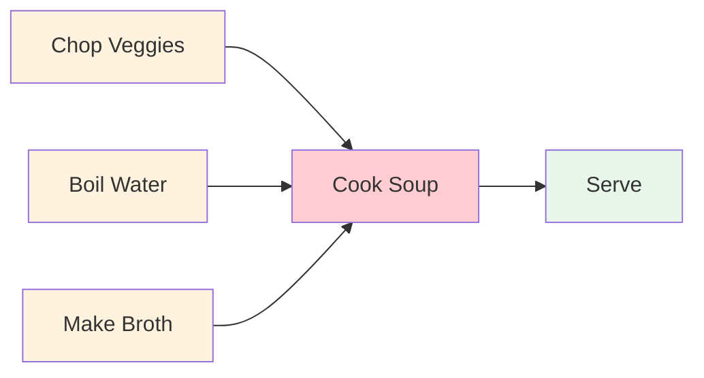
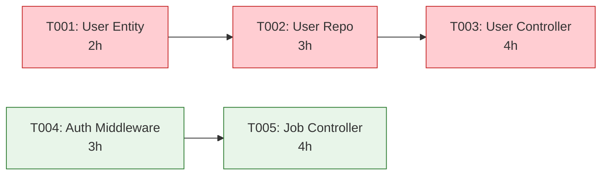

# Chapter 7: Task Dependency Graph & Critical Path Analysis

Welcome back! 🎉

In [Chapter 6: Yarn 4 PnP Project Bootstrap](06_yarn_4_pnp_project_bootstrap_.md), we learned how CODING automatically creates a **complete, working TypeScript project** — `package.json`, `tsconfig.json`, `.yarnrc.yml`, Docker configs, CI/CD pipelines — with all dependencies installed and pinned via Yarn 4 Plug'n'Play.

But a project with only config files doesn't *do* anything. We need to **generate the actual source code**: entities, repositories, services, controllers, tests.

Here's the challenge: **in what order do we generate these files?**

---

## The Problem: "Flat Lists Don't Build Systems"

Imagine the Task Generator produces this flat list:

| Task ID | Title | Category |
|---------|-------|----------|
| T001 | Create User Entity | database |
| T002 | Create User Repository | domain_model |
| T003 | Create User Controller | api |
| T004 | Create Auth Middleware | security |
| T005 | Create Job Entity | database |
| T006 | Create Job Repository | domain_model |
| T007 | Create Job Controller | api |

If we just process them **top-to-bottom**, we get bugs:
- **T002 (User Repository)** imports `User` entity → **fails** because T001 hasn't run yet
- **T003 (User Controller)** imports `UserRepository` → **fails** because T002 hasn't run yet
- **T007 (Job Controller)** imports `JobRepository` → **fails** because T006 hasn't run yet

**We need to know: which tasks depend on which other tasks.**

---

## The Solution: A Dependency Graph + Critical Path

Think of tasks like **cooking a meal**:



- **Chop Veggies**, **Boil Water**, **Make Broth** can happen **in parallel** (no dependencies between them)
- **Cook Soup** must wait for **ALL THREE** to finish
- **Serve** must wait for **Cook Soup**

The **longest chain** (Chop → Cook → Serve) is the **Critical Path** — it determines the **minimum total time**.

In CODING, we do exactly this for code generation:

| Concept | What It Means |
|---------|---------------|
| **Task Dependency Graph** | A Directed Acyclic Graph (DAG) where edges = "Task A must finish before Task B starts" |
| **Critical Path** | The longest chain of dependent tasks — your **minimum project duration** |
| **Slack (Float)** | How much a task can be delayed without delaying the project |
| **Zero-Slack Tasks** | Tasks on the critical path — **any delay here delays the whole project** |
| **Parallel Groups** | Tasks with no dependencies between them — can run **simultaneously** |

---

## How CODING Builds This: Four Nodes

The **Tasks Implementation Workflow** (Stage 3) has four specialized nodes:

```mermaid
flowchart LR
    Loader[SystemSpecLoaderNode\nLoads system_spec] --> Generator[1]] --> Gen[TaskGeneratorNode\nEmits raw tasks with dependencies]
    Gen --> Prioritizer[TaskPrioritizerNode\nRefines priority, category, estimates]
    Prioritizer --> Critical[CriticalPathNode\nBuilds DAG, computes critical path]
    Critical --> Compiler[TaskCompilerNode\nEmits implementation_tasks.json]
    
    style Gen fill:#fff3e0
    style Prioritizer fill:#fff3e0
    style Critical fill:#ffcdd2
    style Compiler fill:#e8f5e9
```

Let's walk through each one.

---

### 1. TaskGeneratorNode — "Here Are the Tasks, With Dependencies"

This node reads the **System Specification** (architecture, domain model, API design, data design, etc.) and emits a **raw task list** where **each task explicitly declares its dependencies**.

```python
# task_nodes.py — TaskGeneratorNode (simplified)
class TaskGeneratorNode(Node):
    def prep(self, shared):
        return {
            "system_spec": shared.get("system_spec", {}),
            "flat_context": shared.get("flat_context", {}),
            "tech_stack": TECH_STACK,  # From Chapter 5
        }

    def exec(self, prep_res):
        context = {
            "bounded_contexts": prep_res["flat_context"].get("bounded_contexts", []),
            "aggregates": prep_res["flat_context"].get("aggregates", []),
            "endpoints": prep_res["flat_context"].get("endpoints", []),
            "tables": prep_res["flat_context"].get("tables", []),
            # ...
        }
        prompt = f"Generate implementation tasks. Context:\n{json.dumps(context, indent=2)}"
        return call_llm(TASK_GENERATOR_PROMPT, prompt, temperature=0.2)

    def post(self, shared, prep_res, exec_res):
        # Extract task list from LLM output
        tasks = unwrap_list(parsed, keys=("tasks", "task_list", "implementation_tasks"))
        shared["tasks"] = tasks  # Each task has "dependencies": ["T001", "T003"]
        return "default"
```

**Example output** (what the LLM produces):

```json
[
  {
    "task_id": "T001",
    "title": "Create User TypeORM Entity",
    "category": "database",
    "dependencies": [],
    "files_to_create": [{"path": "src/modules/user/entities/User.ts"}],
    "estimated_hours": 2
  },
  {
    "task_id": "T002",
    "title": "Create User Repository",
    "category": "domain_model",
    "dependencies": ["T001"],  // ← Must wait for User Entity
    "files_to_create": [{"path": "src/modules/user/repositories/UserRepository.ts"}],
    "estimated_hours": 3
  },
  {
    "task_id": "T003",
    "title": "Create User Controller",
    "category": "api",
    "dependencies": ["T002"],  // ← Must wait for User Repository
    "files_to_create": [{"path": "src/modules/user/controllers/UserController.ts"}],
    "estimated_hours": 4
  }
]
```

> 💡 **Key insight**: The LLM **knows the code structure** — it knows a Repository needs an Entity, a Controller needs a Repository. It encodes this as `dependencies`.

---

### 2. TaskPrioritizerNode — "Refine & Reorder"

The raw tasks might have inconsistent priorities, missing estimates, or wrong categories. The Prioritizer **reviews and refines** them.

```python
# task_nodes.py — TaskPrioritizerNode (simplified)
class TaskPrioritizerNode(Node):
    def exec(self, prep_res):
        context = {
            "tasks": compress_tasks_for_prioritization(prep_res["tasks"]),
            "task_count": len(prep_res["tasks"]),
        }
        prompt = f"Prioritize and refine tasks. Context:\n{json.dumps(context, indent=2)}"
        return call_llm(TASK_PRIORITIZER_PROMPT, prompt, temperature=0.2)
```

**What it fixes**:
- Ensures `priority` is one of: `critical`, `high`, `medium`, `low`
- Ensures `estimated_hours` is realistic
- Adds missing `acceptance_criteria`
- Groups related tasks into logical phases

---

### 3. CriticalPathNode — "Build the DAG, Find the Critical Path"

This is the **heart of the chapter**. It takes the refined tasks and:

1. **Builds a DAG** (Directed Acyclic Graph) from `dependencies`
2. **Computes earliest/latest start times** (forward/backward pass)
3. **Identifies zero-slack tasks** → **Critical Path**
4. **Finds parallel groups** → tasks that can run simultaneously
5. **Detects bottlenecks** → tasks with many dependents

```python
# task_nodes.py — CriticalPathNode (simplified)
class CriticalPathNode(Node):
    def exec(self, prep_res):
        context = {
            "tasks": [
                {"task_id": t["task_id"], "estimated_hours": t.get("estimated_hours", 4),
                 "dependencies": t.get("dependencies", []), "category": t.get("category", "")}
                for t in prep_res["tasks"]
            ]
        }
        prompt = f"Analyze critical path. Context:\n{json.dumps(context, indent=2)}"
        return call_llm(CRITICAL_PATH_PROMPT, prompt, temperature=0.2)

    def post(self, shared, prep_res, exec_res):
        # Extract critical path analysis
        analysis = unwrap_dict(parsed, list_key="critical_path")
        shared["critical_path_analysis"] = analysis
        return "default"
```

**The LLM does the graph math** (forward/backward pass) and returns:

```json
{
  "dependency_graph": {
    "T001": [],           // No deps
    "T002": ["T001"],     // Depends on T001
    "T003": ["T002"],     // Depends on T002
    "T004": [],           // Independent
    "T005": ["T004"]      // Depends on T004
  },
  "critical_path": ["T001", "T002", "T003"],  // Longest chain = 2+3+4 = 9 hours
  "critical_path_duration_hours": 9,
  "parallel_groups": [
    {"group_id": 1, "tasks": ["T001", "T004"]},  // Can run in parallel!
    {"group_id": 2, "tasks": ["T002"]},
    {"group_id": 3, "tasks": ["T003", "T005"]}
  ],
  "bottlenecks": [
    {"task_id": "T002", "dependents_count": 2, "impact": "Blocks T003 and T005"}
  ],
  "slack": {
    "T001": 0,   // Zero slack = on critical path
    "T002": 0,   // Zero slack = on critical path
    "T003": 0,   // Zero slack = on critical path
    "T004": 5,   // 5 hours slack = can delay without affecting project end
    "T005": 0    // Zero slack (depends on T004 but T004 has slack)
  }
}
```

**Visualizing the example**:



- **Critical Path**: T001 → T002 → T003 = **9 hours** (minimum project duration)
- **Parallel Group 1**: T001 and T004 can start **immediately**
- **Slack**: T004 has **5 hours slack** — it can start anytime in the first 5 hours

---

### 4. TaskCompilerNode — "Emit the Final Plan"

The Compiler takes the tasks + critical path analysis and produces the **final artifact**: `implementation_tasks.json` — the **executable project plan**.

```python
# task_nodes.py — TaskCompilerNode (simplified)
class TaskCompilerNode(Node):
    def exec(self, prep_res):
        total_hours = sum(t.get("estimated_hours", 0) for t in prep_res["tasks"])
        
        # Group tasks by category into phases
        category_order = ["setup", "database", "domain_model", "api", "security", "testing", "deployment"]
        phases = []
        for cat in category_order:
            cat_tasks = [t for t in prep_res["tasks"] if t.get("category") == cat]
            if cat_tasks:
                phases.append({
                    "name": f"Phase: {cat.replace('_', ' ').title()}",
                    "tasks": [t["task_id"] for t in cat_tasks],
                    "duration_hours": sum(t.get("estimated_hours", 0) for t in cat_tasks)
                })
        
        context = {
            "tasks": compress_tasks_for_compiler(prep_res["tasks"]),
            "critical_path": prep_res["critical_path"],
            "phases": phases,
            "total_hours": total_hours,
        }
        prompt = f"Compile final implementation plan. Context:\n{json.dumps(context, indent=2)}"
        return call_llm(TASK_COMPILER_PROMPT, prompt, temperature=0.2)
```

**Output: `implementation_tasks.json`** (simplified):

```json
{
  "project_name": "JobPortal",
  "version": "1.0.0",
  "total_estimated_hours": 47,
  "tech_stack_snapshot": { "framework": "Express.js 5.x", "orm": "TypeORM 0.3.x", ... },
  "phases": [
    { "name": "Phase: Setup", "tasks": ["T001", "T002"], "duration_hours": 4 },
    { "name": "Phase: Database", "tasks": ["T003", "T004"], "duration_hours": 6 },
    { "name": "Phase: Domain Model", "tasks": ["T005"], "duration_hours": 5 },
    { "name": "Phase: API", "tasks": ["T006", "T007"], "duration_hours": 8 }
  ],
  "tasks": [
    { "task_id": "T001", "title": "Create User Entity", "dependencies": [], "estimated_hours": 2, ... },
    { "task_id": "T002", "title": "Create User Repository", "dependencies": ["T001"], "estimated_hours": 3, ... }
  ],
  "dependency_graph": { "T001": [], "T002": ["T001"], ... },
  "critical_path": ["T001", "T002", "T005", "T006"],
  "critical_path_duration_hours": 18,
  "parallel_groups": [
    { "group_id": 1, "tasks": ["T001", "T003"] },
    { "group_id": 2, "tasks": ["T002", "T004"] }
  ],
  "coding_agent_instructions": {
    "file_naming_conventions": "kebab-case for files, PascalCase for classes",
    "code_patterns": "Repository pattern, Zod schemas, async/await",
    "import_rules": "Use @/ aliases, no relative imports beyond 2 levels"
  }
}
```

This file is **the contract** between Stage 3 (Planning) and Stage 4 (Code Generation).

---

## How Code Generation Uses This: TaskLoaderNode

In [Chapter 1](01_multi_stage_specification_pipeline_.md), we saw Stage 4's **TaskLoaderNode**. Now you understand **why it works**:

```python
# code_gen_nodes.py — TaskLoaderNode (simplified)
class TaskLoaderNode(Node):
    def exec(self, prep_res):
        tasks = prep_res["tasks"]
        completed = set(prep_res["completed"])
        failed = set(prep_res["failed"])
        
        for task in tasks:
            tid = task.get("task_id", "")
            if tid in completed or tid in failed:
                continue
            # ✅ ONLY pick tasks whose ALL dependencies are completed
            if all(d in completed for d in task.get("dependencies", [])):
                return {"task": task, "task_index": tasks.index(task), ...}
        
        return {"all_complete": True}
```

**The algorithm**:
1. Load all tasks from `implementation_tasks.json`
2. Track `completed_task_ids` and `failed_task_ids` in `shared`
3. **Find the first task** where `all(dep in completed for dep in task.dependencies)`
4. Return that task → CodeGeneratorNode writes it → tests run → TaskFinalizerNode marks it `completed`
5. Loop back to TaskLoaderNode → next available task

**This guarantees**:
- ✅ **No task runs before its dependencies** (Repository before Controller)
- ✅ **Maximum parallelism** (if two tasks have no deps between them, order doesn't matter)
- ✅ **Deterministic execution** (same plan → same order every time)

---

## Internal Implementation: Step-by-Step Walkthrough

Let's trace what happens when the **Tasks Workflow** runs.

```mermaid
sequenceDiagram
    participant Loader as SystemSpecLoaderNode
    participant Gen as TaskGeneratorNode
    participant Prioritizer as TaskPrioritizerNode
    participant Critical as CriticalPathNode
    participant Compiler as TaskCompilerNode
    participant Shared as Shared Dict
    
    Loader->>Shared: Reads system_spec (or loads from disk)
    Loader->>Gen: Passes structured_sections, flat_context
    Gen->>Gen: LLM generates raw tasks with dependencies
    Gen->>Shared: Writes tasks[] (each has dependencies[])
    Prioritizer->>Shared: Reads tasks[]
    Prioritizer->>Prioritizer: LLM refines priority, estimates, categories
    Prioritizer->>Shared: Writes refined tasks[]
    Critical->>Shared: Reads tasks[]
    Critical->>Critical: LLM builds DAG, computes critical path, slack, parallel groups
    Critical->>Shared: Writes critical_path_analysis{}
    Compiler->>Shared: Reads tasks[] + critical_path_analysis
    Compiler->>Compiler: LLM compiles final plan with phases, coding instructions
    Compiler->>Shared: Writes implementation_plan{}
    Compiler->>Disk: Saves implementation_tasks.json + tasks_only.json
```

---

## The DAG Math (What the LLM Does for You)

You don't need to implement this — the LLM does it via `CRITICAL_PATH_PROMPT`. But here's the **algorithm** it follows (for your understanding):

### Forward Pass — Earliest Start Times
```python
# For each task in topological order:
earliest_start[task] = max(earliest_finish[dep] for dep in task.dependencies) if deps else 0
earliest_finish[task] = earliest_start[task] + task.estimated_hours
```

### Backward Pass — Latest Start Times
```python
# Project end = max(earliest_finish)
project_end = max(earliest_finish.values())

# For each task in REVERSE topological order:
latest_finish[task] = min(latest_start[dep] for dep in task.dependents) if dependents else project_end
latest_start[task] = latest_finish[task] - task.estimated_hours
```

### Slack & Critical Path
```python
slack[task] = latest_start[task] - earliest_start[task]
# Zero slack = on critical path
critical_path = [t for t in tasks if slack[t] == 0]
```

### Parallel Groups
```python
# Group by earliest_start time
groups = defaultdict(list)
for task in tasks:
    groups[earliest_start[task]].append(task.task_id)
parallel_groups = [{"group_id": i, "tasks": g} for i, g in enumerate(sorted(groups.values()))]
```

**The LLM prompt** (`utils/system_prompt.py`) encodes this logic:

```python
CRITICAL_PATH_PROMPT = """...
Analyze the task dependency graph and compute:
1. EARLIEST START/FINISH (forward pass)
2. LATEST START/FINISH (backward pass)  
3. SLACK = latest_start - earliest_start
4. CRITICAL PATH = tasks with zero slack
5. PARALLEL GROUPS = tasks with same earliest_start
6. BOTTLENECKS = tasks with most dependents

Output JSON:
{
  "dependency_graph": {"T001": [], "T002": ["T001"], ...},
  "critical_path": ["T001", "T002", "T003"],
  "critical_path_duration_hours": 9,
  "parallel_groups": [{"group_id": 1, "tasks": ["T001", "T004"]}, ...],
  "slack": {"T001": 0, "T002": 0, "T004": 5, ...},
  "bottlenecks": [{"task_id": "T002", "dependents_count": 2, "impact": "..."}]
}
"""
```

---

## Validation: RecheckNode Ensures Graph Correctness

Just like in [Chapter 4](04_recheck___repair_loop__self_healing_validation__.md), the **RecheckNode** validates the task graph:

```python
# utils/external_tools.py — _validate_dependency_graph()
def _validate_dependency_graph(tasks):
    issues = []
    task_ids = {t["task_id"] for t in tasks}
    
    for t in tasks:
        tid = t.get("task_id", "")
        for dep in t.get("dependencies", []):
            if dep not in task_ids:
                issues.append(f"Task '{tid}' depends on unknown task '{dep}'")
            if dep == tid:
                issues.append(f"Task '{tid}' has circular dependency on itself")
    
    # Detect cycles via DFS
    adj = {t["task_id"]: t.get("dependencies", []) for t in tasks}
    visited, stack = set(), set()
    def dfs(node, path):
        if node in stack:
            cycle = path[path.index(node):] + [node]
            issues.append(f"Circular dependency: {' → '.join(cycle)}")
            return
        if node in visited: return
        visited.add(node)
        stack.add(node)
        for dep in adj.get(node, []):
            dfs(dep, path + [node])
        stack.discard(node)
    
    for tid in adj: dfs(tid, [])
    return issues
```

**If validation fails**, the flow routes to `RepairDependenciesNode` which asks the LLM to fix the graph.

---

## What You Get at the End

After the Tasks Workflow completes, your `doc/` folder has:

```
doc/
├── implementation_tasks.json   # Full plan with phases, critical path, graph
├── tasks_only.json             # Just the task array (for Stage 4)
└── implementation_tasks.md     # Human-readable markdown
```

**`tasks_only.json`** is what **TaskLoaderNode** reads in Stage 4:

```json
[
  { "task_id": "T001", "title": "Create User Entity", "dependencies": [], ... },
  { "task_id": "T002", "title": "Create User Repository", "dependencies": ["T001"], ... },
  { "task_id": "T003", "title": "Create User Controller", "dependencies": ["T002"], ... }
]
```

---

## Why This Design Works

| Challenge | How Dependency Graph + Critical Path Solves It |
|-----------|-----------------------------------------------|
| **Wrong build order** | `dependencies` array enforces correct sequence |
| **Wasted time** | Critical path = minimum duration; parallel groups = max concurrency |
| **Hidden bottlenecks** | `bottlenecks` array highlights tasks blocking many others |
| **Unrealistic estimates** | Slack shows which tasks have buffer vs. which are tight |
| **No traceability** | Full artifact chain: system_spec → tasks → graph → plan → code |

---

## Debugging Tip: Inspect the Graph

At any point, check `shared` for the analysis:

```python
# In debugger or print statement
print("Tasks:", len(shared.get("tasks", [])))
print("Critical path:", shared.get("critical_path_analysis", {}).get("critical_path"))
print("Critical path duration:", shared.get("critical_path_analysis", {}).get("critical_path_duration_hours"))
print("Parallel groups:", shared.get("critical_path_analysis", {}).get("parallel_groups"))
print("Slack:", shared.get("critical_path_analysis", {}).get("slack"))
print("Bottlenecks:", shared.get("critical_path_analysis", {}).get("bottlenecks"))
```

**Example output**:
```
Tasks: 23
Critical path: ['T001', 'T002', 'T005', 'T009', 'T014']
Critical path duration: 18
Parallel groups: [{'group_id': 1, 'tasks': ['T001', 'T003', 'T004']}, {'group_id': 2, 'tasks': ['T002', 'T006']}, ...]
Slack: {'T001': 0, 'T002': 0, 'T003': 4, 'T004': 2, 'T005': 0, ...}
Bottlenecks: [{'task_id': 'T002', 'dependents_count': 3, 'impact': 'Blocks T005, T006, T007'}]
```

---

## Summary: What You Learned

| Concept | What It Is | CODING Implementation |
|---------|------------|----------------------|
| **Task Dependency Graph** | DAG where edges = "must finish before" | `TaskGeneratorNode` emits `dependencies: ["T001", "T003"]` |
| **Critical Path** | Longest dependent chain = minimum project time | `CriticalPathNode` computes via forward/backward pass |
| **Zero-Slack Tasks** | Tasks on critical path — delay = project delay | `slack[task] == 0` in analysis |
| **Parallel Groups** | Tasks with same earliest start = can run together | `parallel_groups` array in analysis |
| **Bottlenecks** | Tasks with many dependents | `bottlenecks` array in analysis |
| **TaskLoaderNode** | Runtime scheduler respecting dependencies | Only picks task when `all(dep in completed)` |

---

## What's Next?

You now have a **complete, dependency-aware project plan** with:
- ✅ Granular tasks with explicit dependencies
- ✅ Critical path identifying minimum duration
- ✅ Parallel groups for maximum concurrency
- ✅ Bottleneck analysis for risk management
- ✅ Coding-agent instructions for consistent code style

But a plan is just paper. In the next chapter, we'll see how the **Code Generation Workflow** (Stage 4) **executes this plan** — with adaptive repair, escalation strategies, and fail-stop design that guarantees either working code or a clear diagnostic halt.

👉 **[Chapter 8: Adaptive Code/Test Repair with Escalation](08_adaptive_code_test_repair_with_escalation_.md)**

