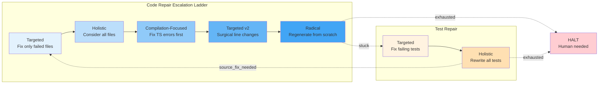
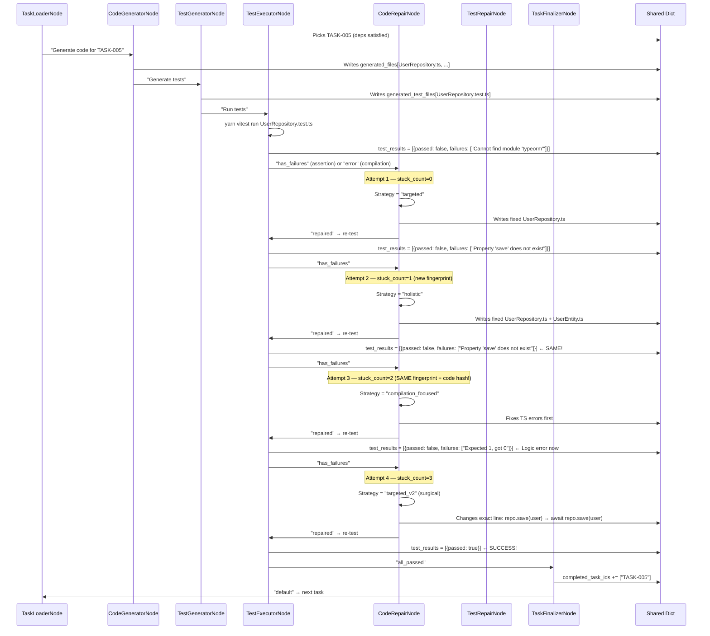

# Chapter 8: Adaptive Code/Test Repair with Escalation


Welcome back! 🎉

In [Chapter 7: Task Dependency Graph & Critical Path Analysis](07_task_dependency_graph___critical_path_analysis_.md), we learned how CODING creates a **smart execution plan** — tasks with explicit dependencies, a critical path showing the minimum project duration, and parallel groups for maximum concurrency.

But a plan is just paper. Now we reach **Stage 4: Code Generation** — where the rubber meets the road. The `CodeGeneratorNode` writes TypeScript files, `TestGeneratorNode` writes tests, and `TestExecutorNode` runs them.

Here's the reality: **generated code often fails on the first try.**

- Missing imports
- Type mismatches
- Logic errors
- Wrong API usage
- Tests that don't match the implementation

A naive system would just **retry the same thing** and hope for better luck. CODING does something much smarter: **it escalates strategies like a senior engineer.**

---

## The Problem: "Retrying the Same Thing Doesn't Work"

Imagine you ask an AI to write a User Repository. It generates code, tests run, and you get:

```
error TS2307: Cannot find module 'typeorm' or its corresponding type declarations.
```

**Naive approach**: "Try again!" → Same error. "Try again!" → Same error. Infinite loop.

**Senior engineer approach**:
1. **First try**: "Ah, missing import. Let me fix just that file." → *Targeted fix*
2. **Still failing**: "Maybe the issue spans multiple files. Let me look at the whole picture." → *Holistic review*
3. **Still failing**: "Lots of TypeScript errors. Let me fix compilation first, then logic." → *Compilation-focused*
4. **Still failing**: "Same error keeps coming back. Let me be surgical — change only the exact lines." → *Targeted v2*
5. **Still failing**: "Nothing works. Scrap it and rewrite from scratch with lessons learned." → *Radical regeneration*

**And if the CODE is actually correct but the TESTS are wrong?** The engineer flips: "Let me fix the tests instead." If tests still fail after that → "Tests look right, code must be wrong" → back to code repair with a **fresh state**.

This is exactly what CODING automates.

---

## The Solution: Two Repair Nodes with Escalation & Handoff



### Key Insight: Each Task Tracks Its Own Repair State

Every task gets a **private repair notebook** in `shared`:

```python
# In shared dict — one per task!
"_code_repair_state_TASK-001": {
    "attempt": 3,
    "strategies_tried": ["targeted", "holistic", "compilation_focused"],
    "last_failure_fingerprint": "a1b2c3d4",  # Hash of current failures
    "last_code_hash": "e5f6g7h8",            # Hash of current code
    "stuck_count": 2                          # Same fingerprint + code hash = stuck!
}
```

**Stuck detection**: If the *same failures* appear on the *same code* → we're spinning wheels → **escalate**.

---

## Core Concepts

### 1. CodeRepairNode — The Escalation Ladder

`CodeRepairNode` chooses a strategy based on `stuck_count`:

| Stuck Count | Strategy | What It Does |
|-------------|----------|--------------|
| 0 | **targeted** | Fix only files with reported failures |
| 1 | **holistic** | Consider all files as a system |
| 2 | **compilation_focused** | Fix TypeScript errors first, ignore logic |
| 3 | **targeted_v2** | Surgical — change exact lines only |
| 4+ | **radical** | Throw away everything, regenerate from scratch |

### 2. TestRepairNode — The Flip Side

`TestRepairNode` has a simpler ladder but a **critical handoff**:

| Stuck Count | Strategy | What It Does |
|-------------|----------|--------------|
| 0 | **targeted** | Fix only failing test files |
| 1 | **holistic** | Rewrite all tests with full source awareness |
| 2+ | **source_fix_needed** | "Tests look right, code is wrong" → signal back to CodeRepair |

**The handoff**: When `TestRepairNode` returns `source_fix_needed`, the flow routes back to `CodeRepairNode` **with reset repair state** — fresh eyes on the code.

### 3. Failure Fingerprinting — Detecting Loops

How do we know we're stuck? We hash the failures and the code:

```python
def failure_fingerprint(test_results):
    """Hash of all failing test names + their failure messages."""
    parts = []
    for r in sorted(test_results, key=lambda x: x.get("test_file", "")):
        if not r.get("passed", False):
            parts.append(r.get("test_file", ""))
            parts.extend(sorted(r.get("failures", [])))
    return hashlib.md5("|".join(parts).encode()).hexdigest()

def code_hash(files):
    """Hash of file paths + content previews."""
    contents = []
    for f in sorted(files, key=lambda x: x.get("path", "")):
        contents.append(f.get("path", ""))
        contents.append(f.get("content", "")[:500])
    return hashlib.md5("|".join(contents).encode()).hexdigest()
```

**Stuck = same fingerprint + same code hash** → we made changes but failures didn't change.

---

## How It Works: Step-by-Step Walkthrough

Let's trace a concrete example: **Task `TASK-005` — Create User Repository**.



---

## Internal Implementation Deep Dive

### 1. CodeRepairNode — The Escalation Engine

```python
# code_gen_nodes.py — CodeRepairNode (simplified)
class CodeRepairNode(Node):
    def prep(self, shared):
        task = shared.get("current_task", {})
        task_id = task.get("task_id", "unknown")
        
        # ── Load or create repair state for THIS task ──
        repair_key = f"_code_repair_state_{task_id}"
        repair_state = shared.get(repair_key, {
            "attempt": 0,
            "strategies_tried": [],
            "last_failure_fingerprint": None,
            "last_code_hash": None,
            "stuck_count": 0
        })
        
        # ── Analyze current failures ──
        generated_files = shared.get("generated_files", [])
        test_results = shared.get("test_results", [])
        source_failures = map_failures_to_sources(test_results, generated_files)
        
        # ── Compute fingerprints ──
        current_fingerprint = failure_fingerprint(test_results)
        current_code_hash = code_hash(generated_files)
        
        # ── Stuck detection ──
        is_stuck = (
            repair_state["last_failure_fingerprint"] == current_fingerprint
            and repair_state["last_code_hash"] == current_code_hash
        )
        if is_stuck:
            repair_state["stuck_count"] += 1
        else:
            repair_state["stuck_count"] = 0
            
        repair_state["last_failure_fingerprint"] = current_fingerprint
        repair_state["last_code_hash"] = current_code_hash
        repair_state["attempt"] += 1
        
        # ── Exhaustion check ──
        if repair_state["stuck_count"] >= 5:
            return {"exhausted": True, "task_id": task_id, ...}
        
        # ── Select strategy based on stuck_count ──
        strategy = select_repair_strategy(repair_state["stuck_count"])
        repair_state["strategies_tried"].append(strategy)
        
        return {
            "task_id": task_id,
            "strategy": strategy,
            "source_failures": source_failures,
            "generated_files": generated_files,
            "test_results": test_results,
            "repair_state": repair_state,
            "output_dir": shared.get("output_dir"),
            "task": task,
        }

    def exec(self, prep_res):
        if prep_res.get("exhausted"):
            return json.dumps({"exhausted": True, "reason": prep_res["reason"], ...})
        
        strategy = prep_res["strategy"]
        
        # ── Dispatch to strategy executor ──
        if strategy == "targeted":
            return exec_targeted_repair(prep_res, ...)
        elif strategy == "holistic":
            return exec_holistic_repair(prep_res, ...)
        elif strategy == "compilation_focused":
            return exec_compilation_focused_repair(prep_res, ...)
        elif strategy == "targeted_v2":
            return exec_targeted_v2_repair(prep_res, ...)
        elif strategy == "radical":
            return exec_radical_repair(prep_res, ...)
```

### 2. Strategy Executors — What Each One Does

**Targeted** — Fix only files with mapped failures:
```python
def exec_targeted_repair(prep_res, source_failures, generated_files):
    files_to_fix = []
    for path, failures in source_failures.items():
        file_obj = next((f for f in generated_files if f["path"] == path), None)
        if file_obj:
            files_to_fix.append({"path": file_obj["path"], "content": file_obj["content"], "reported_failures": failures})
    
    prompt = f"""TARGETED REPAIR for task {prep_res['task_id']}.
Fix ONLY the reported failures in the specified files.
Do NOT rewrite files that have no failures.
Do NOT change the public API or add new exports.

Context: {json.dumps({"files_to_fix": files_to_fix}, indent=2)}
Output JSON array of changed file objects."""
    return call_llm(CODE_REPAIR_PROMPT, prompt, temperature=0.2)
```

**Holistic** — Consider all files as a system:
```python
def exec_holistic_repair(prep_res, source_failures, generated_files, test_results):
    prompt = f"""HOLISTIC REPAIR for task {prep_res['task_id']}.
Consider ALL files and ALL test failures as a system.
The bug may be in one file but manifest in another.
Fix the root cause, not just symptoms.

Context: {json.dumps({
    "all_files": [{"path": f["path"], "content": f["content"]} for f in generated_files],
    "source_failures": source_failures,
    "test_failures_summary": summarize_failures(test_results)
}, indent=2)}
Output JSON array of ALL changed file objects."""
    return call_llm(CODE_REPAIR_PROMPT, prompt, temperature=0.2)
```

**Compilation-Focused** — Fix TypeScript errors first:
```python
def exec_compilation_focused_repair(prep_res, generated_files, test_results):
    compilation_errors = []
    for r in test_results:
        combined = r.get("stdout", "") + r.get("stderr", "")
        for line in combined.split("\n"):
            if "error TS" in line or "Cannot find module" in line:
                compilation_errors.append(line.strip())
    
    prompt = f"""COMPILATION-FOCUSED REPAIR for task {prep_res['task_id']}.
Fix these compilation/import errors FIRST. Ignore assertion failures.
Common causes: missing imports, wrong type annotations, incorrect decorators.

Errors: {json.dumps(compilation_errors[:30], indent=2)}
Files: {json.dumps([{"path": f["path"], "content": f["content"]} for f in generated_files], indent=2)}
Output JSON array of file objects."""
    return call_llm(CODE_REPAIR_PROMPT, prompt, temperature=0.15)
```

**Radical** — Regenerate from scratch with lessons learned:
```python
def exec_radical_repair(prep_res, generated_files, test_results):
    task = prep_res.get("task", {})
    valid_files = [f for f in generated_files if "path" in f]
    regenerated_paths = {f["path"] for f in valid_files}
    
    prompt = f"""RADICAL REPAIR for task {prep_res['task_id']}.
Previous attempts failed repeatedly. REGENERATE all files from scratch.
Learn from the failures below — do NOT repeat the same mistakes.

Task context: {json.dumps({
    "previous_attempt_paths": sorted(regenerated_paths),
    "previous_files": [{"path": f["path"], "content": f["content"]} for f in valid_files],
    "all_test_failures": summarize_failures(test_results),
    "task_description": task.get("description", ""),
    "acceptance_criteria": task.get("acceptance_criteria", []),
    "files_to_create": task.get("files_to_create", []),
    "tech_stack_components": task.get("tech_stack_components", []),
    "coding_agent_context": task.get("coding_agent_context", {}),
}, indent=2)}
Output JSON array of ALL file objects needed for this task."""
    return call_llm(CODE_REPAIR_PROMPT, prompt, temperature=0.3)
```

### 3. TestRepairNode — The Flip Side

```python
# code_gen_nodes.py — TestRepairNode (simplified)
class TestRepairNode(Node):
    def prep(self, shared):
        current_task = shared.get("current_task", {})
        task_id = current_task.get("task_id", "unknown")
        repair_key = f"_test_repair_state_{task_id}"
        repair_state = shared.get(repair_key, {
            "attempt": 0, "last_failure_fingerprint": None,
            "last_test_hash": None, "stuck_count": 0,
            "source_flip_count": 0, "strategies_tried": []
        })
        
        test_files = shared.get("generated_test_files", [])
        test_results = shared.get("test_results", [])
        source_files = shared.get("generated_files", [])
        
        current_fingerprint = failure_fingerprint(test_results)
        current_test_hash = code_hash(test_files)
        is_stuck = (repair_state["last_failure_fingerprint"] == current_fingerprint
                    and repair_state["last_test_hash"] == current_test_hash)
        
        repair_state["stuck_count"] = repair_state["stuck_count"] + 1 if is_stuck else 0
        repair_state["last_failure_fingerprint"] = current_fingerprint
        repair_state["last_test_hash"] = current_test_hash
        repair_state["attempt"] += 1
        
        # ── Exhaustion: both directions tried multiple times ──
        if repair_state["stuck_count"] >= 3 and repair_state["source_flip_count"] >= 1:
            return {"exhausted": True, "task_id": task_id, ...}
        
        # ── Flip signal: test repair not progressing → source likely wrong ──
        if repair_state["stuck_count"] >= 2:
            repair_state["source_flip_count"] += 1
            repair_state["strategies_tried"].append("source_flip")
            return {"source_fix_needed": True, "task_id": task_id, ...}
        
        strategy = "targeted" if repair_state["stuck_count"] == 0 else "holistic"
        repair_state["strategies_tried"].append(strategy)
        return {"strategy": strategy, "test_files": test_files, "source_files": source_files, ...}

    def exec(self, prep_res):
        if prep_res.get("source_fix_needed"):
            return json.dumps({"source_fix_needed": True, "reason": prep_res["reason"]})
        if prep_res.get("exhausted"):
            return json.dumps({"exhausted": True, ...})
        
        if prep_res["strategy"] == "holistic":
            return exec_holistic_test_repair(prep_res, ...)
        return exec_targeted_test_repair(prep_res, ...)

    def post(self, shared, prep_res, exec_res):
        # Handle source_fix_needed signal
        if isinstance(exec_res, str):
            check = json.loads(exec_res)
            if check.get("source_fix_needed"):
                return "source_fix"  # Routes back to CodeRepairNode!
            if check.get("exhausted"):
                return "exhausted"   # Routes to EndNode (HALT)
        
        # Normal test repair success
        repaired_tests = parse_llm_json(exec_res)
        if isinstance(repaired_tests, list):
            shared["generated_test_files"] = repaired_tests
            for f in repaired_tests:
                write_file(f["path"], f["content"], base_dir=prep_res["output_dir"])
            return "repaired"  # Routes back to TestExecutorNode
        return "error"
```

### 4. The Flow Wiring — How It All Connects

```python
# flow.py — code_gen_workflow() (key connections)
def code_gen_workflow():
    loader = TaskLoaderNode()
    generator = CodeGeneratorNode()
    test_generator = TestGeneratorNode()
    test_executor = TestExecutorNode()
    code_repair = CodeRepairNode()
    test_repair = TestRepairNode()
    task_finalizer = TaskFinalizerNode()
    deployment = DeploymentGeneratorNode()
    finalizer = CodeGenFinalizerNode()
    end = EndNode()

    # ── Main flow ──
    loader - "default" >> generator
    generator - "default" >> test_generator
    test_generator - "default" >> test_executor

    # ── Test execution outcomes ──
    test_executor - "all_passed" >> task_finalizer
    test_executor - "has_failures" >> code_repair      # Assertion failures
    test_executor - "error" >> code_repair             # Compilation errors

    # ── Code repair escalation ──
    code_repair - "repaired" >> test_executor          # Fixed something → re-test
    code_repair - "stuck" >> test_repair               # No progress → maybe tests wrong?
    code_repair - "exhausted" >> end                   # All strategies failed → HALT
    code_repair - "error" >> end                       # Unexpected error → HALT

    # ── Test repair & flip ──
    test_repair - "repaired" >> test_executor          # Fixed tests → re-test
    test_repair - "source_fix_needed" >> code_repair   # Tests OK, code wrong → back to code repair (FRESH STATE!)
    test_repair - "exhausted" >> end                   # Both directions failed → HALT
    test_repair - "error" >> end                       # Unexpected error → HALT

    # ── Task completion ──
    task_finalizer - "default" >> loader               # Next task

    # ── All done ──
    loader - "all_complete" >> deployment
    deployment - "default" >> finalizer
    finalizer - "done" >> end

    return Flow(start=loader)
```

---

## The "Fresh State" Handoff — Critical Detail

When `TestRepairNode` signals `source_fix_needed`, it routes back to `CodeRepairNode`. But **the repair state is NOT reset automatically** — instead, `CodeRepairNode.prep()` creates a **new repair state key** if one doesn't exist, effectively giving fresh eyes:

```python
# In CodeRepairNode.prep()
repair_key = f"_code_repair_state_{task_id}"
repair_state = shared.get(repair_key, {  # ← Gets existing or creates NEW
    "attempt": 0,
    "strategies_tried": [],
    "last_failure_fingerprint": None,
    "last_code_hash": None,
    "stuck_count": 0
})
```

**But wait** — the key is the same! So it would load the *old* state. The trick is: **`TestRepairNode.post()` doesn't clear the code repair state**. However, because the code *has changed* (tests were repaired and re-ran), the `code_hash` will be different, so `stuck_count` resets to 0 automatically!

```python
# In CodeRepairNode.prep() — stuck detection
current_code_hash = code_hash(generated_files)  # ← NEW hash after test repair!
is_stuck = (repair_state["last_code_hash"] == current_code_hash  # ← Different!
            and repair_state["last_failure_fingerprint"] == current_fingerprint)
if is_stuck:
    repair_state["stuck_count"] += 1
else:
    repair_state["stuck_count"] = 0  # ← RESET because code changed!
```

**Beautiful**: The fingerprint comparison naturally handles the handoff. No manual reset needed.

---

## Exhaustion & Halt — The Safety Valve

When **both** repair nodes give up, the flow hits `EndNode` and **halts completely**. No silent failure, no skipping to next task.

```python
# In CodeRepairNode.post() — exhaustion
if isinstance(parsed, dict) and parsed.get("exhausted"):
    shared[repair_key] = prep_res["repair_state"]
    reason = parsed.get("reason", "Repair exhausted")
    shared["errors"] = shared.get("errors", []) + [f"TASK HALTED — {task_id}: {reason}"]
    shared["_halted_task"] = {
        "task_id": task_id,
        "node": "CodeRepairNode",
        "reason": reason,
        "final_files": parsed.get("final_files"),
        "final_failures": parsed.get("final_failures"),
        "strategies_tried": prep_res["repair_state"]["strategies_tried"],
        "total_attempts": prep_res["repair_state"]["attempt"],
    }
    return "exhausted"  # → EndNode → HALT
```

The `shared["_halted_task"]` preserves **full diagnostic state** for human inspection:
- Which task halted
- Which node (code vs test repair)
- All strategies tried
- Final code and failures
- Total attempts

---

## Debugging Tip: Inspect Repair State

At any point, check `shared` for the repair trail:

```python
# In debugger or print statement
task_id = "TASK-005"
print("Code repair state:", shared.get(f"_code_repair_state_{task_id}"))
print("Test repair state:", shared.get(f"_test_repair_state_{task_id}"))
print("Halted task:", shared.get("_halted_task"))
```

**Example output during escalation**:
```
Code repair state: {
  'attempt': 3,
  'strategies_tried': ['targeted', 'holistic', 'compilation_focused'],
  'last_failure_fingerprint': 'a1b2c3d4',
  'last_code_hash': 'e5f6g7h8',
  'stuck_count': 2
}
Test repair state: {
  'attempt': 1,
  'last_failure_fingerprint': 'a1b2c3d4',
  'last_test_hash': 'i9j0k1l2',
  'stuck_count': 0,
  'source_flip_count': 0,
  'strategies_tried': ['targeted']
}
Halted task: None
```

---

## Why This Design Works

| Challenge | How Adaptive Repair Solves It |
|-----------|-------------------------------|
| **Same error repeats** | Fingerprint + code hash detection → escalate strategy |
| **Wrong strategy for error type** | Compilation-focused strategy isolates TS errors first |
| **Tests are actually wrong** | TestRepairNode tries fixing tests, then signals `source_fix_needed` |
| **Infinite loops** | `stuck_count` thresholds → exhaustion → HALT with diagnostics |
| **Context loss between retries** | Each strategy gets full context: failures + all files + task spec |
| **Silent failures** | Every exhaustion logs to `shared["errors"]` + `_halted_task` |
| **One-size-fits-all retry** | 5 distinct strategies, each with specialized prompt |

---

## Summary: What You Learned

| Component | Role | Key Mechanism |
|-----------|------|---------------|
| **CodeRepairNode** | Fixes source code | 5 strategies: targeted → holistic → compilation_focused → targeted_v2 → radical |
| **TestRepairNode** | Fixes tests | 2 strategies: targeted → holistic, then `source_fix_needed` flip |
| **Failure Fingerprint** | Detects same failures | Hash of failing test names + failure messages |
| **Code Hash** | Detects same code | Hash of file paths + content previews |
| **Stuck Count** | Triggers escalation | Incremented when fingerprint + code hash unchanged |
| **Source Flip** | Handoff to code repair | After 2 stuck test repairs → "tests OK, code wrong" |
| **Exhaustion** | Safety valve | 5 stuck code repairs OR 3 stuck test repairs + 1 flip → HALT |
| **Halt Diagnostics** | Human inspection | `_halted_task` preserves full state |

---

## What's Next?

You now understand how CODING **self-heals generated code** with escalating strategies, fingerprint-based loop detection, and a bidirectional repair handoff — like a senior engineer who changes tactics when stuck.

But there's one more validation layer: **consistency across specification sections**. Even if code compiles and tests pass, what if the API spec says `GET /users/{id}` but the database schema has `user_id` instead of `id`? Or the domain model calls it `UserId` value object?

In the next chapter, we'll see how **Consistency Checking** catches these cross-section mismatches *before* they become code bugs.

👉 **[Chapter 9: Consistency Checking Across Specification Sections](09_consistency_checking_across_specification_sections_.md)**

