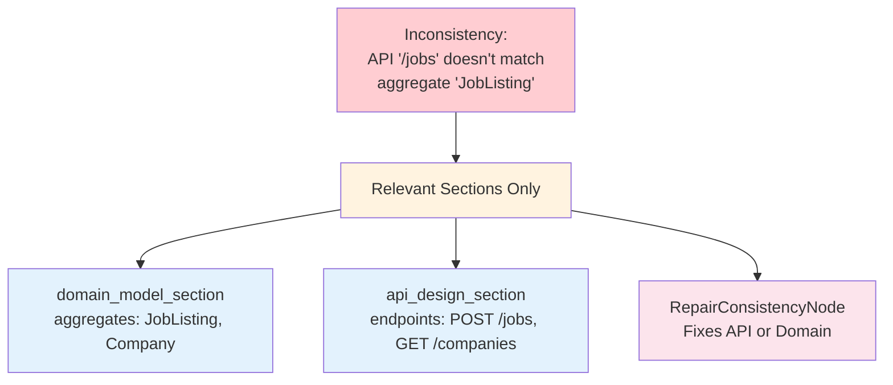
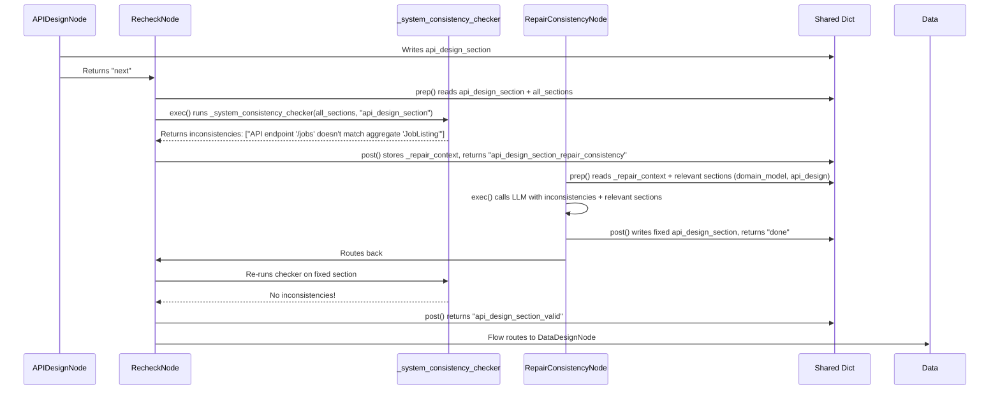

# Chapter 9: Consistency Checking Across Specification Sections


Welcome back! 🎉

In [Chapter 8: Adaptive Code/Test Repair with Escalation](08_adaptive_code_test_repair_with_escalation_.md), we learned how the **Code Generation Workflow** self-heals generated code — escalating through targeted fixes, holistic reviews, compilation-focused repairs, surgical edits, and radical regeneration until tests pass or the system halts with full diagnostics.

But there's a deeper problem: **what if the specification itself is inconsistent?**

Imagine you're building a job portal. The PM writes "Companies can post jobs." The UX designer creates a "Job Posting" flow. The BA writes requirements for "JobListing" entity. The Architect defines a "Job" bounded context. The API Designer creates `POST /jobs`. The Data Designer creates a `job_listings` table.

Everything looks fine *individually*. But together?
- PM says "Job Posting", BA says "JobListing", Architect says "Job", API says "jobs", DB says "job_listings"
- UX scenarios reference "hiring manager" persona but PM stakeholders only list "recruiter" and "admin"
- BA requirements mention "Slack notifications" integration but Research section never mentions Slack
- Security requires "audit logs for all mutations" but Infrastructure has no logging service defined

**These are cross-section inconsistencies — drift between chapters of the spec.** They don't show up in JSON schema validation because each section is valid on its own. But when you try to generate code, everything breaks.

This chapter explains how CODING catches these **semantic mismatches** automatically before they become code bugs.

---

## The Problem: "Each Chapter Looks Fine, But The Book Doesn't Make Sense"

Think of a specification like a **novel written by five different authors**, each writing one chapter:
- Chapter 1 (PM): "The hero is a detective named Sarah."
- Chapter 2 (UX): "Sarah the journalist investigates a crime."
- Chapter 3 (BA): "The protagonist, Detective Smith, collects evidence."
- Chapter 4 (Architect): "The system tracks Investigators with badge numbers."
- Chapter 5 (API): `GET /reporters/{id}` returns journalist data.

Each chapter is internally consistent. But **together they contradict**:
- Is she a detective, journalist, or reporter?
- Is her name Sarah or Smith?
- Does the API serve detectives or reporters?

In software specs, this drift happens constantly:
| Section | What It Defines | Drift Example |
|---------|----------------|---------------|
| **PM** | Business stakeholders | "Hiring Manager" persona |
| **UX** | User personas & scenarios | "Recruiter" persona (missing Hiring Manager) |
| **BA** | Requirements & data entities | `requirement_scenario_map` references "post job" scenario |
| **Architecture** | Bounded contexts | "JobManagement" context |
| **Domain Model** | Aggregates | `JobListing` aggregate |
| **API Design** | Endpoints | `POST /jobs` (not `/job-listings`) |
| **Data Design** | Tables | `job_postings` table (not `job_listings`) |
| **Security** | Compliance rules | "Audit all job mutations" |
| **Infrastructure** | Deployment | No audit log service defined |

**Result**: Generated code has mismatched names, missing features, broken traces. The compiler catches syntax errors, but **semantic drift slips through**.

---

## The Solution: A Cross-Reference Index That Understands Meaning

CODING's **RecheckNode** doesn't just validate JSON structure. It runs **cross-section consistency checkers** that understand *semantic relationships* between sections.

```mermaid
flowchart LR
    Agent[Agent Node\n(e.g., API Designer)] --> Recheck[RecheckNode]
    Recheck -->|Schema Valid| Next[Next Agent]
    Recheck -->|JSON Error| RepairJSON[RepairJSONNode]
    Recheck -->|Consistency Error| RepairConsistency[RepairConsistencyNode]
    RepairJSON --> Recheck
    RepairConsistency --> Recheck
    
    subgraph Consistency Checks [Cross-Section Consistency Checkers]
        B1[Business: PM→UX→BA→Research]
        S1[System: Arch→Domain→API→Data→Security→Infra]
    end
    
    Recheck -.-> B1
    Recheck -.-> S1
    
    style Recheck fill:#fff3e0
    style RepairConsistency fill:#ffebee
    style B1 fill:#e8f5e9
    style S1 fill:#e8f5e9
```

**Key insight**: The consistency checker is like a **cross-reference index in a textbook** — it knows that "Figure 3.2" should match "Table 3.1" and "Section 3.3". When chapter 3 says "see Figure 3.2" but Figure 3.2 doesn't exist, the index catches it.

---

## Core Concepts

### 1. Two Layers of Validation

| Layer | What It Checks | Example |
|-------|----------------|---------|
| **Schema Validation** | Required keys, types, enums | "PM section must have `goals` array" |
| **Consistency Checking** | Semantic cross-references | "PM stakeholders must appear as UX personas" |

**Schema validation** = "Is this JSON well-formed?"
**Consistency checking** = "Does this JSON make sense *in context*?"

---

### 2. Business Consistency Rules (PM → UX → BA → Research)

When `RecheckNode` validates the **Business Spec**, it runs these checkers:

| Check | Trigger Section | What It Verifies |
|-------|-----------------|------------------|
| **Stakeholders ↔ Personas** | `ux_section` | Every PM stakeholder category (`decision_maker`, `end_users`, `blockers`) has a matching UX persona role/goal |
| **Scenarios ↔ Requirement Map** | `ba_section` | UX scenarios (given/when/then) are referenced in BA's `requirement_scenario_map` |
| **Integrations ↔ Research** | `ba_section` | BA integration points (e.g., "Slack", "Razorpay") appear in Research findings |

---

### 3. System Consistency Rules (Arch → Domain → API → Data → Security → Infra)

When validating the **System Spec**, it runs these checkers:

| Check | Trigger Section | What It Verifies |
|-------|-----------------|------------------|
| **Bounded Contexts ↔ Aggregates** | `domain_model_section` | Every Architecture bounded context has at least one matching Domain aggregate |
| **API Endpoints ↔ Domain Aggregates** | `api_design_section` | Every API endpoint path maps to a Domain aggregate name (heuristic: path contains aggregate name) |
| **Data Tables ↔ Aggregates** | `data_design_section` | Every Domain aggregate has a matching table (snake_case plural: `JobListing` → `job_listings`) |
| **Security ↔ Infrastructure** | `security_section` / `infrastructure_section` | Security compliance requirements trace to Infrastructure components (e.g., audit logs → logging service) |

---

### 4. Targeted Context for Repair

When inconsistencies are found, `RepairConsistencyNode` doesn't get the *entire* spec — only the **relevant sections** for that specific check.



**Why not send everything?** 
- Smaller context = cheaper LLM calls
- Focused prompt = higher quality fixes
- Less noise = fewer hallucinations

---

## How It Works: Step-by-Step Walkthrough

Let's trace a concrete example: **API Designer writes `api_design_section`, then RecheckNode validates it**.

### Scenario
API Designer outputs:
```json
{
  "endpoints": [
    {"path": "/jobs", "method": "POST", "summary": "Create job"},
    {"path": "/companies", "method": "GET", "summary": "List companies"}
  ]
}
```

But **Domain Model** has aggregates: `JobListing`, `Company`, `Application`.

### Sequence Diagram



### What the Checker Actually Does

```python
# Simplified from utils/external_tools.py
def _system_consistency_checker(sections, current_section):
    issues = []
    domain = sections.get("domain_model_section", {})
    api = sections.get("api_design_section", {})
    
    # API endpoints must map to domain aggregates
    if current_section == "api_design_section" and domain and api:
        aggregates = [a.get("name", "") for a in domain.get("aggregates", [])]
        for ep in api.get("endpoints", []):
            path = ep.get("path", "")
            # Heuristic: path should contain aggregate name (case-insensitive)
            if not any(agg.lower() in path.lower() for agg in aggregates):
                issues.append(f"API endpoint '{path}' doesn't match any domain aggregate: {aggregates}")
    
    return issues
```

**For our example**: 
- Aggregates: `["JobListing", "Company", "Application"]`
- Endpoint `/jobs` → checks if "joblisting" in "/jobs" → **False** → inconsistency!
- Endpoint `/companies` → checks if "company" in "/companies" → **True** → OK

---

## Internal Implementation Deep Dive

### 1. RecheckNode: The Validator

```python
# recheck_repair_nodes.py — RecheckNode.exec() (simplified)
def exec(self, prep_res):
    workflow_type = prep_res["type"]  # "business" or "system"
    section = prep_res["section"]
    data = prep_res["data"]
    all_sections = prep_res["all_sections"]
    
    # 1. Schema validation (required keys, types)
    schema = get_schema(workflow_type, section)
    errors = validate_json_structure(data, schema)
    
    # 2. Consistency checks (only for certain sections)
    inconsistencies = []
    if section in RECHECK_CONFIG[workflow_type]["consistency_sections"]:
        if workflow_type == "business":
            inconsistencies = _business_consistency_checker(all_sections, section)
        else:
            inconsistencies = _system_consistency_checker(all_sections, section)
    
    # 3. Route to appropriate repair
    if errors:
        return {"status": "repair_json", "errors": errors, "inconsistencies": []}
    if inconsistencies:
        return {"status": "repair_consistency", "errors": [], "inconsistencies": inconsistencies}
    return {"status": "valid", "errors": [], "inconsistencies": []}
```

**Key config** (`utils/schema.py`):
```python
RECHECK_CONFIG = {
    "business": {
        "consistency_sections": ["ux_section", "ba_section"],  # Only these get consistency checks
    },
    "system": {
        "consistency_sections": [
            "api_design_section", "data_design_section", 
            "integration_section", "security_section",
            "infrastructure_section", "implementation_section"
        ],
    },
}
```

---

### 2. Business Consistency Checker

```python
# utils/external_tools.py — _business_consistency_checker (simplified)
def _business_consistency_checker(sections, current_section):
    issues = []
    pm = sections.get("pm_section", {})
    ux = sections.get("ux_section", {})
    ba = sections.get("ba_section", {})
    research = sections.get("research", {})
    
    # PM stakeholders → UX personas
    if current_section == "ux_section" and pm and ux:
        stakeholder_cats = set(pm.get("stakeholders", {}).keys())  # e.g., {"decision_maker", "end_users"}
        persona_roles = {p.get("role", "").lower() for p in ux.get("personas", [])}
        missing = stakeholder_cats - persona_roles
        if missing:
            issues.append(f"PM stakeholders {missing} not covered by UX personas")
    
    # UX scenarios → BA requirement_scenario_map
    if current_section == "ba_section" and ux and ba:
        ux_scenarios = {s.get("given", "") for s in ux.get("scenarios", [])}
        req_map = ba.get("requirement_scenario_map", {})
        # Check that mapped scenarios actually exist
        for req_id, scenario_ref in req_map.items():
            if scenario_ref and scenario_ref not in ux_scenarios:
                issues.append(f"BA requirement '{req_id}' references unknown scenario '{scenario_ref}'")
    
    # BA integrations → Research
    if current_section == "ba_section" and ba and research:
        integrations = [i.get("system", "") for i in ba.get("integration_points", [])]
        research_text = json.dumps(research).lower()
        for integ in integrations:
            if integ and integ.lower() not in research_text:
                issues.append(f"BA integration '{integ}' not mentioned in Research section")
    
    return issues
```

---

### 3. System Consistency Checker

```python
# utils/external_tools.py — _system_consistency_checker (simplified)
def _system_consistency_checker(sections, current_section):
    issues = []
    arch = sections.get("architecture_section", {})
    domain = sections.get("domain_model_section", {})
    api = sections.get("api_design_section", {})
    data = sections.get("data_design_section", {})
    security = sections.get("security_section", {})
    infra = sections.get("infrastructure_section", {})
    
    # Bounded contexts ↔ Domain aggregates
    if current_section == "domain_model_section" and arch and domain:
        contexts = [c.get("name", "") for c in arch.get("bounded_contexts", [])]
        aggregates = [a.get("name", "") for a in domain.get("aggregates", [])]
        for ctx in contexts:
            if not any(ctx.lower() in agg.lower() or agg.lower() in ctx.lower() for agg in aggregates):
                issues.append(f"Bounded context '{ctx}' has no matching aggregate in domain model")
    
    # API endpoints ↔ Domain aggregates
    if current_section == "api_design_section" and domain and api:
        aggregates = [a.get("name", "") for a in domain.get("aggregates", [])]
        for ep in api.get("endpoints", []):
            path = ep.get("path", "")
            if not any(agg.lower() in path.lower() for agg in aggregates):
                issues.append(f"API endpoint '{path}' doesn't match any domain aggregate: {aggregates}")
    
    # Data tables ↔ Aggregates (snake_case plural)
    if current_section == "data_design_section" and domain and data:
        aggregates = [a.get("name", "") for a in domain.get("aggregates", [])]
        tables = [s.get("table", "") for s in data.get("schemas", [])]
        for agg in aggregates:
            # Convert PascalCase → snake_case_plural: JobListing → job_listings
            expected = re.sub(r'(?<!^)(?=[A-Z])', '_', agg).lower() + 's'
            if expected not in tables:
                issues.append(f"Aggregate '{agg}' has no matching table (expected '{expected}')")
    
    # Security compliance ↔ Infrastructure
    if current_section in ("security_section", "infrastructure_section") and security and infra:
        compliance = [c.get("regulation", "") for c in security.get("compliance", [])]
        infra_services = json.dumps(infra).lower()
        for reg in compliance:
            if reg and reg.lower() not in infra_services:
                issues.append(f"Security compliance '{reg}' not addressed in Infrastructure")
    
    return issues
```

---

### 4. RepairConsistencyNode: The Fixer

```python
# recheck_repair_nodes.py — RepairConsistencyNode (simplified)
class RepairConsistencyNode(Node):
    def prep(self, shared):
        context = shared.get("_repair_context", {})
        workflow_type = shared.get("type", "business")
        section = context.get("section")
        
        # Get ONLY relevant sections for this consistency check
        relevant = get_relevant_sections_for_consistency(workflow_type, section)
        sections = {k: shared.get(k, {}) for k in relevant}
        
        return {
            "section": section,
            "inconsistencies": context.get("inconsistencies", []),
            "sections": sections,
            "is_retry": len(shared.get("errors", [])) > 0,
            "error_log": shared.get("errors", [])
        }

    def exec(self, prep_res):
        prompt = f"""Fix these consistency issues across specification sections.

INCONSISTENCIES:
{json.dumps(prep_res["inconsistencies"], indent=2)}

RELEVANT SECTIONS:
{json.dumps(prep_res["sections"], indent=2, default=str)}

Return ONLY the corrected JSON for section: {prep_res["section"]}"""
        return call_llm("You are a specification consistency specialist.", prompt, temperature=0.2)

    def post(self, shared, prep_res, exec_res):
        # Loop detection: same inconsistencies seen twice → give up
        seen_key = f"_seen_inconsistencies_{prep_res['section']}"
        seen = shared.get(seen_key, [])
        sig = json.dumps(sorted(prep_res["inconsistencies"]), sort_keys=True)
        
        if sig in seen and seen.count(sig) >= 2:
            shared[f"_unfixable_{prep_res['section']}"] = True
            shared["errors"].append(f"Unfixable consistency loop in {prep_res['section']}")
            return "error"
        
        seen.append(sig)
        shared[seen_key] = seen
        
        # Apply repair
        repaired = extract_json(exec_res)
        if repaired:
            shared[prep_res["section"]] = {**shared.get(prep_res["section"], {}), **repaired}
            return "done"
        return "error"
```

---

### 5. Getting Relevant Sections Only

```python
# utils/external_tools.py — get_relevant_sections_for_consistency
def get_relevant_sections_for_consistency(workflow_type, section):
    if workflow_type == "business":
        return {
            "ux_section": ["pm_section", "ux_section"],
            "ba_section": ["ux_section", "ba_section", "research"]
        }.get(section, [section])
    
    elif workflow_type == "system":
        return {
            "domain_model_section": ["architecture_section", "domain_model_section"],
            "api_design_section": ["domain_model_section", "api_design_section"],
            "data_design_section": ["domain_model_section", "api_design_section", "data_design_section"],
            "integration_section": ["architecture_section", "domain_model_section", "integration_section"],
            "security_section": ["api_design_section", "data_design_section", "security_section"],
            "infrastructure_section": ["architecture_section", "integration_section", "infrastructure_section"],
            "implementation_section": ["architecture_section", "domain_model_section", "implementation_section"]
        }.get(section, [section])
    
    return [section]
```

**Example**: For `api_design_section` inconsistency, only `domain_model_section` and `api_design_section` are sent to the repair LLM — not the entire 9-section system spec.

---

## Concrete Examples of Caught Issues

### Example 1: Missing Persona
**PM writes**: `stakeholders: {"decision_maker": "CTO", "end_users": "Developers", "blockers": "Legal"}`
**UX writes**: `personas: [{"role": "developer"}, {"role": "cto"}]` — **missing "legal"**
**Caught by**: `_business_consistency_checker` on `ux_section`
**Error**: `"PM stakeholders {'blockers'} not covered by UX personas"`
**Fix**: UX adds `{"role": "legal counsel", "goal": "ensure compliance"}`

---

### Example 2: API Path Mismatch
**Domain**: `aggregates: [{"name": "JobListing"}, {"name": "Company"}]`
**API**: `endpoints: [{"path": "/jobs", "method": "POST"}]`
**Caught by**: `_system_consistency_checker` on `api_design_section`
**Error**: `"API endpoint '/jobs' doesn't match any domain aggregate: ['JobListing', 'Company']"`
**Fix**: API changes to `/job-listings` OR Domain renames to `Job`

---

### Example 3: Missing Table
**Domain**: `aggregates: [{"name": "JobListing"}]`
**Data**: `schemas: [{"table": "job_postings"}]`
**Caught by**: `_system_consistency_checker` on `data_design_section`
**Error**: `"Aggregate 'JobListing' has no matching table (expected 'job_listings')"`
**Fix**: Data renames table to `job_listings` OR Domain renames aggregate to `JobPosting`

---

### Example 4: Compliance Without Infrastructure
**Security**: `compliance: [{"regulation": "SOC2", "requirements": ["audit_logs"]}]`
**Infrastructure**: No logging service defined
**Caught by**: `_system_consistency_checker` on `security_section` or `infrastructure_section`
**Error**: `"Security compliance 'SOC2' not addressed in Infrastructure"`
**Fix**: Infrastructure adds `logging_service: "ELK stack with audit log retention"`

---

## Flow Wiring: How It Connects

```python
# flow.py — Business Spec Workflow (consistency repair loop)
pm_agent - "next" >> recheck
recheck - "pm_section_valid" >> ux_agent
recheck - "pm_section_repair_json" >> repair_json
recheck - "pm_section_repair_consistency" >> repair_consistency
repair_json - "done" >> recheck
repair_consistency - "done" >> recheck

ux_agent - "next" >> recheck
recheck - "ux_section_valid" >> ba_agent
recheck - "ux_section_repair_consistency" >> repair_consistency  # ← Stakeholder check here!
repair_consistency - "done" >> recheck

ba_agent - "next" >> recheck
recheck - "ba_section_valid" >> review_agent
recheck - "ba_section_repair_consistency" >> repair_consistency  # ← Scenario map + integration checks!
repair_consistency - "done" >> recheck
```

```python
# flow.py — System Spec Workflow (consistency repair loop)
architect - "next" >> recheck
recheck - "architecture_section_valid" >> domain_model
# ... domain_model → api_design → data_design → integration → security → infra → implementation ...

# Each consistency section has its repair loop:
api_design - "next" >> recheck
recheck - "api_design_section_repair_consistency" >> repair_consistency  # ← API↔Domain check
repair_consistency - "done" >> recheck

data_design - "next" >> recheck
recheck - "data_design_section_repair_consistency" >> repair_consistency  # ← Table↔Aggregate check
repair_consistency - "done" >> recheck
```

---

## Why This Design Works

| Challenge | How Consistency Checking Solves It |
|-----------|-----------------------------------|
| **Semantic drift** | Checkers understand relationships (stakeholder↔persona, aggregate↔table) |
| **Late discovery** | Caught at spec stage, not code generation |
| **Vague errors** | Specific: "Aggregate 'JobListing' has no matching table (expected 'job_listings')" |
| **Context explosion** | Repair gets only relevant sections (2-3, not 9+) |
| **Infinite loops** | Loop detection via `_seen_inconsistencies_{section}` → force proceed after 2 retries |
| **Silent failures** | All inconsistencies logged to `shared["errors"]` with section context |

---

## Debugging Tip: Inspect Consistency State

At any point, check `shared` for the consistency trail:

```python
# In debugger or print statement
print("Repair counts:", {k: v for k, v in shared.items() if k.startswith("_repair_count_")})
print("Unfixable flags:", {k: v for k, v in shared.items() if k.startswith("_unfixable_")})
print("Seen inconsistencies:", {k: v for k, v in shared.items() if k.startswith("_seen_")})
print("Errors:", shared.get("errors", []))
```

**Example output**:
```
Repair counts: {'_repair_count_api_design_section': 1, '_repair_count_data_design_section': 2}
Unfixable flags: {}
Seen inconsistencies: {
  '_seen_inconsistencies_api_design_section': [
    '["API endpoint \\'/jobs\\' doesn\\'t match any domain aggregate: [\\'JobListing\\', \\'Company\\']"]',
    '["API endpoint \\'/jobs\\' doesn\\'t match any domain aggregate: [\\'JobListing\\', \\'Company\\']"]'
  ]
}
Errors: ['Unfixable consistency issues in api_design_section (loop detected): ["API endpoint \'/jobs\' doesn\'t match any domain aggregate: [\'JobListing\', \'Company\']"]. Manual intervention required.']
```

---

## Summary: What You Learned

| Concept | What It Is | CODING Implementation |
|---------|------------|----------------------|
| **Schema Validation** | Structural JSON checks | `validate_json_structure()` in `RecheckNode.exec()` |
| **Consistency Checking** | Semantic cross-section rules | `_business_consistency_checker()`, `_system_consistency_checker()` |
| **Business Rules** | PM→UX→BA→Research traces | Stakeholders↔Personas, Scenarios↔ReqMap, Integrations↔Research |
| **System Rules** | Arch→Domain→API→Data→Security→Infra traces | Contexts↔Aggregates, API↔Aggregates, Tables↔Aggregates, Compliance↔Infra |
| **Targeted Repair Context** | Only relevant sections sent to LLM | `get_relevant_sections_for_consistency()` |
| **Loop Detection** | Prevents infinite repair cycles | `_seen_inconsistencies_{section}` → `_unfixable_{section}` flag |
| **Specific Errors** | Actionable messages | "Aggregate 'JobListing' has no matching table (expected 'job_listings')" |

---

## What's Next?

You now understand how CODING **catches semantic drift between specification sections** — like a cross-reference index that ensures Chapter 3's "Figure 3.2" actually exists and matches Chapter 3's "Table 3.1".

But all this specification work produces **LLM output** — JSON, markdown, code — that needs to be **parsed, validated, and sometimes repaired** before it can be used. LLMs wrap JSON in markdown, truncate output, or hallucinate keys.

In the final chapter, we'll explore the **LLM Output Parsing & Repair Utilities** — the robust extraction, truncation fixing, and validation layer that makes the entire pipeline resilient to messy LLM outputs.

👉 **[Chapter 10: LLM Output Parsing & Repair Utilities](10_llm_output_parsing___repair_utilities_.md)**

