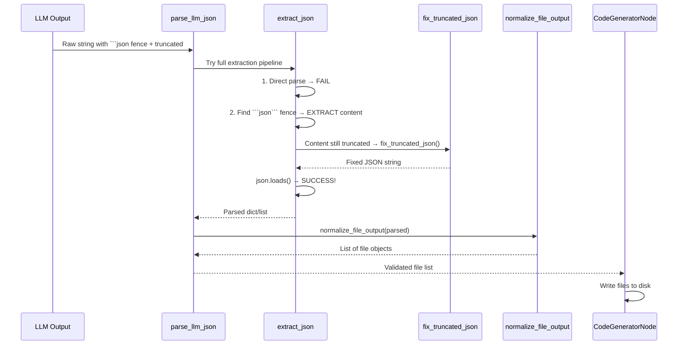
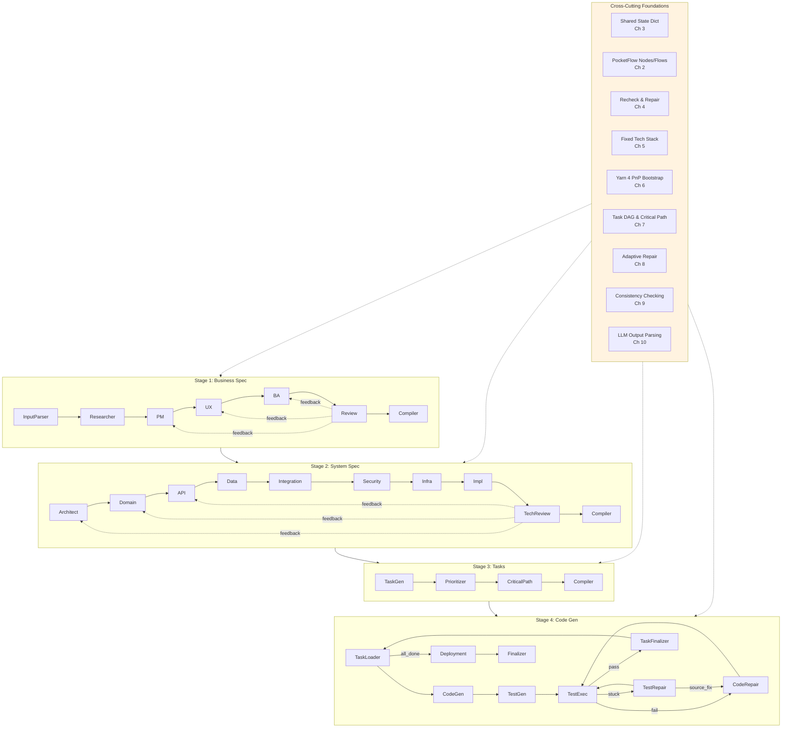

# Chapter 10: LLM Output Parsing & Repair Utilities

Welcome to the final chapter of the CODING tutorial! 🎉

In [Chapter 9: Consistency Checking Across Specification Sections](09_consistency_checking_across_specification_sections_.md), we learned how the pipeline catches **semantic drift** between specification sections — like a cross-reference index ensuring Chapter 3's "Figure 3.2" actually exists and matches "Table 3.1".

But there's one more challenge: **LLMs are messy writers**. They wrap JSON in markdown code fences, truncate output mid-string, forget closing braces, or hallucinate extra keys. If you just call `JSON.parse()` on raw LLM output, your pipeline crashes.

This chapter introduces the **LLM Output Parsing & Repair Utilities** — a robust toolkit that makes the entire pipeline resilient to "the LLM didn't follow format exactly" problems.

---

## The Problem: "LLMs Don't Always Output Clean JSON"

Imagine you ask an LLM: *"Return a JSON object with `name` and `version` fields."*

**What you hope for:**
```json
{"name": "my-app", "version": "1.0.0"}
```

**What you often get:**

| Messy Output | Example |
|--------------|---------|
| **Markdown code fence** | ```json\n{"name": "my-app", "version": "1.0.0"}\n``` |
| **Truncated string** | `{"name": "my-app", "version": "1.0` |
| **Missing closing brace** | `{"name": "my-app", "version": "1.0.0"` |
| **Extra commentary** | "Here's the JSON you asked for:\n{\"name\": \"my-app\"}" |
| **Multiple objects** | `{"name": "my-app"}{"version": "1.0.0"}` |
| **Array instead of object** | `[{"name": "my-app", "version": "1.0.0"}]` |

**Naive `JSON.parse()` fails on ALL of these.** Your pipeline halts with a cryptic error.

---

## The Solution: A Multi-Stage Parsing Pipeline

The utilities implement a **cascading fallback strategy**:

```mermaid
flowchart TD
    Input[Raw LLM Output] --> Try1[1. Direct JSON.parse]
    Try1 -- Success --> Done[✅ Parsed!]
    Try1 -- Fail --> Try2[2. Extract from ```json``` fences]
    Try2 -- Success --> Done
    Try2 -- Fail --> Try3[3. Fix truncated JSON\n(unclosed strings, missing braces)]
    Try3 -- Success --> Done
    Try3 -- Fail --> Try4[4. Bracket matching\nwith string/escaping awareness]
    Try4 -- Success --> Done
    Try4 -- Fail --> Try5[5. Extract largest valid\nJSON object/array]
    Try5 -- Success --> Done
    Try5 -- Fail --> Null[❌ Return null]
    
    style Done fill:#e8f5e9
    style Null fill:#ffcdd2
```

**Analogy**: Like a patient editor who tries:
1. "Read it as-is" → 2. "Strip the markdown" → 3. "Fix the typos" → 4. "Find the JSON hiding in the text" → 5. "Grab the biggest valid chunk"

---

## Key Concepts

### 1. `parse_llm_json` — The Main Entry Point

This is the **primary function** used throughout CODING. It orchestrates the entire fallback chain.

```python
# utils/external_tools.py (simplified)
def parse_llm_json(text, default=None, force_dict=False, required_keys=None):
    # Stage 1: Full extraction pipeline
    parsed = extract_json(text)
    
    if parsed is None:
        # Stage 2: Last-resort cleanup
        cleaned = remove_markdown(text)
        cleaned = fix_truncated_json(cleaned)
        try:
            parsed = json.loads(cleaned)
        except (json.JSONDecodeError, TypeError):
            return default
    
    # Optional: Validate structure
    if force_dict and isinstance(parsed, list):
        return {}
    if required_keys and isinstance(parsed, dict):
        missing = [k for k in required_keys if k not in parsed]
        if missing:
            return default
    
    return parsed
```

**Usage in nodes** (from `business_nodes.py`):
```python
class PMAgentNode(Node):
    def post(self, shared, prep_res, exec_res):
        # Parse with required keys validation!
        parsed = parse_llm_json(exec_res, force_dict=True)
        if parsed is None:
            shared["errors"] = ["PM agent returned invalid JSON"]
            return "error"
        shared["pm_section"] = parsed
        return "next"
```

---

### 2. `extract_json` — The Heavy Lifter

This function implements the **core extraction logic** with bracket matching that understands strings and escaping.

```python
# utils/external_tools.py (simplified)
def extract_json(text):
    if not text or not isinstance(text, str):
        return None
    text = text.strip()
    
    # 1. Try direct parse
    try:
        return json.loads(text)
    except (json.JSONDecodeError, ValueError):
        pass
    
    # 2. Extract from ```json``` code fences
    md = re.search(r'```(?:\w+)?\s*\n?(.*?)\n?```', text, re.DOTALL)
    if md:
        content = md.group(1).strip()
        for fixer in (lambda x: x, fix_truncated_json):
            try:
                return json.loads(fixer(content))
            except (json.JSONDecodeError, ValueError):
                continue
    
    # 3. Find outermost { ... } or [ ... ] with bracket matching
    for start_char, end_char in [('{', '}'), ('[', ']')]:
        start_idx = text.find(start_char)
        if start_idx == -1:
            continue
        
        depth = 0
        in_string = False
        escape_next = False
        
        for i in range(start_idx, len(text)):
            ch = text[i]
            
            # Handle escape sequences
            if escape_next:
                escape_next = False
                continue
            if ch == '\\':
                escape_next = True
                continue
            
            # Track string boundaries
            if ch == '"':
                in_string = not in_string
                continue
            if in_string:
                if ch == start_char:
                    depth += 1
                elif ch == end_char:
                    depth -= 1
                    if depth == 0:
                        candidate = text[start_idx:i+1]
                        for fixer in (lambda x: x, fix_truncated_json):
                            try:
                                return json.loads(fixer(candidate))
                            except (json.JSONDecodeError, ValueError):
                                continue
                        break
    
    # 4. Last resort: fix truncated JSON and try
    try:
        return json.loads(fix_truncated_json(text))
    except (json.JSONDecodeError, ValueError):
        return None
```

**Key insight**: The bracket matching **tracks string state** (`in_string`) and **escape sequences** (`escape_next`) so it doesn't get confused by braces inside strings like `{"path": "src/{id}.ts"}`.

---

### 3. `fix_truncated_json` — The Syntax Healer

Fixes common truncation issues: unclosed strings, missing braces/brackets, trailing commas.

```python
# utils/external_tools.py (simplified)
def fix_truncated_json(text):
    text = text.rstrip()
    if not text:
        return text
    
    # 1. Close unclosed string at end
    in_string = False
    escape = False
    for ch in text:
        if escape:
            escape = False
            continue
        if ch == '\\':
            escape = True
            continue
        if ch == '"':
            in_string = not in_string
    if in_string:
        text += '"'
    
    # 2. Remove trailing comma before closing
    if text.rstrip().endswith(','):
        text = text.rstrip()[:-1]
    
    # 3. Balance braces/brackets
    stack = []
    in_string = escape = False
    for ch in text:
        if escape:
            escape = False
            continue
        if ch == '\\':
            escape = True
            continue
        if ch == '"':
            in_string = not in_string
            continue
        if in_string:
            continue
        if ch in '{[':
            stack.append(ch)
        elif ch == '}' and stack and stack[-1] == '{':
            stack.pop()
        elif ch == ']' and stack and stack[-1] == '[':
            stack.pop()
    
    # Close remaining in reverse order
    while stack:
        text += '}' if stack.pop() == '{' else ']'
    
    return text
```

**Examples**:
| Input | Output |
|-------|--------|
| `{"name": "test"` | `{"name": "test"}` |
| `{"items": ["a", "b"` | `{"items": ["a", "b"]}` |
| `{"msg": "hello` | `{"msg": "hello"}` |
| `[1, 2, 3,` | `[1, 2, 3]` |

---

### 4. `normalize_file_output` — Handles 8+ LLM Patterns

LLMs return file lists in wildly different formats. This normalizes them all to a standard list of file objects.

```python
# utils/external_tools.py (simplified)
def normalize_file_output(parsed):
    """Normalize various LLM output patterns to list of file objects."""
    
    # Pattern 1: Already a list
    if isinstance(parsed, list):
        return parsed
    
    # Pattern 2: Dict with known wrapper keys
    if isinstance(parsed, dict):
        for key in ("files", "code", "output", "result", "data", "generated_files", "tasks"):
            if key in parsed and isinstance(parsed[key], list):
                return parsed[key]
        
        # Pattern 3: Single file object
        if "path" in parsed and "content" in parsed:
            return [parsed]
        
        # Pattern 4: Dict of path → content (e.g., {"src/a.ts": "code", "src/b.ts": "code"})
        if all(isinstance(v, str) for v in parsed.values()):
            return [{"path": k, "content": v, "language": "typescript"} for k, v in parsed.items()]
    
    return None
```

**Supported patterns**:
| LLM Output Format | Example |
|-------------------|---------|
| Array of files | `[{"path": "a.ts", "content": "..."}, ...]` |
| Dict with `"files"` key | `{"files": [{"path": "a.ts", ...}]}` |
| Dict with `"code"` key | `{"code": [{"path": "a.ts", ...}]}` |
| Dict with `"output"` key | `{"output": [{"path": "a.ts", ...}]}` |
| Single file object | `{"path": "a.ts", "content": "..."}` |
| Path → content map | `{"src/a.ts": "code", "src/b.ts": "code"}` |
| Dict with `"generated_files"` | `{"generated_files": [...]}` |
| Dict with `"tasks"` (task gen) | `{"tasks": [...]}` |

---

### 5. `unwrap_list` / `unwrap_dict` — Extract Payloads from Wrappers

LLMs love wrapping the real payload in an object with varying keys. These helpers extract it.

```python
# utils/external_tools.py (simplified)
def unwrap_list(data, keys=("tasks", "files", "tests", "items", "data", "results", "output", "code", "result", "generated_files", "implementation_tasks", "task_list", "prioritized_tasks")):
    """Extract list from LLM output that may be wrapped in a dict."""
    if isinstance(data, list):
        return data
    if not isinstance(data, dict):
        return None
    for key in keys:
        if key in data and isinstance(data[key], list):
            return data[key]
    # Single object that looks like a list item
    if "task_id" in data or ("path" in data and "content" in data):
        return [data]
    return None

def unwrap_dict(data, list_key="critical_path"):
    """Extract dict, wrapping bare list if needed."""
    if isinstance(data, dict):
        return data
    if isinstance(data, list):
        return {list_key: data}
    return None
```

**Usage in nodes** (from `recheck_repair_nodes.py`):
```python
class TaskCompilerNode(Node):
    def post(self, shared, prep_res, exec_res):
        parsed = parse_llm_json(exec_res)
        # Handle both {"tasks": [...]} and [...]
        tasks = unwrap_list(parsed, keys=("tasks", "task_list", "implementation_tasks"))
        shared["tasks"] = tasks
        return "default"
```

---

## How It Works: Step-by-Step Walkthrough

Let's trace what happens when **`CodeGeneratorNode`** receives messy LLM output.



### Concrete Example

**LLM returns**:
```text
Here are the files you requested:

```json
{
  "files": [
    {"path": "src/user.ts", "content": "export class User {", "language": "typescript"},
    {"path": "src/user.test.ts", "content": "import { User } from './user';", "language": "typescript"}
```

**Pipeline processes**:
1. `extract_json` finds the ````json```` fence
2. Extracts content (still truncated — missing `}]}`)
3. `fix_truncated_json` adds `}]}` 
4. `json.loads` succeeds → `{"files": [...]}`
5. `normalize_file_output` sees `"files"` key → returns the list
6. `CodeGeneratorNode` gets clean `[{"path": "...", "content": "..."}, ...]`

---

## Internal Implementation Deep Dive

### 1. The Extraction State Machine

`extract_json` uses a **character-by-character state machine** for bracket matching:

```python
# Simplified state machine logic
def find_outermost_json(text, start_char, end_char):
    start_idx = text.find(start_char)
    if start_idx == -1:
        return None
    
    depth = 0
    in_string = False
    escape_next = False
    
    for i in range(start_idx, len(text)):
        ch = text[i]
        
        # Escape handling
        if escape_next:
            escape_next = False
            continue
        if ch == '\\':
            escape_next = True
            continue
        
        # String boundary tracking
        if ch == '"':
            in_string = not in_string
            continue
        
        # Only count brackets OUTSIDE strings
        if not in_string:
            if ch == start_char:
                depth += 1
            elif ch == end_char:
                depth -= 1
                if depth == 0:
                    return text[start_idx:i+1]  # Found complete JSON!
    
    return None  # Never balanced
```

**Why this matters**: Without string awareness, `{"path": "src/{id}.ts"}` would match the `{` in `{id}` and break.

---

### 2. Truncation Fixing Logic

`fix_truncated_json` handles three common cases:

```mermaid
flowchart LR
    Input[Truncated JSON] --> Check1{Unclosed\nstring at end?}
    Check1 -- Yes --> Fix1[Add closing quote]
    Check1 -- No --> Check2{Trailing\ncomma?}
    Fix1 --> Check2
    Check2 -- Yes --> Fix2[Remove comma]
    Check2 -- No --> Check3{Unbalanced\nbraces?}
    Fix2 --> Check3
    Check3 -- Yes --> Fix3[Add missing } or ]]
    Check3 -- No --> Done[Return fixed]
    Fix3 --> Done
```

---

### 3. Integration with Repair Nodes

The parsing utilities are **critical for repair loops**. When `RepairJSONNode` re-prompts the LLM, the LLM might return messy output again. The same pipeline cleans it up.

```python
# recheck_repair_nodes.py — RepairJSONNode.post()
def post(self, shared, prep_res, exec_res):
    try:
        # Uses parse_llm_json internally via safe_json_loads
        repaired = json.loads(exec_res)  # Could fail!
        apply_repair(shared, workflow_type, section, target, repaired)
        return "done"
    except json.JSONDecodeError:
        # If direct parse fails, the NEXT recheck cycle will
        # call parse_llm_json which handles the mess
        shared["errors"].append(f"Repair attempt failed: invalid JSON")
        return "error"
```

**But wait** — `RepairConsistencyNode` **does** use the robust extractor:

```python
# recheck_repair_nodes.py — RepairConsistencyNode.post()
repaired = extract_json(exec_res)  # ← Robust extraction!
if repaired is None:
    shared["errors"].append("Could not extract valid JSON from LLM response")
    return "error"
```

---

## Debugging Tip: Inspect Parsing Failures

When a node fails with "invalid JSON", check what the LLM actually returned:

```python
# In any node's post() method
parsed = parse_llm_json(exec_res)
if parsed is None:
    print(f"DEBUG: Failed to parse LLM output")
    print(f"  Raw preview: {str(exec_res)[:500]}")
    print(f"  After markdown removal: {remove_markdown(exec_res)[:500]}")
    print(f"  After truncation fix: {fix_truncated_json(remove_markdown(exec_res))[:500]}")
    shared["errors"] = ["Invalid JSON"]
    return "error"
```

**Example debug output**:
```
DEBUG: Failed to parse LLM output
  Raw preview: Here's the JSON:\n```json\n{"name": "test", "version": "1.0
  After markdown removal: {"name": "test", "version": "1.0
  After truncation fix: {"name": "test", "version": "1.0"}
```

---

## Why This Design Works

| Challenge | How Utilities Solve It |
|-----------|------------------------|
| **Markdown fences** | `extract_json` finds and extracts ````json```` blocks |
| **Truncated output** | `fix_truncated_json` closes strings, balances braces |
| **Extra commentary** | Bracket matching finds JSON *inside* text |
| **Wrong wrapper keys** | `normalize_file_output` + `unwrap_list` handle 8+ patterns |
| **String-aware parsing** | State machine tracks quotes/escapes during bracket matching |
| **Graceful degradation** | Returns `None` instead of crashing — caller decides fallback |
| **Validation hooks** | `required_keys` and `force_dict` catch partial parses |

---

## Usage Patterns in CODING

### Pattern 1: Agent Output Validation (Required Keys)
```python
# Business/System spec agents
parsed = parse_llm_json(exec_res, force_dict=True)
# Validates it's a dict, not a list
```

### Pattern 2: Task List Extraction (Flexible Keys)
```python
# TaskGeneratorNode, TaskPrioritizerNode
tasks = unwrap_list(parsed, keys=("tasks", "task_list", "implementation_tasks"))
```

### Pattern 3: File Generation (Multiple Formats)
```python
# CodeGeneratorNode, TestGeneratorNode
files = normalize_file_output(parsed)
```

### Pattern 4: Repair Node Output (Robust Extraction)
```python
# RepairConsistencyNode
repaired = extract_json(exec_res)  # Handles markdown, truncation, etc.
```

---

## Summary: What You Learned

| Utility | Purpose | Key Feature |
|---------|---------|-------------|
| **`parse_llm_json`** | Main entry point | Cascading fallback + optional validation |
| **`extract_json`** | Core extraction | Bracket matching with string/escaping awareness |
| **`fix_truncated_json`** | Syntax repair | Closes strings, removes trailing commas, balances braces |
| **`normalize_file_output`** | File list normalization | Handles 8+ LLM output patterns |
| **`unwrap_list`** | List extraction | Tries 13+ wrapper keys |
| **`unwrap_dict`** | Dict extraction | Wraps bare lists |

**The big picture**: These utilities form a **defensive perimeter** around every LLM call in CODING. They transform "LLM output" → "structured data the pipeline can trust" — enabling the self-healing loops in [Chapter 4](04_recheck___repair_loop__self_healing_validation__.md), [Chapter 8](08_adaptive_code_test_repair_with_escalation_.md), and [Chapter 9](09_consistency_checking_across_specification_sections_.md) to work reliably.

---

## The Complete Pipeline: A Final View

You've now seen all **10 chapters** of the CODING architecture:



---

## Congratulations! 🎉

You've completed the **CODING Tutorial**! You now understand how an **AI-driven software development pipeline** works end-to-end:

| Chapter | Concept | Key Takeaway |
|---------|---------|--------------|
| 1 | Multi-Stage Pipeline | Four stages: Business → System → Tasks → Code |
| 2 | PocketFlow Orchestration | Nodes + Flows = decoupled, composable workflows |
| 3 | Shared State Dictionary | Single "whiteboard" for all inter-node communication |
| 4 | Recheck & Repair Loop | Self-healing validation after every LLM call |
| 5 | Fixed Tech Stack | One source of truth, enforced in every prompt |
| 6 | Yarn 4 PnP Bootstrap | Automated, self-healing project initialization |
| 7 | Task DAG & Critical Path | Dependency-aware execution with parallelism |
| 8 | Adaptive Code/Test Repair | Escalating strategies + bidirectional handoff |
| 9 | Consistency Checking | Cross-section semantic validation |
| 10 | LLM Output Parsing | Robust extraction from messy LLM output |

**What you can build with this**:
- ✅ A system that turns raw ideas into production code
- ✅ Self-healing pipelines that recover from LLM errors
- ✅ Consistent, reproducible outputs via fixed tech stack
- ✅ Full traceability: idea → spec → tasks → code
- ✅ Checkpointable, inspectable, debuggable execution

---

## Where to Go From Here

The CODING project is **open source** and **extensible**. You can:

1. **Add new agents** — Create a `Node` subclass, add to a `Flow`
2. **Support new tech stacks** — Modify `TECH_STACK` in `utils/system_prompt.py`
3. **Extend consistency rules** — Add checkers in `utils/external_tools.py`
4. **Customize repair strategies** — Add new escalation levels in `code_gen_nodes.py`
5. **Build new workflows** — Compose `Flow` objects for different pipelines

The architecture is designed for **evolution** — not just for the current stack, but for whatever comes next.

---

**Thank you for following along!** 🙏

If you build something cool with these patterns, we'd love to hear about it.

> *"The best way to predict the future is to implement it."* — Alan Kay (paraphrased)

Happy coding! 🚀

